# 🧪 Automatización de Pruebas — Herramientas y Buenas Prácticas

Repositorio de estudio y referencia sobre **automatización de pruebas de software**: herramientas, frameworks, patrones y flujos de integración continua. Incluye notas propias, tutoriales resumidos, prompts útiles y capturas organizadas por herramienta.

> 📌 Este repo se va construyendo de forma incremental: a medida que voy investigando, tomando capturas o siguiendo tutoriales, se convierten en notas en Markdown organizadas aquí.

---

## 📚 Tabla de contenidos

- [🗺️ Por dónde empezar si eres nuevo](#️-por-dónde-empezar-si-eres-nuevo)
- [Estructura del repositorio](#-estructura-del-repositorio)
- [Contenido disponible](#-contenido-disponible)
- [Herramientas cubiertas](#-herramientas-cubiertas)
- [Cómo navegar el repo](#-cómo-navegar-el-repo)
- [Convenciones](#-convenciones)
- [Roadmap](#-roadmap)
- [Recursos generales](#-recursos-generales)

---

## 🗺️ Por dónde empezar si eres nuevo

Si nunca has hecho testing ni automatización, **no leas el repo de arriba hacia abajo** — sigue este orden. Cada nota da por hecho que ya leíste las anteriores.

> 📌 **Prerequisito:** las notas de Selenium y Appium usan Java (clases, herencia, `try/catch`). Si no tienes esa base, primero busca un curso introductorio de Java — el resto del repo asume que ya sabes programar en algo orientado a objetos.

### Fase 0 — Entender qué es esto antes de tocar una herramienta

1. [Testing manual vs automatizado](./docs/conceptos-generales/testing-manual-vs-automatizado.md)
2. [Tipos de pruebas](./docs/conceptos-generales/tipos-de-pruebas.md)
3. [Pirámide de testing](./docs/conceptos-generales/piramide-de-testing.md)
4. [Estrategia de automatización](./docs/conceptos-generales/estrategia-de-automatizacion.md)
5. [Buenas prácticas generales](./docs/conceptos-generales/buenas-practicas-generales.md)
6. [Glosario](./docs/conceptos-generales/glosario.md) — no lo leas de corrido, consúltalo cuando aparezca un término que no reconozcas en las fases siguientes.

### Fase 1 — Selenium (la base de todo lo demás)

Sigue este orden exacto — cada nota se apoya en la anterior:

1. [¿Qué es Selenium?](./selenium/notas/que-es-selenium.md)
2. [Instalación y setup](./selenium/notas/instalacion-y-setup.md)
3. [Locators](./selenium/notas/locators.md)
4. [Esperas en Selenium](./selenium/notas/esperas-selenium.md)
5. [Interacciones con elementos](./selenium/notas/interacciones-elementos-selenium.md)
6. [Ventanas, pestañas y frames/iframes](./selenium/notas/ventanas-frames-selenium-java.md)
7. [Alertas de JavaScript](./selenium/notas/alertas-javascript-selenium-java.md)
8. [Page Object Model](./selenium/notas/page-object-model-selenium-java.md) — aquí es donde todo empieza a "hacer clic" (sin juego de palabras)
9. [Integración con test runner: JUnit 5 vs TestNG](./selenium/notas/test-runner-selenium-java.md)
10. [Screenshots y evidencias](./selenium/notas/screenshots-evidencias-selenium-java.md)
11. [Excepciones comunes](./selenium/notas/excepciones-comunes-selenium-java.md)
12. [Generación de reportes: Allure Report y Extent Reports](./selenium/notas/reportes-selenium-java.md)
13. 🏁 **Práctica integradora:** [Suite completa de automatización con Gradle](./selenium/tutoriales/tutorial_suite_completa_selenium_gradle.md) — el tutorial que junta todo lo anterior en un proyecto real, de principio a fin.

**Opcionales (vuelve a ellas cuando las necesites, no bloquean tu avance):**
- [Selenium 4 vs versiones anteriores](./selenium/notas/selenium-4-vs-versiones-anteriores.md) — más historia que práctica.
- [Selenium Grid](./selenium/notas/selenium-grid.md) — solo cuando necesites correr en paralelo o multi-navegador.
- [Serenity + Gradle: por qué el reporte solo muestra la última corrida](./selenium/notas/explicacion-aggregate-serenity.md) — troubleshooting puntual, útil si usas Serenity.

### Fase 2 — Appium (mobile, reutilizando lo que ya sabes de WebDriver)

Si ya completaste la Fase 1, este bloque se lee mucho más rápido — Appium reutiliza casi todos los conceptos de Selenium.

1. [¿Qué es Appium y cómo funciona?](./appium/notas/que-es-appium.md)
2. [Instalación y setup del entorno](./appium/notas/instalacion-setup-appium.md)
3. [Capabilities (Desired Capabilities)](./appium/notas/capabilities-appium.md)
4. [Appium Inspector en profundidad](./appium/notas/appium-inspector.md)
5. [Locators específicos de mobile](./appium/notas/locators-mobile-appium.md)
6. [Gestos táctiles](./appium/notas/gestos-tactiles-appium.md)
7. 🏁 **Práctica integradora:** [El primer test funcional completo](./appium/notas/primer-test-appium.md)

### Fase 3 — Cypress (arquitectura distinta, aprovecha el contraste con lo anterior)

1. [¿Qué es Cypress y cómo funciona?](./cypress/notas/que-es-cypress.md) — léela con atención especial: la arquitectura es distinta a todo lo visto hasta ahora.
2. [Instalación y setup](./cypress/notas/instalacion-setup-cypress.md)
3. [Anatomía de un test en Cypress](./cypress/notas/anatomia-test-cypress.md)
4. [Selectors y buenas prácticas de selección](./cypress/notas/selectors-cypress.md)
5. [Reintentos automáticos (retry-ability)](./cypress/notas/retry-ability-cypress.md)
6. [Interceptar requests de red con cy.intercept](./cypress/notas/cy-intercept-cypress.md)
7. 🏁 **Práctica integradora:** [El primer test funcional completo](./cypress/notas/primer-test-cypress.md)

### Fase 4 — Playwright (la síntesis de todo lo anterior)

1. [¿Qué es Playwright y cómo funciona?](./playwright/notas/que-es-playwright.md) — se lee más rápido si ya se completaron las Fases 1 y 3, porque compara constantemente con Selenium y Cypress.
2. [Instalación y setup](./playwright/notas/instalacion-setup-playwright.md)
3. _(se irá completando)_

### Fase 5+ — Comparativas finales

_(Se irá completando a medida que se agregue contenido.)_

---

## 🗂 Estructura del repositorio

```
automatizacion-pruebas/
├── README.md
├── docs/
│   ├── conceptos-generales/
│   └── comparativas/
├── selenium/
│   ├── notas/
│   ├── recursos/
│   │   ├── prompts/
│   │   └── capturas/
│   └── tutoriales/
├── appium/
│   ├── notas/
│   ├── recursos/
│   └── tutoriales/
├── cypress/
│   ├── notas/
│   ├── recursos/
│   └── tutoriales/
├── playwright/
│   ├── notas/
│   ├── recursos/
│   └── tutoriales/
├── ci-cd/
│   ├── notas/
│   ├── jenkins/
│   ├── github-actions/
│   └── gitlab-ci/
└── recursos-generales/
    ├── capturas/
    └── prompts/
```

### Diagrama visual

```mermaid
graph TD
    ROOT["📦 automatizacion-pruebas"]

    ROOT --> DOCS["📁 docs"]
    DOCS --> DOCS_CONCEPTOS["conceptos-generales"]
    DOCS --> DOCS_COMPARATIVAS["comparativas"]

    ROOT --> SEL["📁 selenium"]
    SEL --> SEL_NOTAS["notas"]
    SEL --> SEL_RECURSOS["recursos (prompts, capturas)"]
    SEL --> SEL_TUT["tutoriales"]

    ROOT --> APP["📁 appium"]
    APP --> APP_NOTAS["notas"]
    APP --> APP_RECURSOS["recursos (prompts, capturas)"]
    APP --> APP_TUT["tutoriales"]

    ROOT --> CYP["📁 cypress"]
    CYP --> CYP_NOTAS["notas"]
    CYP --> CYP_RECURSOS["recursos (prompts, capturas)"]
    CYP --> CYP_TUT["tutoriales"]

    ROOT --> PLAY["📁 playwright"]
    PLAY --> PLAY_NOTAS["notas"]
    PLAY --> PLAY_RECURSOS["recursos (prompts, capturas)"]
    PLAY --> PLAY_TUT["tutoriales"]

    ROOT --> CICD["📁 ci-cd"]
    CICD --> CICD_JENKINS["jenkins"]
    CICD --> CICD_GHA["github-actions"]
    CICD --> CICD_GITLAB["gitlab-ci"]

    ROOT --> GEN["📁 recursos-generales"]
    GEN --> GEN_CAPTURAS["capturas"]
    GEN --> GEN_PROMPTS["prompts"]
```



---

## 📖 Contenido disponible

### `docs/conceptos-generales/`
- [Testing manual vs automatizado](./docs/conceptos-generales/testing-manual-vs-automatizado.md) — definiciones, tabla comparativa, cuándo automatizar y cuándo no, diagrama de decisión.
- [Pirámide de testing](./docs/conceptos-generales/piramide-de-testing.md) — origen (Mike Cohn), cada capa explicada, errores comunes, variante "testing trophy", ejemplos aplicados (web y móvil).
- [Tipos de pruebas](./docs/conceptos-generales/tipos-de-pruebas.md) — funcionales vs no funcionales, mapa completo con analogías cotidianas, tabla resumen, relación con la pirámide de testing.
- [Patrones de diseño](./docs/conceptos-generales/patrones-de-diseno.md) — Page Object Model, Page Factory y Screenplay Pattern, con ejemplos de código, comparación y guía de cuándo elegir cada uno.
- [Estrategia de automatización](./docs/conceptos-generales/estrategia-de-automatizacion.md) — criterios de priorización, matriz impacto/frecuencia, cálculo de ROI, mantenibilidad y proceso práctico para decidir qué automatizar primero.
- [Buenas prácticas generales](./docs/conceptos-generales/buenas-practicas-generales.md) — naming de tests, independencia entre pruebas, datos de prueba, cómo evitar flaky tests, esperas explícitas vs. implícitas.
- [Glosario](./docs/conceptos-generales/glosario.md) — ~100 términos de testing y automatización, ordenados alfabéticamente, con referencias cruzadas al resto de las notas.

### `docs/comparativas/`
_(Pendiente)_

### `selenium/notas/`
- [¿Qué es Selenium?](./selenium/notas/que-es-selenium.md) — qué es, para qué se usa, cómo funciona (WebDriver), componentes clave, ejemplos cotidianos y primer script en Python.
- [Selenium 4 vs versiones anteriores](./selenium/notas/selenium-4-vs-versiones-anteriores.md) — protocolo W3C WebDriver, relative locators, soporte multi-ventana, Chrome DevTools Protocol (CDP), Selenium Grid renovado, tabla comparativa y ejemplos cotidianos.
- [Instalación y setup](./selenium/notas/instalacion-y-setup.md) — instalación con pip (Python) y Maven/Gradle (Java), manejo de drivers de navegador, Selenium Manager (desde 4.6) vs configuración manual, ejemplos en Python y Java.
- [Locators](./selenium/notas/locators.md) — las 8 estrategias de `By` (ID, CSS_SELECTOR, XPATH, CLASS_NAME, etc.), orden de prioridad recomendado, razones técnicas y ejemplos cotidianos.
- [Selenium Grid](./selenium/notas/selenium-grid.md) — qué problema resuelve concretamente (ejecución en paralelo, cobertura multi-navegador/SO), arquitectura Hub-Nodos, Selenium 4 vs 3, configuración con Docker Compose.
- [Esperas en Selenium](./selenium/notas/esperas-selenium.md) — por qué evitar `time.sleep()`, implicit vs explicit vs fluent wait, `expected_conditions` más usadas, condiciones personalizadas, tabla comparativa, patrón Page Object para esperas y ejemplos con analogías cotidianas.
- [Interacciones con elementos](./selenium/notas/interacciones-elementos-selenium.md) — clicks (normal, JS, `ActionChains`, doble/derecho), `send_keys` y manejo de campos controlados por frameworks, dropdowns nativos (`Select`) vs custom, checkboxes, radio buttons, `ActionChains` avanzado (hover, drag & drop), tabla de errores comunes (`ElementClickInterceptedException`, `StaleElementReferenceException`, etc.) y patrón de `BasePage` reutilizable.
- [Ventanas, pestañas y frames/iframes (Java)](./selenium/notas/ventanas-frames-selenium-java.md) — manejo de `window handles`, cambio entre pestañas/ventanas, frames/iframes (por nombre, elemento e índice), `defaultContent()` vs `parentFrame()`, tabla de errores comunes y patrón reutilizable `VentanaUtils`. Incluye analogías cotidianas (habitación de hotel / caja fuerte) y diagramas de apoyo.
- [Alertas de JavaScript (Java)](./selenium/notas/alertas-javascript-selenium-java.md) — los tres tipos de alerta (`alert`, `confirm`, `prompt`), espera explícita con `alertIsPresent()`, lectura de texto, `accept()`/`dismiss()`/`sendKeys()`, alertas nativas del navegador (fuera del alcance de Selenium), tabla resumen, patrón reutilizable `AlertUtils` y diagrama de apoyo. Incluye analogías cotidianas (alarma de incendios).
- [Page Object Model (Java)](./selenium/notas/page-object-model-selenium-java.md) — el problema sin POM, estructura del patrón (locators privados + métodos públicos), ejemplo completo funcional (Login + Dashboard con navegación entre Page Objects), variante con `PageFactory`/`@FindBy`, tabla de beneficios y buenas prácticas. Incluye el primer script end-to-end (login + assert) del roadmap y diagrama de apoyo.
- [Screenshots y evidencias (Java)](./selenium/notas/screenshots-evidencias-selenium-java.md) — captura básica con `TakesScreenshot`, captura automática solo en fallos con `TestWatcher` (JUnit 5), convención de nombres con timestamp, integración con Allure, captura de HTML como evidencia extra, buenas prácticas. Incluye diagrama de apoyo.
- [Excepciones comunes (Java)](./selenium/notas/excepciones-comunes-selenium-java.md) — `NoSuchElementException`, `StaleElementReferenceException` y `TimeoutException`: qué significan, causas típicas, cómo depurarlas paso a paso, patrón de reintento ante staleness, tabla resumen de diagnóstico rápido y errores de principiante que agravan estas excepciones. Incluye diagrama comparativo.
- [Integración con test runner: JUnit 5 vs TestNG (Java)](./selenium/notas/test-runner-selenium-java.md) — qué le falta a Selenium sin un test runner, fixtures (`@BeforeEach`/`@AfterEach` vs `@BeforeMethod`/`@AfterMethod`), asserts, tests parametrizados (`@CsvSource` / `@DataProvider`), agrupar/filtrar con `@Tag`/`groups`, dependencias entre tests (`dependsOnMethods`), tabla comparativa JUnit 5 vs TestNG y buenas prácticas. Incluye diagrama de apoyo.
- [Generación de reportes: Allure Report y Extent Reports (Java)](./selenium/notas/reportes-selenium-java.md) — reporte básico de Surefire/Maven, configuración de Allure (`@Step`, `@Severity`, adjuntar screenshots y HTML automáticamente, categorización de fallos), alternativa con Extent Reports, tabla comparativa Surefire vs Allure vs Extent Reports y buenas prácticas para reportes útiles. Incluye diagrama comparativo.
- [Serenity + Gradle: por qué el reporte solo muestra la última corrida](./selenium/notas/explicacion-aggregate-serenity.md) — comportamiento de `test.finalizedBy(aggregate)` en Gradle, diferencia entre correr `test --tests X` (reporte parcial, solo esa sesión) vs `aggregate` solo (relee todos los JSON acumulados y arma el reporte completo), y flujo recomendado para correr múltiples carpetas de tests sin perder histórico visual. Incluye analogías cotidianas (álbum de fotos reveladas, resumen bancario) y tabla de comandos.

### `selenium/tutoriales/`
- [Suite completa de automatización con Gradle](./selenium/tutoriales/tutorial_suite_completa_selenium_gradle.md) — recorrido paso a paso end-to-end: setup del proyecto con `gradle init`, primer test crudo, esperas explícitas, refactor a Page Object Model, screenshots automáticos en fallos, reportes con Allure (plugin oficial de Gradle), modo headless, y pipeline de GitHub Actions. Incluye tabla comparativa Maven vs Gradle y diagrama del flujo completo.
  - 🖥️ [Versión interactiva (HTML)](./selenium/tutoriales/tutorial-suite-completa-selenium-gradle.html) — mismo contenido en formato de pipeline visual navegable, con sidebar tipo stepper de CI que resalta la etapa activa al hacer scroll.

### `appium/notas/`
- [¿Qué es Appium y cómo funciona?](./appium/notas/que-es-appium.md) — arquitectura cliente-servidor, el rol del Appium Server, `UiAutomator2` vs `XCUITest`, diferencia entre apps nativas/híbridas/web móvil (con cambio de contexto `NATIVE_APP`/`WEBVIEW`), y por qué Appium reutiliza el protocolo WebDriver de Selenium. Incluye analogías cotidianas (línea de atención al cliente internacional, casas locales vs prefabricadas) y diagrama de apoyo.
- [Instalación y setup del entorno](./appium/notas/instalacion-setup-appium.md) — Node.js como base, instalación del Appium Server y drivers (`uiautomator2`, `xcuitest`), Appium Inspector, kit de Android (Android Studio, SDK, `ANDROID_HOME`), kit de iOS (Xcode, certificados, solo macOS), emuladores/simuladores vs dispositivos reales, verificación con `appium-doctor`, y errores comunes al iniciar. Incluye analogías cotidianas (taller de electricista, cursos de idiomas por país) y diagrama de apoyo.
- [Capabilities (Desired Capabilities)](./appium/notas/capabilities-appium.md) — qué son y por qué son obligatorias desde el primer momento, `platformName`, `platformVersion`, `deviceName`, `app` vs `appPackage`/`appActivity` (Android) vs `bundleId` (iOS), `automationName`, tabla comparativa Android vs iOS, ejemplo completo lado a lado y errores comunes por capabilities mal configuradas. Incluye analogías cotidianas (formulario de reserva de hotel) y diagrama de apoyo.
- [Appium Inspector en profundidad](./appium/notas/appium-inspector.md) — cómo conectarlo al Appium Server con las mismas capabilities, el árbol de elementos y sus atributos, tabla de confiabilidad de locators (`resource-id`/`accessibility id` vs `text` vs `bounds`), generación automática de código, interacción en vivo, diferencias Android vs iOS al inspeccionar, y errores comunes (elementos duplicados, capturas en blanco). Incluye analogías cotidianas (ficha policial de un sospechoso) y diagrama de apoyo.
- [Locators específicos de mobile](./appium/notas/locators-mobile-appium.md) — `accessibility id` (multiplataforma), `-android uiautomator`/UiSelector, `-ios predicate string` y `-ios class chain`, por qué XPath es el último recurso en mobile, tabla comparativa de las 5 estrategias, ejemplo lado a lado del mismo botón localizado de 5 formas, y cómo se adapta el Page Object Model con locators condicionales por plataforma. Incluye analogías cotidianas (pasaporte universal vs formularios exclusivos por país) y diagrama comparativo.
- [Gestos táctiles](./appium/notas/gestos-tactiles-appium.md) — por qué `TouchAction` está deprecado en favor de W3C Actions (`PointerInput`/`Sequence`), tap, swipe, scroll "inteligente" (`UiScrollable`), long press, y pinch/zoom con dos dedos coordinados, tabla de complejidad y errores comunes (duración insuficiente, sincronización de dedos). Incluye analogías cotidianas (tocar el timbre vs mantenerlo presionado, coreografía de baile) y diagrama de complejidad.
- [El primer test funcional completo](./appium/notas/primer-test-appium.md) — flujo end-to-end real: capabilities apuntando a una app de demo (ApiDemos/UICatalog), uso del Inspector para sacar locators reales, interacción combinando locators y gestos, assert final, todo envuelto en Page Object Model, y fixtures de JUnit para el setup/teardown de la sesión. Incluye analogías cotidianas (aprender a manejar en un circuito cerrado) y diagrama del flujo completo.

### `cypress/notas/`
- [¿Qué es Cypress y cómo funciona?](./cypress/notas/que-es-cypress.md) — la diferencia arquitectónica clave frente a Selenium/Appium (no usa WebDriver, corre dentro del navegador), el proceso de Node.js detrás de bambalinas, por qué es tan rápido, la limitación de multi-dominio derivada de este diseño, y tabla comparativa directa con Selenium/Appium. Incluye analogías cotidianas (obrero parado en la obra vs operador de grúa a distancia) y diagrama de arquitectura.
- [Instalación y setup](./cypress/notas/instalacion-setup-cypress.md) — instalación con `npm install cypress`, la estructura de carpetas autogenerada (`e2e/`, `fixtures/`, `support/`), `cypress.config.js` como panel de control central (`baseUrl`, viewport, timeouts), modo interactivo vs modo headless, soporte de TypeScript de fábrica, y tabla comparativa de instalación con Selenium/Appium. Incluye analogías cotidianas (electrodoméstico todo-en-uno, horno de puerta de vidrio) y diagrama de apoyo.
- [Anatomía de un test en Cypress](./cypress/notas/anatomia-test-cypress.md) — estructura `describe`/`it`, fixtures del ciclo de vida (`before`/`beforeEach`/`afterEach`/`after`) y su equivalencia con JUnit 5, el objeto global `cy`, comandos encadenados y por qué no son promesas tradicionales de JavaScript, aserciones integradas con Chai (`should`), y tabla comparativa completa con Selenium+JUnit. Incluye analogías cotidianas (capítulos de un libro, mensajero con un paquete) y diagrama de la jerarquía completa.
- [Selectors y buenas prácticas de selección](./cypress/notas/selectors-cypress.md) — la jerarquía oficial de Cypress (`data-cy` > `data-testid` > `role`/`name` > clases/IDs > texto visible > posición en el DOM), por qué usar un atributo exclusivo de testing, cómo pedirle esto al equipo de desarrollo, y tabla resumen de confiabilidad. Incluye analogías cotidianas (gafete "solo para auditoría", marca de ropa vs identidad) y diagrama comparativo.
- [Reintentos automáticos (retry-ability)](./cypress/notas/retry-ability-cypress.md) — qué significa retry-ability y por qué reemplaza a `WebDriverWait`, qué comandos reintentan (`get`, `contains`, `should`) y cuáles no (`click`, `request`), configuración de timeouts (global y por comando), el antipatrón de `cy.wait(tiempo fijo)`, y tabla comparativa con Selenium. Incluye analogías cotidianas (tocar la puerta de un vecino con paciencia) y diagrama comparativo.
- [Interceptar requests de red con cy.intercept](./cypress/notas/cy-intercept-cypress.md) — espiar peticiones con `.as()` y sincronizar con `cy.wait('@alias')`, mockear respuestas completas, simular errores de red/servidor y respuestas lentas, comparación con lo que Selenium/Appium no pueden hacer nativamente, el riesgo de abusar del mock, y fixtures reutilizables. Incluye analogías cotidianas (micrófono oculto, apuntador con guion distinto) y diagrama de flujo.
- [El primer test funcional completo](./cypress/notas/primer-test-cypress.md) — flujo end-to-end real de login: `cy.intercept` antes de `cy.visit`, interacción vía Page Object con selectors `data-cy`, sincronización con `cy.wait('@alias')`, aserción final, y fixtures para datos reutilizables. Incluye analogías cotidianas (montar la obra de teatro completa, GPS con ruta guardada) y diagrama del flujo completo.

### `playwright/notas/`
- [¿Qué es Playwright y cómo funciona?](./playwright/notas/que-es-playwright.md) — arquitectura híbrida (corre fuera del navegador como Selenium, pero se comunica por CDP directo en vez de WebDriver), instalación automática de los tres motores de navegador (Chromium, Firefox, WebKit), `BrowserContext` para multi-pestaña/multi-sesión sin la limitación de dominio de Cypress, soporte multi-lenguaje, y tabla comparativa completa con Selenium y Cypress. Incluye analogías cotidianas (especialista de mantenimiento con llaves maestras) y diagrama de arquitectura.
- [Instalación y setup](./playwright/notas/instalacion-setup-playwright.md) — `npm init playwright@latest` y las 4 preguntas interactivas explicadas a fondo (TypeScript vs JavaScript, carpeta de tests, workflow de GitHub Actions, instalar navegadores ahora), estructura autogenerada con CI incluido, `playwright.config.ts` con soporte multi-proyecto nativo, modo headless/headed/`--ui`, y tabla comparativa de instalación con Selenium y Cypress. Incluye analogías cotidianas (electrodoméstico con tres motores de fábrica) y diagrama de apoyo.

---

## 🛠 Herramientas cubiertas

| Herramienta | Tipo | Lenguaje(s) principal(es) | Estado |
|---|---|---|---|
| [Selenium](./selenium) | Web (navegador) | Java, Python, JS, C# | 🟢 Completo (fundamentos + avanzado + tutorial) |
| [Appium](./appium) | Móvil (Android/iOS) | Java, Python, JS | 🟢 Completo (fundamentos) |
| [Cypress](./cypress) | Web (navegador) | JavaScript/TypeScript | 🟢 Completo (fundamentos) |
| [Playwright](./playwright) | Web (navegador, multi-motor) | JS/TS, Python, .NET, Java | 🟡 En progreso (2 notas agregadas) |
| [CI/CD](./ci-cd) | Integración continua | YAML / Groovy | 🟡 En progreso |

**Leyenda:** 🟢 Completo · 🟡 En progreso · 🔴 Pendiente

---

## 🧭 Cómo navegar el repo

- **`docs/`** → panorama general: qué es la automatización de pruebas, pirámide de testing, cuándo usar cada herramienta, comparativas directas (ej. Cypress vs Playwright).
- **`<herramienta>/notas/`** → apuntes propios en Markdown, resumidos de tutoriales o documentación oficial.
- **`<herramienta>/recursos/prompts/`** → prompts reutilizables (ej. para generar scripts, debug de tests, prompts de IA usados en el proceso).
- **`<herramienta>/recursos/capturas/`** → capturas de pantalla de configuraciones, errores, resultados de ejecución, así como diagramas SVG de apoyo (ej. flujos de ventanas/frames) que no van embebidos como Mermaid en la nota.
- **`<herramienta>/tutoriales/`** → tutoriales paso a paso ya convertidos a Markdown.
- **`ci-cd/`** → integración de las herramientas anteriores en pipelines (Jenkins, GitHub Actions, GitLab CI).
- **`recursos-generales/`** → todo lo que no pertenece a una sola herramienta (capturas sueltas, prompts generales).

---

## ✅ Convenciones

- Archivos en **Markdown** (`.md`), nombres en minúsculas y con guiones: `configuracion-inicial.md`.
- Cada nota debe iniciar con un encabezado `# Título` y, si aplica, la fuente original (link al tutorial/documentación).
- Las capturas se guardan en `recursos/capturas/` con nombres descriptivos: `selenium-config-driver-2026-07-07.png`.
- Los diagramas de flujo o arquitectura se hacen en **Mermaid** dentro del propio `.md`, no como imágenes sueltas (salvo que sea una captura real).

---

## 🗺 Roadmap

- [ ] Completar `docs/conceptos-generales` (fundamentos de testing y automatización) — 7/8 notas agregadas
- [x] Selenium: fundamentos + avanzado completos — introducción, instalación/setup, locators, Selenium Grid, esperas, interacciones con elementos, ventanas/frames, alertas de JavaScript, Page Object Model (con script end-to-end de login+assert), screenshots/evidencias, excepciones comunes, integración con test runner (JUnit 5/TestNG), generación de reportes (Allure/Extent Reports) y troubleshooting de Serenity+Gradle (`aggregate`).
- [x] Selenium: `tutoriales/` — primer tutorial agregado (suite completa con Gradle: setup → POM → screenshots → Allure → GitHub Actions).
- [x] Appium: fundamentos completos — "¿Qué es Appium?", instalación/setup del entorno, capabilities, Appium Inspector, locators específicos de mobile, gestos táctiles, y el primer test funcional completo (end-to-end en app de demo con Page Object Model). Pendiente para más adelante: testing cross-platform, Appium + CI/CD, y device farms en la nube.
- [x] Cypress: fundamentos completos — "¿Qué es Cypress?", instalación/setup, anatomía de un test, selectors, retry-ability, `cy.intercept`, y el primer test funcional completo (end-to-end de login con Page Object Model y fixtures). Pendiente para más adelante: custom commands, Cypress + CI/CD, y Component Testing.
- [ ] Playwright: setup + primer test — "¿Qué es Playwright?" e "Instalación y setup" agregados; falta anatomía de un test, locators, auto-waiting, `page.route`, y primer test funcional
- [ ] CI/CD: primer pipeline con GitHub Actions
- [ ] `docs/comparativas`: tabla comparativa Selenium vs Playwright vs Cypress

---

## 🔗 Recursos generales

_(Se irá llenando con enlaces a documentación oficial, cursos, artículos, etc.)_

- Documentación oficial de cada herramienta (pendiente de enlazar)
- Blogs / canales de referencia (pendiente)

---

📌 *Repositorio en construcción — se actualiza a medida que avanza la investigación.*
