# 🧪 Automatización de Pruebas — Herramientas y Buenas Prácticas

Repositorio de estudio y referencia sobre **automatización de pruebas de software**: herramientas, frameworks, patrones y flujos de integración continua. Incluye notas propias, tutoriales resumidos, prompts útiles y capturas organizadas por herramienta.

> 📌 Este repo se va construyendo de forma incremental: a medida que voy investigando, tomando capturas o siguiendo tutoriales, se convierten en notas en Markdown organizadas aquí.

---

## 📚 Tabla de contenidos

- [Estructura del repositorio](#-estructura-del-repositorio)
- [Contenido disponible](#-contenido-disponible)
- [Herramientas cubiertas](#-herramientas-cubiertas)
- [Cómo navegar el repo](#-cómo-navegar-el-repo)
- [Convenciones](#-convenciones)
- [Roadmap](#-roadmap)
- [Recursos generales](#-recursos-generales)

---

## 🗂 Estructura del repositorio

```
automatizacion-pruebas/
├── README.md
├── docs/
│   ├── conceptos-generales/
│   └── comparativas/
├── selenium/
│   ├── notas/
│   ├── recursos/
│   │   ├── prompts/
│   │   └── capturas/
│   └── tutoriales/
├── appium/
│   ├── notas/
│   ├── recursos/
│   └── tutoriales/
├── cypress/
│   ├── notas/
│   ├── recursos/
│   └── tutoriales/
├── playwright/
│   ├── notas/
│   ├── recursos/
│   └── tutoriales/
├── ci-cd/
│   ├── notas/
│   ├── jenkins/
│   ├── github-actions/
│   └── gitlab-ci/
└── recursos-generales/
    ├── capturas/
    └── prompts/
```

### Diagrama visual

```mermaid
graph TD
    ROOT["📦 automatizacion-pruebas"]

    ROOT --> DOCS["📁 docs"]
    DOCS --> DOCS_CONCEPTOS["conceptos-generales"]
    DOCS --> DOCS_COMPARATIVAS["comparativas"]

    ROOT --> SEL["📁 selenium"]
    SEL --> SEL_NOTAS["notas"]
    SEL --> SEL_RECURSOS["recursos (prompts, capturas)"]
    SEL --> SEL_TUT["tutoriales"]

    ROOT --> APP["📁 appium"]
    APP --> APP_NOTAS["notas"]
    APP --> APP_RECURSOS["recursos (prompts, capturas)"]
    APP --> APP_TUT["tutoriales"]

    ROOT --> CYP["📁 cypress"]
    CYP --> CYP_NOTAS["notas"]
    CYP --> CYP_RECURSOS["recursos (prompts, capturas)"]
    CYP --> CYP_TUT["tutoriales"]

    ROOT --> PLAY["📁 playwright"]
    PLAY --> PLAY_NOTAS["notas"]
    PLAY --> PLAY_RECURSOS["recursos (prompts, capturas)"]
    PLAY --> PLAY_TUT["tutoriales"]

    ROOT --> CICD["📁 ci-cd"]
    CICD --> CICD_JENKINS["jenkins"]
    CICD --> CICD_GHA["github-actions"]
    CICD --> CICD_GITLAB["gitlab-ci"]

    ROOT --> GEN["📁 recursos-generales"]
    GEN --> GEN_CAPTURAS["capturas"]
    GEN --> GEN_PROMPTS["prompts"]
```



---

## 📖 Contenido disponible

### `docs/conceptos-generales/`
- [Testing manual vs automatizado](./docs/conceptos-generales/testing-manual-vs-automatizado.md) — definiciones, tabla comparativa, cuándo automatizar y cuándo no, diagrama de decisión.
- [Pirámide de testing](./docs/conceptos-generales/piramide-de-testing.md) — origen (Mike Cohn), cada capa explicada, errores comunes, variante "testing trophy", ejemplos aplicados (web y móvil).
- [Tipos de pruebas](./docs/conceptos-generales/tipos-de-pruebas.md) — funcionales vs no funcionales, mapa completo con analogías cotidianas, tabla resumen, relación con la pirámide de testing.
- [Patrones de diseño](./docs/conceptos-generales/patrones-de-diseno.md) — Page Object Model, Page Factory y Screenplay Pattern, con ejemplos de código, comparación y guía de cuándo elegir cada uno.
- [Estrategia de automatización](./docs/conceptos-generales/estrategia-de-automatizacion.md) — criterios de priorización, matriz impacto/frecuencia, cálculo de ROI, mantenibilidad y proceso práctico para decidir qué automatizar primero.
- [Buenas prácticas generales](./docs/conceptos-generales/buenas-practicas-generales.md) — naming de tests, independencia entre pruebas, datos de prueba, cómo evitar flaky tests, esperas explícitas vs. implícitas.
- [Glosario](./docs/conceptos-generales/glosario.md) — ~100 términos de testing y automatización, ordenados alfabéticamente, con referencias cruzadas al resto de las notas.

### `docs/comparativas/`
_(Pendiente)_

### `selenium/notas/`
- [¿Qué es Selenium?](./selenium/notas/que-es-selenium.md) — qué es, para qué se usa, cómo funciona (WebDriver), componentes clave, ejemplos cotidianos y primer script en Python.

---

## 🛠 Herramientas cubiertas

| Herramienta | Tipo | Lenguaje(s) principal(es) | Estado |
|---|---|---|---|
| [Selenium](./selenium) | Web (navegador) | Java, Python, JS, C# | 🟡 En progreso |
| [Appium](./appium) | Móvil (Android/iOS) | Java, Python, JS | 🟡 En progreso |
| [Cypress](./cypress) | Web (navegador) | JavaScript/TypeScript | 🟡 En progreso |
| [Playwright](./playwright) | Web (navegador, multi-motor) | JS/TS, Python, .NET, Java | 🟡 En progreso |
| [CI/CD](./ci-cd) | Integración continua | YAML / Groovy | 🟡 En progreso |

**Leyenda:** 🟢 Completo · 🟡 En progreso · 🔴 Pendiente

---

## 🧭 Cómo navegar el repo

- **`docs/`** → panorama general: qué es la automatización de pruebas, pirámide de testing, cuándo usar cada herramienta, comparativas directas (ej. Cypress vs Playwright).
- **`<herramienta>/notas/`** → apuntes propios en Markdown, resumidos de tutoriales o documentación oficial.
- **`<herramienta>/recursos/prompts/`** → prompts reutilizables (ej. para generar scripts, debug de tests, prompts de IA usados en el proceso).
- **`<herramienta>/recursos/capturas/`** → capturas de pantalla de configuraciones, errores, resultados de ejecución, etc.
- **`<herramienta>/tutoriales/`** → tutoriales paso a paso ya convertidos a Markdown.
- **`ci-cd/`** → integración de las herramientas anteriores en pipelines (Jenkins, GitHub Actions, GitLab CI).
- **`recursos-generales/`** → todo lo que no pertenece a una sola herramienta (capturas sueltas, prompts generales).

---

## ✅ Convenciones

- Archivos en **Markdown** (`.md`), nombres en minúsculas y con guiones: `configuracion-inicial.md`.
- Cada nota debe iniciar con un encabezado `# Título` y, si aplica, la fuente original (link al tutorial/documentación).
- Las capturas se guardan en `recursos/capturas/` con nombres descriptivos: `selenium-config-driver-2026-07-07.png`.
- Los diagramas de flujo o arquitectura se hacen en **Mermaid** dentro del propio `.md`, no como imágenes sueltas (salvo que sea una captura real).

---

## 🗺 Roadmap

- [ ] Completar `docs/conceptos-generales` (fundamentos de testing y automatización) — 7/8 notas agregadas
- [ ] Selenium: setup + primeros scripts — introducción agregada, falta instalación/setup y locators
- [ ] Appium: setup + primer test móvil
- [ ] Cypress: setup + primer test E2E
- [ ] Playwright: setup + primer test
- [ ] CI/CD: primer pipeline con GitHub Actions
- [ ] `docs/comparativas`: tabla comparativa Selenium vs Playwright vs Cypress

---

## 🔗 Recursos generales

_(Se irá llenando con enlaces a documentación oficial, cursos, artículos, etc.)_

- Documentación oficial de cada herramienta (pendiente de enlazar)
- Blogs / canales de referencia (pendiente)

---

📌 *Repositorio en construcción — se actualiza a medida que avanza la investigación.*
