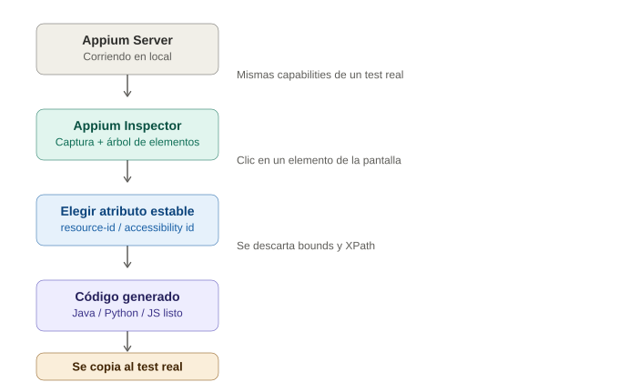

# Appium Inspector en profundidad

## La analogía general

Ya vimos que Appium Inspector es como las "gafas especiales" que le prestas al traductor antes de entrar a la casa. Vamos a profundizar: imagina que eres un detective que necesita **describir a un sospechoso a la policía** para que puedan encontrarlo después. No basta con decir "un hombre" — necesitas dar detalles específicos: nombre, altura, color de ropa, cicatrices. Appium Inspector es la herramienta que te deja **pararte frente al sospechoso (los elementos de la app) y anotar sus características exactas**, para que después tu código (el test) pueda encontrarlo sin ambigüedad.

Sin el Inspector, estarías intentando describir a alguien que nunca viste — adivinando locators a ciegas, revisando el código fuente de la app manualmente (si es que tienes acceso a él), o copiando locators de otro tutorial que puede que ni siquiera coincidan con tu app.

---

## 1. Qué es exactamente y cómo se conecta

Appium Inspector es una **aplicación de escritorio separada** (Electron app) — no es parte del Appium Server ni de tu código de test. Se conecta al mismo Appium Server que usarías normalmente, mandándole las mismas capabilities que ya conoces.

```json
{
  "platformName": "Android",
  "appium:automationName": "UiAutomator2",
  "appium:deviceName": "emulator-5554",
  "appium:app": "/ruta/a/mi-app.apk"
}
```

> **Analogía:** es como llenar el mismo formulario de reserva de hotel que ya conoces, pero esta vez **no para hacer el checkin real** — es para que un inspector de calidad entre primero a la habitación, tome fotos de cada mueble, y anote la ubicación exacta de cada uno antes de que lleguen los huéspedes (tus tests). El formulario es idéntico, el propósito de la visita es distinto.

### Pasos para conectar

1. Arranca el Appium Server (`appium` en la terminal, o desde la app de escritorio de Appium Server si la tienes instalada).
2. Abre Appium Inspector.
3. Pega el JSON de capabilities en el panel de "Desired Capabilities".
4. Indica la URL del servidor (usualmente `http://127.0.0.1:4723`).
5. Clic en "Start Session".

> **Analogía:** es literalmente marcar el mismo número de teléfono del hotel (el Appium Server) y decir "no vengo a hospedarme, vengo a hacer la inspección previa de la propiedad" — usas el mismo canal de comunicación, pero con un propósito distinto.

---

## 2. El árbol de elementos (jerarquía)

Una vez conectado, el Inspector te muestra dos cosas lado a lado:
- **Una captura visual** de la pantalla actual de la app.
- **Un árbol jerárquico** (tipo carpetas anidadas) con todos los elementos que existen en esa pantalla.

Al hacer clic en cualquier parte de la captura visual, el Inspector resalta ese elemento en el árbol y te muestra **todos sus atributos**: `resource-id`, `content-desc`, `text`, `class`, `bounds` (coordenadas), etc.

> **Analogía:** es como tener una ficha policial completa del sospechoso apenas lo señalas en una foto — no solo ves su cara, ves su nombre completo, dirección, señas particulares, todo en un solo panel. No tienes que adivinar ni memorizar nada; está todo documentado ahí, frente a ti.

### Ejemplo de lo que verías para un botón de "Iniciar sesión"

```
class: android.widget.Button
resource-id: com.miapp:id/btn_login
content-desc: Botón de inicio de sesión
text: "Iniciar sesión"
bounds: [120,540][360,600]
```

> **Analogía:** esta ficha es exactamente lo que un buen detective anotaría: "sospechoso encontrado en la esquina de la calle X con Y (`bounds`), usa un gafete con el número de placa Z (`resource-id`), responde al nombre 'Iniciar sesión' (`text`)". Cualquiera de estos datos podría servir para encontrarlo después, pero algunos son mucho más confiables que otros.

---

## 3. Cuál atributo usar como locator (y por qué esto es la parte más importante)

No todos los atributos son igual de confiables. El Inspector los muestra todos, pero **elegir el correcto** es la habilidad real que hay que desarrollar aquí.

| Atributo | Confiabilidad | Por qué |
|---|---|---|
| `resource-id` / `content-desc` (`accessibility id`) | 🟢 Alta | Suelen ser estables entre versiones de la app; los desarrolladores rara vez los cambian sin querer |
| `text` | 🟡 Media | Cambia si la app soporta varios idiomas, o si el copy del botón se actualiza |
| `class` | 🟡 Media | Útil combinado con otros atributos, pero solo no distingue entre 10 botones del mismo tipo |
| `bounds` (coordenadas) | 🔴 Baja | Cambia con cualquier ajuste de diseño, tamaño de pantalla o resolución — es el equivalente a identificar a alguien "por dónde estaba parado" en vez de por su nombre |

> **Analogía:** es la diferencia entre identificar a alguien por su **número de identificación oficial** (`resource-id` — casi nunca cambia y es único) versus identificarlo por **"la persona que estaba parada en la esquina a las 3pm"** (`bounds` — válido solo en ese momento exacto, inútil si la persona se movió o si buscas describirlo mañana). El Inspector muestra ambas opciones, pero un buen detective siempre prioriza el dato estable sobre el circunstancial.

Este es el motivo por el que el XPath (que en el fondo casi siempre depende de la posición/estructura) es la última opción en mobile — es como describir a alguien por "el tercer sospechoso de la fila", que se rompe apenas cambia el orden.

---

## 4. Generar el código del locator automáticamente

Una ventaja práctica: Appium Inspector no solo muestra los atributos, sino que también ofrece el **snippet de código listo** en el lenguaje que se elija (Java, Python, JS), para el locator seleccionado.

```java
driver.findElement(AppiumBy.accessibilityId("Botón de inicio de sesión"));
// o
driver.findElement(AppiumBy.id("com.miapp:id/btn_login"));
```

> **Analogía:** es como si, además de dar la ficha completa del sospechoso, el sistema policial también entregara **la orden de arresto ya redactada y lista para firmar**, en el formato exacto que necesita el juzgado (el lenguaje de programación). No hay que traducir manualmente los atributos a código — solo se copia y pega.

---

## 5. Interactuar en vivo desde el propio Inspector

Antes de escribir una sola línea de test, se puede **hacer clic, escribir texto o hacer swipe directamente desde el Inspector**, y ver el resultado reflejado en el emulador/dispositivo en tiempo real. Esto sirve para confirmar que el locator elegido realmente apunta al elemento correcto, antes de automatizarlo.

> **Analogía:** es como hacer un simulacro de arresto con el sospechoso correcto antes de mandar a todo el operativo real — se confirma que se agarró a la persona correcta en un ensayo controlado, antes de comprometer recursos reales (la suite completa de tests) en base a una identificación equivocada.

---

## 6. Diferencias al inspeccionar Android vs iOS

| | Android | iOS |
|---|---|---|
| Atributo más estable | `resource-id` | `accessibility identifier` (`name`) |
| Herramienta de "vista de accesibilidad" | Basada en `UiAutomator2` | Basada en `XCUITest` |
| Atributo de texto visible | `text` | `label` o `value` |
| Estrategia de locator nativa | `-android uiautomator` (UiSelector) | `-ios predicate string` / `-ios class chain` |

> **Analogía:** es como si el mismo sistema de identificación policial usara **campos con nombres ligeramente distintos** según el país donde se investigue — en un país el campo se llama "número de cédula" y en otro "número de identificación nacional", pero el concepto de fondo (un identificador único y estable) es el mismo.

---

## 7. Errores y frustraciones comunes al usar el Inspector

| Síntoma | Causa típica |
|---|---|
| El Inspector no muestra ningún elemento (pantalla en blanco) | La app tardó en cargar y el Inspector tomó la captura demasiado pronto — hay que refrescar (`Refresh`) una vez que la app terminó de cargar |
| Un elemento aparece pero no tiene `resource-id` ni `content-desc` | Los desarrolladores no le pusieron un identificador de accesibilidad — hay que pedirles que lo agreguen, o recurrir a un locator menos estable como último recurso |
| El locator funciona en el Inspector pero falla en el test real | La app puede comportarse distinto según el estado (ej. un elemento que solo aparece después de un login) — hay que asegurarse de estar en la misma pantalla/estado al inspeccionar que al automatizar |
| Elementos duplicados con el mismo `resource-id` | Es común en listas (ej. cada fila de un `RecyclerView` reutiliza el mismo id) — en ese caso se necesita combinar el `resource-id` con el índice o con texto específico de esa fila |

---

## 8. Diagrama del flujo de inspección



*(Diagrama ilustrativo: Appium Inspector se conecta al Appium Server con las mismas capabilities de un test real, muestra el árbol de elementos de la app, y a partir de ahí se elige el atributo más estable como locator antes de generar el código.)*

---

## 9. Por qué esto importa antes de escribir locators en código

Appium Inspector convierte lo que sería "adivinar a ciegas" en un proceso **verificable y repetible**: en vez de escribir un locator y correr el test para ver si falla, se confirma visualmente que el locator es correcto **antes** de escribir una sola línea de test. Es la herramienta que hace que el siguiente tema (locators específicos de mobile) deje de ser teoría abstracta y se convierta en algo que se puede ver funcionando en pantalla mientras se aprende.
