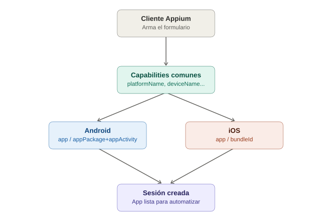

# Capabilities (Desired Capabilities) en Appium

## La analogía general

Cuando reservas una habitación de hotel por teléfono, no basta con decir "quiero una habitación" — necesitas dar información específica: en qué ciudad, para qué fecha, cuántas personas, si quieres cama king o dos individuales, si necesitas vista al mar. Sin esos datos, la recepcionista **no puede ni empezar a buscarte una habitación**.

Las **Capabilities** son exactamente eso: un formulario de reserva que le entregas al Appium Server **antes** de que intente abrir cualquier app. Le dices "quiero trabajar en Android, versión 13, en este dispositivo específico, con esta app instalada" — y solo con esos datos completos, el servidor puede empezar a buscarte la "habitación" (la sesión de automatización).

Con Selenium, existía algo parecido (`ChromeOptions`), pero era casi opcional — el navegador por defecto ya sabía abrirse solo. Con Appium, las capabilities son **obligatorias desde el primer momento**: sin ellas, el servidor ni siquiera sabe si debe hablar con Android o con iOS.

---

## 1. ¿Qué son técnicamente?

Es un objeto (diccionario/mapa clave-valor) que se envía al crear la sesión del driver:

```java
DesiredCapabilities capabilities = new DesiredCapabilities();
capabilities.setCapability("platformName", "Android");
capabilities.setCapability("appium:platformVersion", "13");
capabilities.setCapability("appium:deviceName", "emulator-5554");
capabilities.setCapability("appium:app", "/ruta/a/mi-app.apk");
capabilities.setCapability("appium:automationName", "UiAutomator2");

AndroidDriver driver = new AndroidDriver(new URL("http://127.0.0.1:4723"), capabilities);
```

> **Analogía:** es literalmente el formulario de reserva llenado con letra clara antes de llamar al hotel. Cada campo (`platformName`, `deviceName`, `app`...) es una casilla del formulario que la recepcionista (Appium Server) necesita leer antes de poder decir "sí, tengo disponibilidad" o "no, con estos datos no puedo ayudarte".

Nota el prefijo `appium:` en varias — desde que Appium adoptó el estándar W3C, las capabilities que no son parte del estándar oficial de WebDriver deben ir prefijadas así, para distinguir "esto es un campo estándar de cualquier reserva" de "esto es un campo específico de las reservas de este hotel en particular".

---

## 2. `platformName` — el país al que estás llamando

```java
capabilities.setCapability("platformName", "Android"); // o "iOS"
```

> **Analogía:** es lo primero que dices en la llamada — "quiero reservar en un hotel de **Japón**" (Android) o "quiero reservar en un hotel de **Alemania**" (iOS). Sin decir esto primero, el operador ni siquiera sabe a qué central transferir tu llamada. Esto determina si el Appium Server usa `UiAutomator2` o `XCUITest` por debajo.

---

## 3. `platformVersion` — el año/modelo específico del hotel

```java
capabilities.setCapability("appium:platformVersion", "13"); // Android 13
capabilities.setCapability("appium:platformVersion", "17.0"); // iOS 17
```

> **Analogía:** no todos los hoteles de Japón son idénticos — hay una cadena que renovó sus habitaciones en 2023 y otra que sigue con el diseño de 2018. Decir la versión exacta es como decir "quiero específicamente la sucursal remodelada en 2023" — si pides una versión de Android que el emulador/dispositivo no tiene instalada, la reserva simplemente falla porque esa "sucursal" no existe en tu inventario disponible.

Esto es más crítico de lo que parece: si tienes un emulador con Android 12 pero le pides `platformVersion: 13`, Appium no encuentra el dispositivo que coincida y la sesión no arranca — el error clásico de principiante.

---

## 4. `deviceName` — el nombre específico de la habitación/sucursal

```java
capabilities.setCapability("appium:deviceName", "emulator-5554");   // Android
capabilities.setCapability("appium:deviceName", "iPhone 15 Pro");   // iOS (simulador)
```

> **Analogía:** dentro de la cadena de hoteles japonesa, dices "específicamente en la sucursal de Shibuya, habitación 502" — no cualquier sucursal de Tokio sirve, quieres esa exacta. En Android, esto suele ser el identificador que ves al correr `adb devices`. En iOS (simulador), es el nombre exacto del modelo que tienes registrado en Xcode (`xcrun simctl list devices`).

Un detalle importante: en Android, `deviceName` en la práctica **no siempre es tan estricto** como en iOS — muchas veces Appium igual encuentra el único dispositivo/emulador conectado aunque el nombre no coincida al 100%. En iOS es mucho más estricto: si el nombre no coincide exactamente con un simulador existente, falla.

---

## 5. `app` vs `appPackage`/`appActivity` — cómo le dices "abre esta puerta específica"

Aquí hay dos formas de decirle a Appium **qué app abrir**, y es una de las partes que más confunde a los principiantes.

### Opción A: `app` — la maleta completa

```java
capabilities.setCapability("appium:app", "/ruta/local/mi-app.apk");   // Android
capabilities.setCapability("appium:app", "/ruta/local/mi-app.app");   // iOS (simulador)
```

> **Analogía:** es como decirle al botones del hotel "aquí está mi maleta completa (el `.apk`/`.app`), por favor instálala en la habitación antes de que yo llegue". Appium toma ese archivo, lo instala en el emulador/dispositivo, y luego lo abre. Cómodo, pero implica tener el archivo completo disponible localmente (o una URL a él).

### Opción B: `appPackage` + `appActivity` — la app ya está instalada, solo dime dónde tocar

```java
capabilities.setCapability("appium:appPackage", "com.miempresa.miapp");
capabilities.setCapability("appium:appActivity", "com.miempresa.miapp.MainActivity");
```

> **Analogía:** es distinto a entregar la maleta — es como decir "no traigo maleta, la app **ya vive instalada de forma permanente en esa habitación del hotel** (`appPackage` = el número de la habitación/identificador único de la app), simplemente entra directo a la sala principal (`appActivity` = la puerta específica por la que debes entrar, la pantalla inicial)". Esto solo aplica a Android — es su forma nativa de identificar apps y pantallas.

En iOS, el equivalente conceptual es `bundleId`:

```java
capabilities.setCapability("appium:bundleId", "com.miempresa.miapp");
```

> **Analogía:** el `bundleId` es como el nombre único registrado de esa app en el "directorio del hotel" — Appium lo usa para encontrar la app ya instalada, sin necesitar la maleta (`.app`) físicamente si ya está ahí.

**Regla práctica:** usa `app` cuando quieras instalar una versión nueva o limpia en cada corrida (típico en CI). Usa `appPackage`/`appActivity` (o `bundleId`) cuando la app **ya está instalada** y solo quieres reutilizarla — más rápido, porque te saltas el paso de instalación en cada test.

---

## 6. `automationName` — qué "protocolo del hotel" seguir internamente

```java
capabilities.setCapability("appium:automationName", "UiAutomator2"); // Android (el estándar hoy)
capabilities.setCapability("appium:automationName", "XCUITest");     // iOS (el estándar hoy)
```

> **Analogía:** esto es decirle al operador **qué manual de procedimientos internos** debe seguir el hotel para atenderte — hay un "curso de japonés" (`UiAutomator2`) y un "curso de alemán" (`XCUITest`). Appium tiene otros automation names más viejos o específicos (`Espresso` para Android, `Mac2` para macOS), pero `UiAutomator2` y `XCUITest` son el estándar actual para el 95% de los casos.

Si se omite esta capability, Appium suele asumir el driver por defecto según `platformName` — pero es buena práctica declararlo explícitamente, para que no haya ambigüedad sobre qué "manual" se está usando.

---

## 7. Tabla comparativa: Android vs iOS

| Capability | Android | iOS |
|---|---|---|
| `platformName` | `"Android"` | `"iOS"` |
| `automationName` | `"UiAutomator2"` | `"XCUITest"` |
| `deviceName` | Nombre del emulador/dispositivo (`emulator-5554`) — algo flexible | Nombre exacto del simulador (`"iPhone 15 Pro"`) — estricto |
| Identificar la app (maleta) | `app` → ruta a `.apk` | `app` → ruta a `.app` |
| Identificar la app (ya instalada) | `appPackage` + `appActivity` | `bundleId` |
| `platformVersion` | Versión de Android (`"13"`) | Versión de iOS (`"17.0"`) |

---

## 8. Ejemplo completo lado a lado

### Android

```java
DesiredCapabilities caps = new DesiredCapabilities();
caps.setCapability("platformName", "Android");
caps.setCapability("appium:automationName", "UiAutomator2");
caps.setCapability("appium:deviceName", "emulator-5554");
caps.setCapability("appium:platformVersion", "13");
caps.setCapability("appium:app", "/ruta/a/app-debug.apk");

AndroidDriver driver = new AndroidDriver(new URL("http://127.0.0.1:4723"), caps);
```

### iOS

```java
DesiredCapabilities caps = new DesiredCapabilities();
caps.setCapability("platformName", "iOS");
caps.setCapability("appium:automationName", "XCUITest");
caps.setCapability("appium:deviceName", "iPhone 15 Pro");
caps.setCapability("appium:platformVersion", "17.0");
caps.setCapability("appium:app", "/ruta/a/MiApp.app");

IOSDriver driver = new IOSDriver(new URL("http://127.0.0.1:4723"), caps);
```

> **Analogía final:** son dos formularios de reserva casi idénticos en estructura, pero llenados con los datos correctos de cada cadena hotelera. El "número de teléfono al que llamas" (la URL del Appium Server, `http://127.0.0.1:4723`) es el mismo en ambos casos — lo único que cambia es el contenido del formulario que se entrega al llegar.

---

## 9. Errores comunes por capabilities mal configuradas

| Síntoma | Causa típica |
|---|---|
| `A new session could not be created` | Falta alguna capability obligatoria, o `platformVersion` no coincide con ningún dispositivo/emulador disponible |
| Sesión arranca pero la app nunca abre | `appPackage`/`appActivity` mal escritos (typo en el nombre del paquete o de la actividad) |
| Funciona en Android pero falla igual en "iOS" con el mismo código | Se reutilizaron capabilities de Android sin adaptarlas (ej. dejar `automationName: UiAutomator2` con `platformName: iOS`) |
| `deviceName` no encontrado | En iOS, el nombre no coincide exactamente con un simulador existente (revisar con `xcrun simctl list devices`) |

---

## 10. Diagrama del flujo de capabilities



*(Diagrama ilustrativo: las capabilities comunes se ramifican hacia las específicas de Android o iOS, y ambas rutas convergen en la creación de la sesión de Appium.)*

---

## 11. Por qué esto importa antes del primer test funcional

Las capabilities son el punto de partida obligatorio de **cualquier** test de Appium — antes de poder usar locators, esperas o Page Object Model, primero hay que lograr que la sesión arranque correctamente. Es la razón por la que este tema va justo después del setup del entorno: sin el driver instalado (`uiautomator2`/`xcuitest`) las capabilities no tienen a quién hablarle, y sin las capabilities bien configuradas, el driver instalado no tiene con qué app ni dispositivo trabajar.
