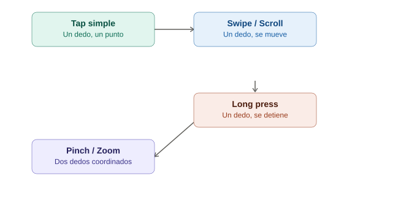

# Gestos táctiles en Appium

## La analogía general

Con Selenium, básicamente todo lo que hacía un usuario se reducía a **clicks y escritura de texto** — el mouse era la única forma de interactuar. Con un celular, en cambio, el dedo humano hace muchísimas cosas que un mouse jamás podría: deslizar, mantener presionado, pellizcar para hacer zoom, arrastrar. Es la diferencia entre **tocar un piano** con un solo dedo estático (clic) versus **tocar una guitarra**, donde se necesita deslizar, rasguear, presionar y soltar en secuencias con timing específico. Appium necesita un lenguaje mucho más rico para describir estos movimientos, y ese lenguaje son las **W3C Actions**.

---

## 1. El primer problema: `TouchAction` está deprecado

Si se buscan tutoriales viejos de Appium, se van a encontrar `TouchAction` y `MultiTouchAction` — durante años fue la forma estándar de hacer gestos. **Ya no se debe usar**: fue reemplazado por el estándar `W3C Actions` (el mismo mecanismo que ya usa Selenium para `ActionChains`, extendido para soportar dedos/toques).

> **Analogía:** es como si existieran dos manuales de instrucciones para tocar guitarra — uno viejo, descontinuado, que el fabricante ya no soporta ni actualiza, y uno nuevo que es el estándar oficial actual. Aunque el manual viejo técnicamente todavía "funciona" en algunas guitarras antiguas, cualquier guitarra nueva (versión reciente de Appium/Selenium) solo entiende bien el manual actualizado.

```java
// ❌ Forma vieja (deprecada) — evitar
TouchAction touchAction = new TouchAction(driver);
touchAction.press(point).waitAction(500).moveTo(otroPoint).release().perform();

// ✅ Forma actual — W3C Actions con PointerInput
PointerInput finger = new PointerInput(PointerInput.Kind.TOUCH, "finger");
Sequence swipe = new Sequence(finger, 0);
```

---

## 2. Tap simple

El gesto más básico — equivalente a un click, pero descrito como "un dedo baja y sube en el mismo punto".

```java
PointerInput finger = new PointerInput(PointerInput.Kind.TOUCH, "finger");
Sequence tap = new Sequence(finger, 0);
tap.addAction(finger.createPointerMove(Duration.ofMillis(0), PointerInput.Origin.viewport(), x, y));
tap.addAction(finger.createPointerDown(PointerInput.MouseButton.LEFT.asArg()));
tap.addAction(finger.createPointerUp(PointerInput.MouseButton.LEFT.asArg()));

driver.perform(Collections.singletonList(tap));
```

> **Analogía:** es describir, en cámara lenta y por escrito, algo que un humano hace sin pensar: "mueve el dedo a esta coordenada exacta, bájalo hasta tocar la pantalla, y levántalo de inmediato". Un mouse hace exactamente lo mismo con un clic — la diferencia es que aquí hay que **describir cada micro-paso por separado**, en vez de tener un método `.click()` que ya lo empaqueta todo.

**Nota práctica:** para un tap simple sobre un elemento ya localizado, no hace falta tanto código — `element.click()` sigue funcionando en Appium para taps directos sobre un elemento visible. Las W3C Actions se vuelven necesarias cuando el gesto es más complejo que un simple toque (swipe, long press, gestos con coordenadas sin un elemento claro).

---

## 3. Swipe (deslizar)

Es el gesto más común después del tap — usado para scroll, para cerrar tarjetas, para navegar entre pantallas tipo carrusel.

```java
public void swipe(int startX, int startY, int endX, int endY) {
    PointerInput finger = new PointerInput(PointerInput.Kind.TOUCH, "finger");
    Sequence swipe = new Sequence(finger, 0);

    swipe.addAction(finger.createPointerMove(Duration.ofMillis(0), PointerInput.Origin.viewport(), startX, startY));
    swipe.addAction(finger.createPointerDown(PointerInput.MouseButton.LEFT.asArg()));
    swipe.addAction(finger.createPointerMove(Duration.ofMillis(600), PointerInput.Origin.viewport(), endX, endY));
    swipe.addAction(finger.createPointerUp(PointerInput.MouseButton.LEFT.asArg()));

    driver.perform(Collections.singletonList(swipe));
}

// Swipe hacia arriba (para hacer scroll hacia abajo en el contenido)
swipe(500, 1500, 500, 300);
```

> **Analogía:** es como describirle a alguien, paso a paso, cómo pasar la página de un libro físico: "coloca el dedo en la esquina inferior derecha, presiónalo contra el papel, arrástralo lentamente hacia la izquierda durante medio segundo, y suéltalo". El `Duration.ofMillis(600)` es literalmente **la velocidad del gesto** — un swipe demasiado rápido (0ms) puede no ser reconocido por la app como un deslizamiento real, sino como un tap fallido; es la diferencia entre pasar la página suavemente y solo darle un golpecito seco a la esquina.

---

## 4. Scroll — versión "inteligente" del swipe

Muchas apps móviles tienen un helper nativo más simple para hacer scroll hasta encontrar un elemento específico, sin tener que calcular coordenadas manualmente:

```java
// Android: usando UiScrollable dentro de un UiSelector
driver.findElement(AppiumBy.androidUIAutomator(
    "new UiScrollable(new UiSelector().scrollable(true))" +
    ".scrollIntoView(new UiSelector().text(\"Configuración avanzada\"))"
));
```

> **Analogía:** en vez de decirle a alguien "desliza exactamente 500 píxeles hacia arriba, tres veces" (coordenadas fijas, frágiles), es como decirle **"sigue bajando por la lista hasta que veas la opción que dice 'Configuración avanzada'"** — el propio sistema se encarga de calcular cuántos swipes hacen falta y se detiene automáticamente al encontrar el objetivo, sin necesidad de adivinar la distancia exacta.

---

## 5. Long press (mantener presionado)

Usado típicamente para abrir menús contextuales (como "mantener presionado un ícono para ver opciones").

```java
public void longPress(int x, int y, int duracionMs) {
    PointerInput finger = new PointerInput(PointerInput.Kind.TOUCH, "finger");
    Sequence longPress = new Sequence(finger, 0);

    longPress.addAction(finger.createPointerMove(Duration.ofMillis(0), PointerInput.Origin.viewport(), x, y));
    longPress.addAction(finger.createPointerDown(PointerInput.MouseButton.LEFT.asArg()));
    longPress.addAction(new Pause(finger, Duration.ofMillis(duracionMs))); // aquí está la clave: la pausa
    longPress.addAction(finger.createPointerUp(PointerInput.MouseButton.LEFT.asArg()));

    driver.perform(Collections.singletonList(longPress));
}

longPress(300, 600, 1500); // mantener presionado 1.5 segundos
```

> **Analogía:** la diferencia entre un tap y un long press es exactamente como la diferencia entre **tocar el timbre de una casa una vez** (tap) y **mantener el dedo presionado sobre el timbre durante varios segundos** (long press) — mismo botón, mismo dedo, pero el significado para quien está adentro es completamente distinto según cuánto tiempo se mantuvo presionado. El `Pause` en el código es literalmente ese "mantener el dedo quieto" antes de soltar.

---

## 6. Pinch/zoom (pellizcar con dos dedos)

Es el gesto más complejo, porque requiere **dos dedos moviéndose simultáneamente** — dos `PointerInput` distintos, coordinados en la misma `perform()`.

```java
PointerInput dedo1 = new PointerInput(PointerInput.Kind.TOUCH, "dedo1");
PointerInput dedo2 = new PointerInput(PointerInput.Kind.TOUCH, "dedo2");

Sequence secuenciaDedo1 = new Sequence(dedo1, 0);
secuenciaDedo1.addAction(dedo1.createPointerMove(Duration.ofMillis(0), PointerInput.Origin.viewport(), 400, 400));
secuenciaDedo1.addAction(dedo1.createPointerDown(PointerInput.MouseButton.LEFT.asArg()));
secuenciaDedo1.addAction(dedo1.createPointerMove(Duration.ofMillis(600), PointerInput.Origin.viewport(), 200, 200)); // se aleja
secuenciaDedo1.addAction(dedo1.createPointerUp(PointerInput.MouseButton.LEFT.asArg()));

Sequence secuenciaDedo2 = new Sequence(dedo2, 0);
secuenciaDedo2.addAction(dedo2.createPointerMove(Duration.ofMillis(0), PointerInput.Origin.viewport(), 400, 400));
secuenciaDedo2.addAction(dedo2.createPointerDown(PointerInput.MouseButton.LEFT.asArg()));
secuenciaDedo2.addAction(dedo2.createPointerMove(Duration.ofMillis(600), PointerInput.Origin.viewport(), 600, 600)); // se aleja en dirección opuesta
secuenciaDedo2.addAction(dedo2.createPointerUp(PointerInput.MouseButton.LEFT.asArg()));

driver.perform(Arrays.asList(secuenciaDedo1, secuenciaDedo2));
```

> **Analogía:** es literalmente coreografiar un baile de dos personas al mismo tiempo — no basta con describir los pasos de un bailarín (`dedo1`) y luego los del otro (`dedo2`) por separado; **ambas coreografías se ejecutan simultáneamente** en la misma llamada a `perform()`, igual que dos dedos que se separan a la vez sobre la pantalla para hacer zoom in, o se juntan para hacer zoom out.

---

## 7. Tabla resumen

| Gesto | Complejidad | Cuándo usarlo |
|---|---|---|
| Tap | 🟢 Baja | Casi siempre basta con `element.click()` |
| Swipe | 🟡 Media | Scroll manual, cerrar tarjetas, carruseles |
| Scroll "inteligente" (`UiScrollable`) | 🟡 Media | Buscar un elemento en una lista larga sin calcular coordenadas |
| Long press | 🟡 Media | Menús contextuales, "mantener para ver opciones" |
| Pinch/zoom | 🔴 Alta | Mapas, galerías de imágenes, editores gráficos |

---

## 8. Errores comunes con gestos

| Síntoma | Causa típica |
|---|---|
| El swipe no hace nada | Duración demasiado corta (`0ms`) — la app lo interpreta como un tap fallido, no como un deslizamiento |
| El scroll no encuentra el elemento | El contenedor no es realmente "scrollable" según el atributo que Android/iOS espera, o el texto buscado no coincide exactamente |
| El long press abre el menú equivocado | Duración insuficiente — cada app puede tener un umbral distinto de "cuánto es mantener presionado" |
| El pinch no hace zoom | Las dos secuencias de dedos no están perfectamente sincronizadas en el tiempo (duraciones distintas entre `dedo1` y `dedo2`) |

---

## 9. Diagrama de complejidad de gestos



*(Diagrama ilustrativo: los gestos ordenados de menor a mayor complejidad, desde el tap simple hasta el pinch/zoom con dos dedos coordinados.)*

---

## 10. Por qué esto cierra el círculo antes del primer test funcional

Con locators (cómo encontrar elementos) y gestos (cómo interactuar con ellos) ya cubiertos, se tienen las dos piezas necesarias para escribir el primer test end-to-end real — el mismo patrón de "login + assert" que se hizo con Selenium, pero ahora con las particularidades específicas de mobile: capabilities para arrancar la sesión, locators para encontrar los campos, y gestos (aunque sea solo taps) para interactuar con ellos.
