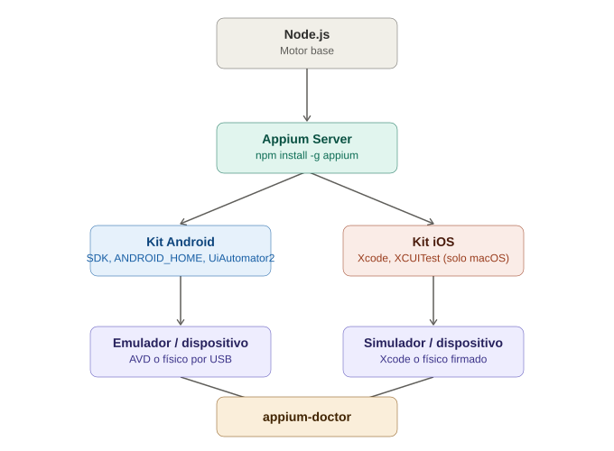

# Instalación y setup del entorno — Appium

## La analogía general

Con Selenium, instalar el entorno era como comprarte un electrodoméstico que **ya viene armado de fábrica** — lo enchufas (`pip install selenium` o la dependencia de Maven/Gradle) y funciona. Con Appium, el setup se parece más a **montar un taller de electricista completo antes de poder arreglar la primera casa**: necesitas las herramientas base (Node.js), el traductor especializado (Appium Server), y además un **kit específico por país** — un kit para trabajar en casas de Android y otro distinto para casas de iOS, cada uno con sus propios permisos, certificaciones y herramientas locales. No es que Appium sea "más complicado" porque sí — es que está coordinando piezas de terceros (Google y Apple) que Selenium nunca tuvo que tocar.

---

## 1. Node.js — la base sobre la que corre todo

Appium Server está escrito en Node.js, así que es el primer requisito, sin importar en qué lenguaje vayas a escribir tus tests después (Java, Python, JS).

```bash
node --version   # se recomienda Node 18 o superior
npm --version
```

> **Analogía:** Node.js es como la **electricidad del taller** — no es la herramienta que usas directamente para arreglar la casa, pero absolutamente nada más funciona si no está conectada primero. Aunque tú vayas a escribir tus tests en Java, el "motor" que hace correr al traductor (Appium Server) necesita esta electricidad de base.

---

## 2. Instalar el Appium Server

```bash
npm install -g appium
appium --version
appium driver list --installed
```

> **Analogía:** esto es comprar al **traductor en sí** — la persona que va a recibir tus instrucciones en el idioma universal (WebDriver) y las va a repartir al equipo correcto según el país. Antes de este paso, no tienes a nadie parado en la puerta esperando tu llamada.

### Instalar los drivers específicos de plataforma

El Appium Server, por sí solo, no sabe hablar con Android ni con iOS — necesita instalarle "el diccionario" de cada país por separado:

```bash
appium driver install uiautomator2   # para Android
appium driver install xcuitest       # para iOS (solo funciona en macOS)
```

> **Analogía:** contratar al traductor no significa que automáticamente hable japonés y alemán — tienes que **inscribirlo en el curso de idiomas específico de cada país** antes de que pueda transferir llamadas ahí. `uiautomator2` es el curso de japonés (Android); `xcuitest` es el curso de alemán (iOS, y solo puedes tomarlo si tu "escuela" está en macOS).

---

## 3. Appium Inspector (la herramienta visual, opcional pero muy recomendada)

No es parte del servidor — es una aplicación de escritorio aparte que te deja **ver la app y hacer clic en los elementos para obtener sus locators**, sin escribir código todavía.

> **Analogía:** es como las gafas especiales que le prestas al traductor antes de entrar a la casa por primera vez — le permiten "ver" el interior (la jerarquía de elementos de la app) y anotar en un papel cómo se llama cada puerta y ventana, antes de empezar a dar órdenes a ciegas.

Se aborda con más detalle en la nota de locators — aquí solo queda instalado y listo para usarse.

---

## 4. El kit de Android — Android Studio + SDK

Aunque no vayas a escribir código Android nunca, necesitas el **SDK de Android** (las herramientas de línea de comandos y las bibliotecas), que normalmente se instalan a través de Android Studio.

Piezas clave:
- **Android Studio** — trae el SDK Manager, donde descargas versiones específicas de Android (API levels).
- **SDK Platform-Tools** — incluye `adb` (Android Debug Bridge), la herramienta de línea de comandos que Appium usa por debajo para hablar con el dispositivo/emulador.
- **Variables de entorno:**

```bash
# ejemplo en Linux/Mac (~/.zshrc o ~/.bashrc)
export ANDROID_HOME=$HOME/Library/Android/sdk
export PATH=$PATH:$ANDROID_HOME/platform-tools
export PATH=$PATH:$ANDROID_HOME/emulator
```

> **Analogía:** `ANDROID_HOME` es como dejar anotada en un lugar visible del taller la **dirección exacta de la bodega de Android** ("las herramientas de esta casa están en la bodega X"). Si esa variable no está bien configurada, el traductor sencillamente no sabe dónde ir a buscar `adb`, aunque las herramientas existan en tu computadora — es la diferencia entre tener las llaves y saber en qué cajón están.

### Verificar que quedó bien instalado

```bash
adb version
adb devices   # debería listar emuladores/dispositivos conectados
```

---

## 5. El kit de iOS — Xcode (solo en macOS)

Este es el punto donde Appium **deja de ser multiplataforma para el desarrollador**: para automatizar iOS, tu máquina de desarrollo **tiene que ser una Mac**, sin excepción — Xcode no existe para Windows/Linux.

```bash
xcode-select --install
xcodebuild -version
```

`XCUITest` (el driver de iOS) internamente usa herramientas de Xcode para instrumentar la app — por eso la dependencia es tan fuerte.

> **Analogía:** es como si el curso de idioma alemán **solo se pudiera tomar físicamente en Alemania** — no existe una versión online ni una sede en otro país. Si tu computadora no es una Mac, simplemente no puedes inscribir al traductor en ese curso; tendrás que rentar (usar un servicio en la nube tipo BrowserStack o Sauce Labs) una Mac ajena para lograrlo.

### Certificados y perfiles (solo relevante para dispositivos físicos)

Para correr en un iPhone real (no en el simulador), además necesitas una cuenta de Apple Developer y firmar la app con un certificado — un paso que no existe en Android para pruebas locales.

> **Analogía:** es el equivalente a necesitar un **permiso de residencia firmado por el gobierno** para poder entrar físicamente a una casa real en ese país — el simulador es como visitar una réplica de la casa dentro de un parque temático, donde no te piden ese papeleo.

---

## 6. Emuladores/simuladores vs dispositivos reales

| | Android | iOS |
|---|---|---|
| Virtual | **Emulador** (AVD — Android Virtual Device) | **Simulador** (viene con Xcode) |
| Real | Dispositivo físico conectado por USB (modo desarrollador activado) | iPhone/iPad físico (requiere certificado de firma) |

> **Analogía:** el emulador/simulador es una **réplica de la casa dentro de un parque temático** — perfecta para practicar, pero técnicamente no es la casa real (no tiene, por ejemplo, GPS real, cámara real, o el hardware exacto de un fabricante específico). El dispositivo físico es la **casa de verdad**, con todas sus particularidades — a veces un bug solo aparece ahí porque el "parque temático" no reproduce el 100% del comportamiento real del hardware.

Crear un emulador Android:

```bash
avdmanager create avd -n pixel6_test -k "system-images;android-33;google_apis;x86_64"
emulator -avd pixel6_test
```

Listar simuladores de iOS disponibles (macOS):

```bash
xcrun simctl list devices
```

---

## 7. Verificación final: `appium-doctor`

Antes de escribir el primer test, existe una herramienta que revisa **todo el setup de una vez** y te dice específicamente qué falta:

```bash
npm install -g @appium/doctor
appium-doctor --android   # revisa el entorno de Android
appium-doctor --ios       # revisa el entorno de iOS (solo en Mac)
```

> **Analogía:** es como llamar a un **inspector de obra** antes de abrir el taller al público — revisa que la electricidad esté bien conectada (Node.js), que el traductor tenga sus diplomas (drivers instalados), y que la dirección de la bodega esté correctamente anotada (`ANDROID_HOME`). Te entrega una lista clara de qué le falta arreglar antes de recibir al primer cliente (tu primer test).

---

## 8. Diagrama del entorno completo



*(Diagrama ilustrativo: Node.js y Appium Server como base común, ramificándose hacia el kit de Android (SDK, `ANDROID_HOME`, `UiAutomator2`) y el kit de iOS (Xcode, `XCUITest`), cada uno terminando en un emulador/simulador o un dispositivo físico.)*

---

## 9. Tabla resumen

| Pieza | Obligatorio para | Analogía |
|---|---|---|
| Node.js | Ambas plataformas | La electricidad del taller |
| Appium Server | Ambas plataformas | El traductor contratado |
| `uiautomator2` | Android | Curso de idioma japonés |
| `xcuitest` | iOS (solo macOS) | Curso de idioma alemán, presencial en Alemania |
| Android Studio + SDK | Android | La bodega de herramientas de esa casa |
| `ANDROID_HOME` | Android | La dirección anotada de la bodega |
| Xcode | iOS | La escuela física en Alemania |
| Certificado Apple Developer | iOS en dispositivo real | Permiso de residencia firmado por el gobierno |
| Emulador / Simulador | Pruebas locales rápidas | Réplica en un parque temático |
| Dispositivo físico | Pruebas realistas | La casa de verdad |
| `appium-doctor` | Diagnóstico general | El inspector de obra |

---

## 10. Errores comunes al iniciar

| Síntoma | Causa típica |
|---|---|
| `Could not find "adb"` | `ANDROID_HOME`/`PATH` mal configurados |
| Appium Server arranca pero no encuentra el driver | Falta instalar `uiautomator2` o `xcuitest` explícitamente |
| `xcodebuild` no reconocido | Xcode Command Line Tools no instaladas (`xcode-select --install`) |
| El emulador arranca pero Appium no lo detecta | El emulador no terminó de bootear del todo antes de correr el test (falta esperar a que `adb devices` lo liste como `device`, no como `offline`) |
| Todo instalado pero nada funciona en Mac con chip M1/M2/M3 | Algunas versiones viejas de herramientas Android no tienen build nativo para Apple Silicon — revisar que se esté usando la versión de SDK/emulador compatible con ARM |

---

## 11. Por qué esto importa antes de escribir el primer test

A diferencia de Selenium, donde un `pip install selenium` te deja funcionando en minutos, con Appium **el 80% de las dudas de un principiante son de entorno, no de código**. Vale la pena correr `appium-doctor` y confirmar que todo esté verde antes de siquiera abrir el editor de código — ahorra horas de debugging que en realidad no tienen nada que ver con Selenium/Appium, sino con una variable de entorno mal puesta.
