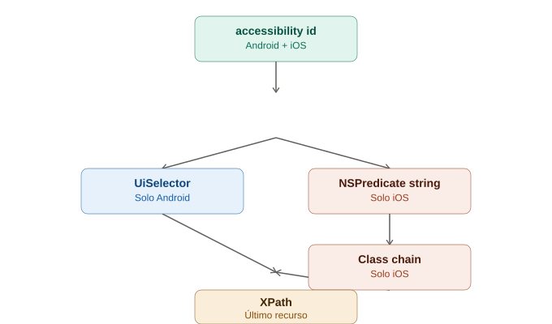

# Locators específicos de mobile

## La analogía general

Ya vimos con el Inspector que cada elemento tiene una "ficha policial" con varios atributos. Ahora toca aprender **el idioma exacto** en el que se le pide a Appium "encuéntrame a esta persona usando este dato específico de su ficha". Es como aprender las distintas formas oficiales de pedir información en una comisaría: se puede pedir "por número de placa", "por nombre completo", "por descripción física en la fila de sospechosos" — cada una tiene su propia sintaxis y su propio nivel de confiabilidad, y algunas solo existen en ciertos países (Android vs iOS).

---

## 1. `accessibility id` — el número de identificación universal

Es la estrategia **más recomendada** porque funciona igual en Android (`content-desc`) y en iOS (`accessibility identifier`/`name`) — el mismo código de locator sirve para ambas plataformas si los desarrolladores etiquetaron bien la app.

```java
driver.findElement(AppiumBy.accessibilityId("Botón de inicio de sesión"));
```

> **Analogía:** es como pedir a alguien por su **número de pasaporte internacional** — es un identificador reconocido en cualquier país, no importa si es la comisaría de Japón (Android) o de Alemania (iOS), el formato de búsqueda es el mismo. Por eso es la primera opción que se debe intentar: es estable, rápida, y multiplataforma.

**Requisito:** solo funciona si el equipo de desarrollo puso ese atributo de accesibilidad en el elemento (pensado originalmente para lectores de pantalla de personas con discapacidad visual). Si la app no lo tiene, hay que recurrir a estrategias específicas de cada plataforma.

---

## 2. `-android uiautomator` (UiSelector) — el idioma exclusivo de Android

Es una estrategia **exclusiva de Android** que permite escribir consultas más ricas usando la sintaxis de `UiSelector`, el lenguaje nativo de Android para automatización.

```java
driver.findElement(AppiumBy.androidUIAutomator(
    "new UiSelector().text(\"Iniciar sesión\")"
));

// Ejemplo más complejo: buscar por texto parcial + clase
driver.findElement(AppiumBy.androidUIAutomator(
    "new UiSelector().className(\"android.widget.Button\").textContains(\"Iniciar\")"
));

// Buscar un elemento dentro de una lista, por índice
driver.findElement(AppiumBy.androidUIAutomator(
    "new UiSelector().className(\"android.widget.TextView\").instance(2)"
));
```

> **Analogía:** es como usar el **formulario de búsqueda avanzada exclusivo de la comisaría japonesa** — tiene campos que no existen en ningún otro país (buscar "el tercer sospechoso de esta clase específica", o "alguien cuyo nombre contenga esta palabra"). Es más poderoso que el pasaporte universal, pero **solo lo entienden en Japón** — si se intenta usar este mismo formulario en la comisaría alemana (iOS), simplemente no lo van a reconocer.

**Cuándo usarlo:** cuando `accessibility id` no está disponible, y se necesitan búsquedas más específicas (por texto parcial, por posición dentro de una lista, combinando múltiples atributos).

---

## 3. `-ios predicate string` — el idioma exclusivo de iOS (consultas tipo NSPredicate)

Es el equivalente iOS de `UiSelector`, basado en el lenguaje `NSPredicate` de Apple.

```java
driver.findElement(AppiumBy.iOSNsPredicateString(
    "label == 'Iniciar sesión' AND type == 'XCUIElementTypeButton'"
));

// Búsqueda por texto parcial
driver.findElement(AppiumBy.iOSNsPredicateString(
    "label CONTAINS 'Iniciar'"
));
```

> **Analogía:** es el **formulario de búsqueda avanzada exclusivo de la comisaría alemana**, con su propia gramática ("el sospechoso cuyo apodo sea exactamente X y además su categoría sea Y"). Tiene el mismo poder expresivo que `UiSelector`, pero con una sintaxis completamente distinta — y, otra vez, **solo lo entienden en Alemania** (iOS).

---

## 4. `-ios class chain` — navegar la jerarquía como si fueran carpetas anidadas

También exclusivo de iOS, pero en vez de buscar por atributos como el predicate string, permite **navegar la estructura padre-hijo** de forma explícita, similar a un path de carpetas.

```java
driver.findElement(AppiumBy.iOSClassChain(
    "**/XCUIElementTypeButton[`label == \"Iniciar sesión\"`]"
));
```

> **Analogía:** si el predicate string es "buscar a alguien por su descripción", el class chain es como decir **"ve al tercer piso del edificio, entra a la oficina de la esquina, y ahí busca al empleado con el gafete azul"** — se navega la estructura física paso a paso en vez de solo describir a la persona. Es más verboso, pero útil cuando la ubicación estructural del elemento es más confiable que sus atributos individuales.

---

## 5. XPath — el último recurso (y por qué)

XPath **sí funciona** en mobile, exactamente como en Selenium, pero es la opción menos recomendada:

```java
driver.findElement(By.xpath("//android.widget.Button[@text='Iniciar sesión']"));
```

> **Analogía:** es como identificar a alguien únicamente por **"la tercera persona sentada en la segunda fila del auditorio"** — funciona hoy, pero en cuanto alguien se cambie de asiento (la app se actualice, cambie de versión, o el layout se reorganice), esa descripción deja de servir. Además, en mobile, calcular esa "posición en el auditorio completo" (recorrer todo el árbol de la UI) es **mucho más lento computacionalmente** que en web — cada consulta XPath en Appium recorre toda la jerarquía nativa, lo cual puede ser notablemente más lento que un `accessibility id` directo.

**Cuándo usarlo:** solo cuando ninguna otra estrategia funciona (elemento sin ningún atributo útil, y sin forma clara de aislarlo con `UiSelector`/`predicate string`).

---

## 6. Tabla comparativa completa

| Estrategia | Plataforma | Velocidad | Estabilidad | Cuándo usar |
|---|---|---|---|---|
| `accessibility id` | Android + iOS | 🟢 Rápida | 🟢 Alta | Primera opción siempre |
| `-android uiautomator` (UiSelector) | Solo Android | 🟢 Rápida | 🟢 Alta | Cuando falta `accessibility id`, o se necesitan búsquedas más ricas (texto parcial, índice) |
| `-ios predicate string` | Solo iOS | 🟢 Rápida | 🟢 Alta | Equivalente a UiSelector, pero en iOS |
| `-ios class chain` | Solo iOS | 🟡 Media | 🟡 Media | Cuando la posición estructural es más confiable que los atributos |
| XPath | Android + iOS | 🔴 Lenta | 🔴 Baja | Último recurso, sin otra alternativa disponible |

---

## 7. Ejemplo lado a lado: el mismo botón, 5 formas de encontrarlo

```java
// 1. accessibility id (ideal, funciona en ambas plataformas)
driver.findElement(AppiumBy.accessibilityId("btn_login"));

// 2. UiSelector (solo Android)
driver.findElement(AppiumBy.androidUIAutomator(
    "new UiSelector().resourceId(\"com.miapp:id/btn_login\")"
));

// 3. NSPredicate (solo iOS)
driver.findElement(AppiumBy.iOSNsPredicateString("name == 'btn_login'"));

// 4. Class chain (solo iOS)
driver.findElement(AppiumBy.iOSClassChain("**/XCUIElementTypeButton[`name == \"btn_login\"`]"));

// 5. XPath (último recurso, ambas plataformas)
driver.findElement(By.xpath("//*[@resource-id='com.miapp:id/btn_login']"));
```

> **Analogía final:** son cinco formas distintas de pedir en la comisaría que se entregue al mismo sospechoso — desde el pasaporte universal (rápido y reconocido en todos lados) hasta describirlo por dónde estaba sentado (lento, y se rompe si se movió). El objetivo siempre es usar la opción más alta posible en esta lista antes de recurrir a la siguiente.

---

## 8. Cómo el Page Object Model se adapta aquí

Como los locators cambian entre Android e iOS, el patrón ya conocido de Selenium se adapta manteniendo el mismo método público, pero con locators condicionales según la plataforma:

```java
public class LoginPage extends BasePage {

    private final By campoUsuario = MobileBy.AccessibilityId("username_field"); // funciona en ambas plataformas

    private final By botonIngresar = driver instanceof AndroidDriver
        ? AppiumBy.androidUIAutomator("new UiSelector().resourceId(\"com.miapp:id/btn_login\")")
        : AppiumBy.iOSNsPredicateString("name == 'btn_login'");

    // ... resto del Page Object igual que en Selenium
}
```

> **Analogía:** el "servicio que ofrece el electricista" (el método público, `clickIngresar()`) sigue siendo idéntico sin importar el país — pero internamente, el electricista sabe que en Japón debe tocar el interruptor de una forma y en Alemania de otra, aunque el resultado visible para el cliente (el test) sea exactamente el mismo.

---

## 9. Diagrama comparativo



*(Diagrama ilustrativo: las 5 estrategias de locator ordenadas de mayor a menor confiabilidad/velocidad, mostrando cuáles son multiplataforma y cuáles son exclusivas de Android o iOS.)*

---

## 10. Por qué esto importa antes de escribir gestos táctiles

Antes de poder hacer un tap, swipe o long press sobre un elemento (el siguiente tema), primero hay que poder **encontrarlo de forma confiable**. Elegir bien la estrategia de locator aquí evita que los gestos táctiles fallen de forma intermitente por culpa de un locator frágil — el problema no estaría en el gesto en sí, sino en que Appium nunca encontró el elemento correcto para empezar.
