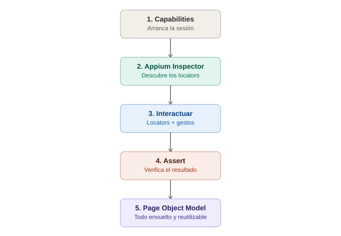

# El primer test funcional completo — Appium end-to-end

## La analogía general

Hasta ahora se aprendió, por separado, a **reservar la habitación** (capabilities), **usar las gafas de inspección** (Appium Inspector), **describir a un sospechoso** (locators), y **coreografiar gestos con el dedo** (gestos táctiles). Es como haber tomado clases separadas de manejo, mecánica y navegación — pero nunca haber hecho un viaje real de principio a fin. Este tema es exactamente eso: **subirse al auto y manejar del punto A al punto B**, usando todo lo aprendido en conjunto, en un solo recorrido con sentido.

---

## 1. Elegir una app de demo real

No hace falta una app propia para practicar — existen apps oficiales pensadas específicamente para esto:

- **Android**: `ApiDemos.apk` (viene con el propio SDK de Android, en `platforms/android-XX/samples`) o apps públicas como la de **Sauce Labs "My Demo App"**.
- **iOS**: `UICatalog` (viene con las muestras de Xcode) o la misma "My Demo App" que Sauce Labs también publica para iOS.

> **Analogía:** es como aprender a manejar en un **circuito cerrado de práctica**, diseñado a propósito con curvas, semáforos y señales de tránsito realistas, en vez de salir directo a una autopista real desde el primer día. Estas apps ya tienen botones, campos de texto y listas pensadas justo para que un principiante practique cada gesto sin arriesgar nada.

---

## 2. El flujo completo, paso a paso

### Paso 1 — Capabilities apuntando a la app de demo

```java
DesiredCapabilities caps = new DesiredCapabilities();
caps.setCapability("platformName", "Android");
caps.setCapability("appium:automationName", "UiAutomator2");
caps.setCapability("appium:deviceName", "emulator-5554");
caps.setCapability("appium:app", "/ruta/a/ApiDemos-debug.apk");

AndroidDriver driver = new AndroidDriver(new URL("http://127.0.0.1:4723"), caps);
```

> **Analogía:** este es el formulario de reserva ya conocido, pero ahora con los datos reales del "hotel de práctica" al que se va a entrar.

### Paso 2 — Usar el Inspector para sacar los locators reales

Antes de escribir el resto del test, se abre Appium Inspector con esas mismas capabilities, se navega a la pantalla de interés (por ejemplo, la lista de "Views" dentro de ApiDemos), y se anota el `resource-id` o `accessibility id` de los elementos que se van a tocar.

> **Analogía:** es la etapa de "reconocimiento del terreno" antes de manejar — igual que un piloto de carreras recorre la pista caminando antes de correrla a alta velocidad, para memorizar dónde está cada curva.

### Paso 3 — Interactuar: locators + gestos juntos

```java
// Buscar y tocar un elemento de una lista usando accessibility id
driver.findElement(AppiumBy.accessibilityId("Views")).click();

// Hacer scroll hasta encontrar un elemento específico más abajo en la lista
driver.findElement(AppiumBy.androidUIAutomator(
    "new UiScrollable(new UiSelector().scrollable(true))" +
    ".scrollIntoView(new UiSelector().text(\"Controls\"))"
)).click();

// Escribir texto en un campo
driver.findElement(AppiumBy.id("io.appium.android.apis:id/edit")).sendKeys("Hola Appium");
```

> **Analogía:** este es el tramo real de manejo — usando el volante (locators) y los pedales (gestos) ya practicados por separado, ahora encadenados en una secuencia con sentido: "gira aquí, acelera allá, frena en este punto", en vez de practicar cada acción de forma aislada.

### Paso 4 — El assert (confirmar que el viaje llegó a destino)

```java
WebElement resultado = driver.findElement(AppiumBy.id("io.appium.android.apis:id/text"));
Assertions.assertEquals("Hola Appium", resultado.getText());
```

> **Analogía:** es cruzar la línea de meta y confirmar que efectivamente se llegó al destino correcto — no basta con haber manejado, hay que verificar que el auto terminó exactamente donde debía.

---

## 3. Envolviendo todo en Page Object Model

Igual que con Selenium, un test real no debería tener locators sueltos por todos lados — se organiza en un Page Object:

```java
public class ViewsPage extends BasePage {

    private final By opcionViews = AppiumBy.accessibilityId("Views");
    private final By opcionControls = AppiumBy.androidUIAutomator(
        "new UiScrollable(new UiSelector().scrollable(true))" +
        ".scrollIntoView(new UiSelector().text(\"Controls\"))"
    );

    public ViewsPage(AndroidDriver driver) {
        super(driver);
    }

    public void abrirViews() {
        click(opcionViews);
    }

    public ControlsPage abrirControls() {
        click(opcionControls);
        return new ControlsPage(driver);
    }
}
```

> **Analogía:** es la diferencia entre memorizar de nuevo cada curva de la ruta cada vez que se maneja (locators sueltos en el test), versus tener un **GPS con la ruta ya guardada** (el Page Object) que solo necesita que se le diga "llévame a Controls" — el conocimiento detallado del camino vive en un solo lugar reutilizable.

---

## 4. Diferencia clave con Selenium: el setup/teardown

La estructura con JUnit/TestNG es prácticamente la misma ya conocida, solo que ahora el `@BeforeEach`/`@AfterEach` maneja la sesión de Appium en vez del navegador:

```java
@BeforeEach
void setUp() throws MalformedURLException {
    DesiredCapabilities caps = new DesiredCapabilities();
    caps.setCapability("platformName", "Android");
    caps.setCapability("appium:automationName", "UiAutomator2");
    caps.setCapability("appium:deviceName", "emulator-5554");
    caps.setCapability("appium:app", "/ruta/a/ApiDemos-debug.apk");

    driver = new AndroidDriver(new URL("http://127.0.0.1:4723"), caps);
}

@Test
void navegarAViewsYControls() {
    ViewsPage viewsPage = new ViewsPage(driver);
    ControlsPage controlsPage = viewsPage.abrirControls();

    assertTrue(controlsPage.estaVisible());
}

@AfterEach
void tearDown() {
    if (driver != null) driver.quit();
}
```

> **Analogía final:** todo el "protocolo de la agencia de autos" (fixtures de JUnit) sigue siendo idéntico a lo ya conocido — se recoge el auto antes de cada viaje (`setUp`) y se devuelve al final, sin importar si el viaje salió bien o mal (`tearDown`). Lo único que cambió fue **qué tipo de vehículo** se está manejando (una app móvil en vez de un navegador), pero el procedimiento alrededor es exactamente el mismo que ya se dominaba.

---

## 5. Errores comunes al armar el primer test completo

| Síntoma | Causa típica |
|---|---|
| La app abre pero el primer `findElement` falla inmediatamente | No se esperó a que la app terminara de cargar (falta un `WebDriverWait` con `visibilityOfElementLocated`, igual que en Selenium) |
| El test funciona una vez y falla en la segunda corrida | La app quedó en un estado distinto de la corrida anterior (no se reinstaló limpia, o quedó una sesión de login activa) |
| El Page Object funciona en Android pero no en iOS | Los locators no se adaptaron por plataforma (revisar la nota de locators específicos de mobile) |

---

## 6. Diagrama del flujo completo



*(Diagrama ilustrativo: capabilities para arrancar la sesión, Inspector para descubrir locators, interacción combinando locators y gestos, assert para verificar el resultado, y todo envuelto en un Page Object reutilizable.)*

---

## 7. Cierre del círculo de fundamentos de Appium

Con este tema se completan los fundamentos de Appium: arquitectura y setup, capabilities, Appium Inspector, locators de mobile, gestos táctiles, y ahora un test end-to-end real que junta todas las piezas anteriores. A partir de aquí, los siguientes pasos naturales (para cuando se quiera profundizar más) serían testing cross-platform, Appium + CI/CD, y testing en la nube con device farms — temas más avanzados que se apoyan directamente en esta base.
