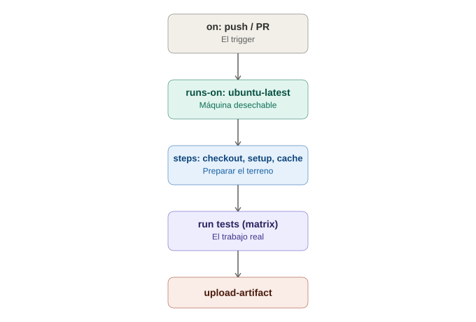

# GitHub Actions — Anatomía de un workflow

## La analogía general

Ya se vio, en la nota conceptual de CI/CD, que un pipeline es como una línea de ensamblaje. Un archivo `.yml` de GitHub Actions es literalmente **el manual de instrucciones escrito** de esa línea de ensamblaje — le dice a GitHub exactamente qué campana debe sonar para empezar (`on`), qué estaciones existen (`jobs`), y qué hace cada trabajador en cada estación (`steps`), todo en un archivo de texto plano que vive dentro del propio repositorio.

---

## 1. Dónde vive el archivo

```
.github/
└── workflows/
    └── tests.yml
```

> **Analogía:** GitHub tiene un cajón específico (`.github/workflows/`) donde espera encontrar los manuales de instrucciones. Cualquier archivo `.yml` que se coloque ahí, GitHub lo lee automáticamente — no hay que "registrarlo" en ningún otro lugar.

---

## 2. `on` — el trigger, la campana que arranca todo

```yaml
on:
  push:
    branches: [main]
  pull_request:
    branches: [main]
  schedule:
    - cron: '0 6 * * *'  # todos los días a las 6am UTC
```

> **Analogía:** es literalmente decirle a la fábrica **cuándo debe empezar a trabajar** — "cada vez que llegue un camión nuevo a la bodega principal" (`push` a `main`), "cada vez que alguien proponga agregar un camión" (`pull_request`), o "todos los días a la misma hora, sin importar si llegó algo nuevo o no" (`schedule`, útil para correr la suite completa de regresión cada noche).

---

## 3. `jobs` — las estaciones de trabajo

```yaml
jobs:
  test:
    runs-on: ubuntu-latest
    steps:
      - uses: actions/checkout@v4
      - name: Configurar Java
        uses: actions/setup-java@v4
        with:
          java-version: '17'
      - name: Correr tests con Gradle
        run: ./gradlew test
```

> **Analogía:** `runs-on: ubuntu-latest` es pedir **una estación de trabajo nueva y limpia** cada vez (una máquina virtual desechable, recién salida de fábrica) — nadie más usó esa máquina antes, así que no hay contaminación de ejecuciones anteriores. Cada `step` es una instrucción concreta que el trabajador de esa estación sigue en orden: primero **trae la pieza** (`actions/checkout`, que descarga el código), luego **prepara sus herramientas** (`setup-java`), y finalmente **hace el trabajo real** (`./gradlew test`).

### `uses` vs `run`

- **`uses`** — reutiliza una "receta ya empaquetada" que alguien más publicó (una **Action** de la comunidad o de GitHub). `actions/checkout` es la más común: sin ella, la máquina virtual empieza completamente vacía, sin el código del repositorio.
- **`run`** — ejecuta un comando de terminal directo, como si se escribiera manualmente en esa máquina.

> **Analogía:** `uses` es como pedirle a un proveedor externo especializado que traiga **una máquina ya armada y probada** para una tarea específica (instalar Java, cachear dependencias). `run` es dar una instrucción manual directa al trabajador, como si se le dictara el paso exacto en ese momento.

---

## 4. Matrix strategy — la misma línea de ensamblaje, en paralelo, con variaciones

```yaml
jobs:
  test:
    strategy:
      matrix:
        browser: [chrome, firefox]
        os: [ubuntu-latest, windows-latest]
    runs-on: ${{ matrix.os }}
    steps:
      - name: Correr tests
        run: ./gradlew test -Dbrowser=${{ matrix.browser }}
```

Esto crea automáticamente **4 combinaciones** (chrome+ubuntu, chrome+windows, firefox+ubuntu, firefox+windows), cada una corriendo en paralelo, sin escribir 4 jobs separados a mano.

> **Analogía:** en vez de escribir 4 manuales de instrucciones casi idénticos (uno por cada combinación de navegador y sistema operativo), se escribe **un solo manual con una tabla de variaciones al lado** — la fábrica multiplica automáticamente las estaciones necesarias para cubrir cada combinación, todas trabajando al mismo tiempo.

---

## 5. Cachear dependencias — no empezar de cero cada vez

```yaml
- name: Cachear dependencias de Gradle
  uses: actions/cache@v4
  with:
    path: ~/.gradle/caches
    key: gradle-${{ hashFiles('**/*.gradle*') }}
```

> **Analogía:** sin esto, cada vez que llega un camión nuevo a la fábrica, el trabajador tiene que **ir a comprar cada herramienta de cero** en la ferretería, aunque ya las haya comprado ayer. El caché es como tener **un cajón de herramientas que se queda en la estación de trabajo** entre una corrida y la siguiente — si nada cambió (la `key` sigue siendo la misma), no hay que volver a descargar todo.

---

## 6. Artifacts — lo que queda disponible después de que el job termina

```yaml
- name: Correr tests
  run: ./gradlew test

- name: Subir reporte de Allure
  if: always()
  uses: actions/upload-artifact@v4
  with:
    name: reporte-allure
    path: build/reports/allure-report/
```

`if: always()` asegura que el reporte se suba **incluso si los tests fallaron** — precisamente el escenario donde más se necesita revisar la evidencia.

> **Analogía:** es la caja donde se guarda el reporte de control de calidad de esa corrida específica, disponible para que cualquier persona del equipo la abra después desde la pestaña "Actions" de GitHub — sin necesitar acceso a la máquina virtual que ya se destruyó apenas terminó el job.

---

## 7. Secrets — credenciales sin exponerlas en el código

```yaml
- name: Login con credenciales de prueba
  run: ./gradlew test
  env:
    TEST_USER: ${{ secrets.TEST_USER }}
    TEST_PASSWORD: ${{ secrets.TEST_PASSWORD }}
```

Los secrets se configuran en `Settings → Secrets and variables → Actions` del repositorio — nunca viven en el código.

> **Analogía:** es la diferencia entre pegar la combinación de la caja fuerte **en un papel visible en la pared** (hardcodear la contraseña en el `.yml`) versus guardarla en **una caja fuerte separada** a la que solo la fábrica tiene acceso en el momento exacto que la necesita.

---

## 8. El workflow completo, todo junto

```yaml
name: Tests E2E

on:
  push:
    branches: [main]
  pull_request:
    branches: [main]

jobs:
  test:
    runs-on: ubuntu-latest
    strategy:
      matrix:
        browser: [chrome, firefox]
    steps:
      - uses: actions/checkout@v4

      - name: Configurar Java
        uses: actions/setup-java@v4
        with:
          java-version: '17'

      - name: Cachear dependencias
        uses: actions/cache@v4
        with:
          path: ~/.gradle/caches
          key: gradle-${{ hashFiles('**/*.gradle*') }}

      - name: Correr tests
        run: ./gradlew test -Dbrowser=${{ matrix.browser }}
        env:
          TEST_USER: ${{ secrets.TEST_USER }}
          TEST_PASSWORD: ${{ secrets.TEST_PASSWORD }}

      - name: Subir reporte
        if: always()
        uses: actions/upload-artifact@v4
        with:
          name: reporte-${{ matrix.browser }}
          path: build/reports/allure-report/
```

---

## 9. Tabla resumen

| Sección | Rol en la analogía |
|---|---|
| `on` | La campana que dispara la línea |
| `jobs` / `runs-on` | Las estaciones y su máquina desechable |
| `steps` | Las instrucciones en orden dentro de una estación |
| `strategy.matrix` | Multiplicar la línea en variaciones paralelas |
| `actions/cache` | El cajón de herramientas que no se vacía cada vez |
| `upload-artifact` | La caja con el reporte de calidad, disponible después |
| `secrets` | La caja fuerte separada de las credenciales |

---

## 10. Diagrama del flujo de un workflow



*(Diagrama ilustrativo: el trigger dispara el job en una máquina desechable, que ejecuta sus steps en orden — trayendo el código, preparando herramientas, cacheando dependencias — antes de correr los tests y subir el reporte como artifact.)*

---

## 11. Por qué esto importa antes de ver un pipeline aplicado

Con estas piezas ya identificadas, el siguiente paso natural es ver un workflow real y completo aplicado a un proyecto de esta guía — tomando exactamente el mismo tutorial de Selenium con Gradle ya construido, y explicando cada decisión de su `.yml` con este mismo vocabulario.
