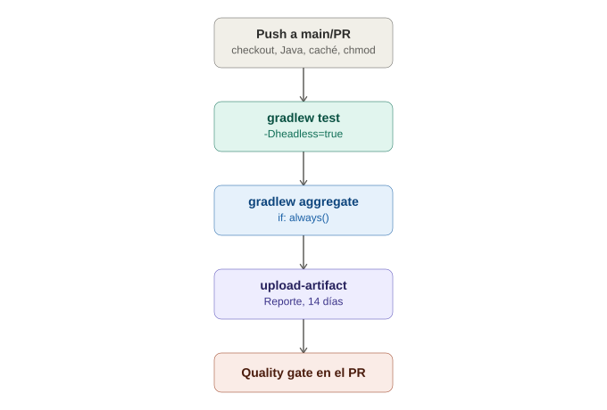

# GitHub Actions — Pipeline real aplicado (Selenium + Gradle)

## La analogía general

Ya se vio la anatomía de un workflow en piezas sueltas — el trigger, las estaciones, los pasos, el caché, los artifacts. Ahora toca **armar la fábrica completa y real**, tomando el proyecto exacto que ya se construyó en el tutorial de Selenium con Gradle. No es un ejemplo genérico inventado — es el mismo `build.gradle`, la misma estructura de Page Objects, y el mismo reporte de Allure/Serenity ya armados paso a paso, ahora conectados a una línea de ensamblaje real que corre en cada `push`.

---

## 1. El punto de partida: lo que ya existe en el proyecto

Del tutorial ya construido, se tiene:
- Un proyecto Gradle con Selenium + JUnit 5.
- Page Objects (`LoginPage`, `DashboardPage`).
- Reportes con el plugin de Allure/Serenity para Gradle.
- Modo headless configurado para Chrome.

> **Analogía:** es como llegar a la fábrica con **las máquinas y los planos ya construidos** — no hay que inventar nada nuevo de automatización, solo conectar lo que ya existe a una línea que lo dispare automáticamente en vez de que alguien tenga que prender cada máquina a mano.

---

## 2. El workflow completo, explicado en el contexto real

```yaml
name: Suite de Selenium

on:
  push:
    branches: [main]
  pull_request:
    branches: [main]

jobs:
  test:
    runs-on: ubuntu-latest

    steps:
      - name: Descargar el código
        uses: actions/checkout@v4

      - name: Configurar Java 17
        uses: actions/setup-java@v4
        with:
          distribution: 'temurin'
          java-version: '17'

      - name: Cachear dependencias de Gradle
        uses: actions/cache@v4
        with:
          path: |
            ~/.gradle/caches
            ~/.gradle/wrapper
          key: gradle-${{ hashFiles('**/*.gradle*', '**/gradle-wrapper.properties') }}

      - name: Dar permisos al wrapper de Gradle
        run: chmod +x ./gradlew

      - name: Correr los tests en modo headless
        run: ./gradlew test -Dheadless=true

      - name: Generar el reporte de Allure
        if: always()
        run: ./gradlew aggregate

      - name: Subir el reporte como artifact
        if: always()
        uses: actions/upload-artifact@v4
        with:
          name: reporte-allure
          path: build/site/serenity/
          retention-days: 14
```

---

## 3. Decisiones puntuales, explicadas una por una

### `chmod +x ./gradlew`

> **Analogía:** el manual de instrucciones de la fábrica no tiene, por defecto, **el sello de "autorizado para operar"** en la máquina virtual nueva — hay que estamparlo explícitamente antes de poder usarla. Sin este paso, el comando `./gradlew` falla con "Permission denied" en la mayoría de runners de Linux.

### `-Dheadless=true`

Recordando la nota del tutorial: el navegador nunca abre una ventana visible en la máquina virtual (no hay pantalla física en el runner), así que el modo headless no es opcional aquí — **es obligatorio**.

> **Analogía:** es literalmente correr el auto en un simulador cerrado en vez de en una pista visible — la máquina virtual del runner no tiene "ojos" para mostrar una ventana gráfica, así que el navegador debe operar sin necesitar mostrarse en pantalla.

### `if: always()` en dos pasos, no solo uno

Tanto la generación del reporte como la subida del artifact usan `if: always()` — si los tests fallan, **de todas formas** se quiere el reporte completo (mostrando exactamente qué falló), no que el pipeline se detenga antes de generarlo.

> **Analogía:** es como decir "aunque la línea de ensamblaje se detenga por una pieza defectuosa, **de todas formas quiero el informe completo de qué pasó**" — el informe de fallo es, si acaso, más valioso que el de éxito.

### `retention-days: 14`

Los artifacts no se guardan para siempre por defecto — sin especificarlo, GitHub usa un valor por defecto (usualmente 90 días) que puede consumir espacio de almacenamiento innecesario para reportes de pruebas rutinarias.

> **Analogía:** es decidir **cuánto tiempo se guarda la caja del reporte en la bodega** antes de desecharla — no todo necesita guardarse indefinidamente, especialmente en un proyecto con cientos de corridas al mes.

---

## 4. El detalle real del proyecto: por qué `aggregate` va después de `test`, no dentro

Recordando la nota de troubleshooting de Serenity+Gradle ya escrita en este repositorio: `test.finalizedBy(aggregate)` ya dispara el reporte automáticamente al terminar `test` — así que, en la mayoría de los casos, **no sería necesario** el paso explícito de "Generar el reporte de Allure" por separado.

Sin embargo, en un pipeline de CI, es una buena práctica hacerlo explícito de todas formas (como en el YAML de arriba) — deja más claro, para cualquier persona que lea el workflow, exactamente en qué momento se genera el reporte, en vez de depender de un comportamiento configurado en otro archivo (`build.gradle`) que no es visible en el propio `.yml`.

---

## 5. Cómo se ve el resultado desde GitHub

Una vez que el workflow corre:
1. En la pestaña **"Actions"** del repositorio, aparece cada corrida con su estado (✅ o ❌).
2. Dentro de cada corrida, la pestaña **"Summary"** muestra el artifact `reporte-allure` descargable como un `.zip`.
3. Si el pipeline está conectado a un Pull Request, GitHub muestra el estado directamente en la conversación del PR — bloqueando el merge si se configuró como **quality gate** obligatorio (`Settings → Branches → Branch protection rules`).

> **Analogía:** esto es literalmente el tablero de control de la fábrica, visible para cualquiera del equipo — no hace falta pedirle a la persona que corrió el pipeline "¿cómo salió?", el tablero ya lo muestra públicamente, con la caja del reporte lista para que cualquiera la abra.

---

## 6. Errores comunes al aplicar esto a un proyecto real

| Síntoma | Causa típica |
|---|---|
| `Permission denied` al correr `./gradlew` | Falta el paso `chmod +x ./gradlew` |
| El navegador nunca abre / timeout constante | Falta el flag headless, o el `WebDriver` intenta abrir una ventana gráfica inexistente |
| El artifact no aparece aunque el job "pasó" | El `path` del `upload-artifact` no coincide con la carpeta real donde Allure/Serenity genera el reporte — confirmar la ruta exacta con `ls` en un paso de debug temporal |
| El caché nunca cambia entre corridas, incluso tras actualizar dependencias | La `key` del caché no incluye todos los archivos relevantes (`hashFiles` debe cubrir todos los `.gradle`/`gradle-wrapper.properties` que afectan las dependencias) |

---

## 7. Tabla resumen: de la teoría a este proyecto específico

| Concepto genérico (nota anterior) | Cómo se ve aquí, aplicado |
|---|---|
| Trigger | `push`/`pull_request` a `main` |
| Job / runner | Un solo job, `ubuntu-latest` |
| Steps de preparación | `checkout`, `setup-java`, `cache`, `chmod` |
| El trabajo real | `./gradlew test -Dheadless=true` |
| Artifact | El reporte de Allure/Serenity, con retención de 14 días |
| Quality gate (opcional) | Branch protection rule bloqueando merge si el job falla |

---

## 8. Diagrama del pipeline aplicado



*(Diagrama ilustrativo: el push dispara la preparación del entorno (checkout, Java, caché, permisos), corre los tests en modo headless, genera y sube el reporte como artifact incluso si algo falló, y opcionalmente actúa como quality gate sobre el Pull Request.)*

---

## 9. Por qué esto cierra el círculo entre CI/CD y todo lo demás

Con esta nota, el círculo queda cerrado: el mismo proyecto que se construyó desde cero (setup → Page Object Model → esperas → screenshots → reportes) ahora corre automáticamente en cada cambio, sin depender de que nadie lo ejecute manualmente. Es la diferencia real entre "tener tests" y "tener una red de seguridad activa" para el proyecto.
