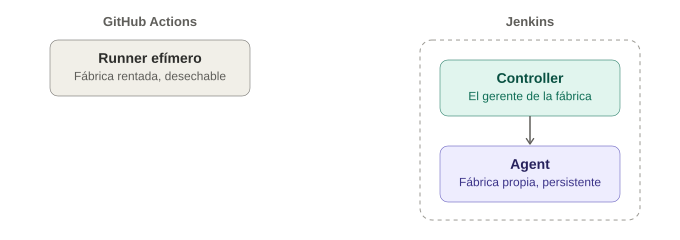

# Jenkins — Conceptos y tu primer pipeline

## La analogía general

GitHub Actions es como una **fábrica de renta por horas** — se llega, se usa una máquina completamente nueva y desechable, y cuando se termina, la fábrica desaparece hasta la próxima vez que se necesite. Jenkins es lo opuesto: es **una fábrica propia, construida y mantenida por el propio equipo**, que vive permanentemente en un servidor (propio, de la empresa, o en la nube administrada por uno mismo). Nadie la renta ni la presta — el equipo es responsable de instalarla, actualizarla, y decidir exactamente qué máquinas tiene adentro.

Esta diferencia de fondo (infraestructura efímera y ajena vs. infraestructura propia y persistente) explica casi todas las diferencias prácticas entre ambas herramientas.

---

## 1. Arquitectura: Master/Controller y Agents

Jenkins tiene una arquitectura de dos piezas:

- **Controller** (antes llamado "master") — el cerebro central: la interfaz web, la configuración, la cola de trabajos.
- **Agents** (antes "slaves") — las máquinas que efectivamente ejecutan los pipelines. Pueden ser la misma máquina que el controller, o máquinas separadas conectadas a él.

> **Analogía:** el **Controller** es la oficina central de la fábrica, donde está el gerente que recibe los pedidos y decide qué estación los va a atender. Los **Agents** son las estaciones de trabajo reales, que pueden estar en el mismo edificio o en sucursales conectadas por radio — el gerente les asigna trabajo, pero él mismo no ensambla nada.

Esto es distinto a GitHub Actions, donde **no existe un servidor propio que mantener** — GitHub ya tiene la fábrica completa lista, solo hay que dejar el manual de instrucciones (`.yml`) en el repo.

---

## 2. El `Jenkinsfile` — el equivalente al `.yml`, pero en Groovy

```groovy
pipeline {
    agent any

    stages {
        stage('Checkout') {
            steps {
                git branch: 'main', url: 'https://github.com/tu-usuario/tu-repo.git'
            }
        }

        stage('Build') {
            steps {
                sh './gradlew build -x test'
            }
        }

        stage('Test') {
            steps {
                sh './gradlew test -Dheadless=true'
            }
        }

        stage('Reporte') {
            steps {
                sh './gradlew aggregate'
            }
        }
    }

    post {
        always {
            archiveArtifacts artifacts: 'build/site/serenity/**', allowEmptyArchive: true
        }
    }
}
```

> **Analogía:** es el mismo tipo de manual de instrucciones ya visto con GitHub Actions, pero escrito en un idioma distinto (Groovy en vez de YAML) — la estructura de fondo (etapas, pasos, qué hacer al final) es conceptualmente la misma, solo cambia la gramática con la que se escribe.

---

## 3. Tabla de equivalencias directas con GitHub Actions

| GitHub Actions | Jenkins | Rol |
|---|---|---|
| `.github/workflows/*.yml` | `Jenkinsfile` | El manual de instrucciones |
| `on:` | Configurado en el job (webhook, poll SCM, cron) | El trigger |
| `jobs:` | `stages` | Las etapas grandes del proceso |
| `runs-on:` | `agent` | Dónde se ejecuta |
| `steps:` | `steps` | Las instrucciones dentro de una etapa |
| `uses: actions/...` | Plugins de Jenkins | Recetas empaquetadas por terceros |
| `upload-artifact` | `archiveArtifacts` | Guardar el resultado para revisar después |
| `secrets.ALGO` | Jenkins Credentials | La caja fuerte de credenciales |

Casi todo lo aprendido conceptualmente en la nota de CI/CD general y en la anatomía de GitHub Actions **se traslada directamente** — solo cambia el vocabulario específico de cada herramienta.

---

## 4. Plugins — el ecosistema que lo hace funcionar todo

Jenkins, en su instalación base, hace muy poco por sí solo. **Casi todo lo útil viene de plugins** que hay que instalar manualmente: soporte para Git, para Allure, para notificaciones de Slack, para casi cualquier cosa.

> **Analogía:** es como comprar la fábrica **completamente vacía**, sin ninguna máquina instalada — hay que ir comprando e instalando cada máquina específica que se necesita (el plugin de Git, el plugin de Allure, el plugin de Docker) una por una. GitHub Actions, en cambio, viene con un catálogo enorme de "máquinas ya certificadas y listas" (el Marketplace de Actions) que solo hay que mencionar con `uses:`, sin instalar nada en un servidor propio.

Esto es una de las razones por las que Jenkins requiere más mantenimiento: alguien tiene que mantener esos plugins actualizados, y las incompatibilidades entre versiones de plugins son un dolor de cabeza real y conocido en la comunidad.

---

## 5. Triggers: cómo Jenkins se entera de que hay un cambio

A diferencia de GitHub Actions (donde el trigger vive integrado en la misma plataforma que el código), Jenkins necesita que **alguien le avise** que hubo un cambio:

- **Webhook** — GitHub/GitLab le manda una notificación HTTP a Jenkins cada vez que hay un push (requiere que Jenkins sea accesible desde internet, o usar un túnel).
- **Poll SCM** — Jenkins mismo revisa el repositorio cada cierto tiempo ("¿hubo cambios? ¿hubo cambios?"), en vez de que le avisen.
- **Build periódico** — como un `cron`, correr en un horario fijo sin importar si hubo cambios.

> **Analogía:** el webhook es como que la fábrica de piezas **llame por teléfono** apenas envía un camión nuevo. El poll SCM es **llamar cada 5 minutos** preguntando "¿ya me enviaron algo?" — funciona, pero es menos eficiente y más lento en reaccionar.

---

## 6. La interfaz: Blue Ocean vs la clásica

Jenkins tiene dos caras visuales: la interfaz "clásica" (más antigua, funcional pero poco visual) y **Blue Ocean** (un plugin oficial con una vista mucho más moderna, mostrando las etapas del pipeline como un diagrama visual paso a paso).

> **Analogía:** es la diferencia entre leer una bitácora de la fábrica en una tabla de números, versus ver un tablero visual con lucecitas verdes/rojas por cada estación — el mismo dato, presentado de forma mucho más digerible.

---

## 7. Cuándo Jenkins tiene sentido sobre GitHub Actions

| Escenario | Conviene |
|---|---|
| Repositorio ya vive en GitHub, sin restricciones corporativas | GitHub Actions (más simple, sin servidor que mantener) |
| Empresa con infraestructura on-premise, políticas de seguridad estrictas (código no puede "salir" a servidores de terceros) | Jenkins (corre en la propia red) |
| Necesidad de integrarse con sistemas legacy internos muy específicos | Jenkins (ecosistema de plugins más amplio y flexible para casos raros) |
| Equipo pequeño, sin nadie dedicado a mantener infraestructura de CI | GitHub Actions (cero mantenimiento de servidor) |

---

## 8. Diagrama de arquitectura: fábrica rentada vs fábrica propia



*(Diagrama ilustrativo: GitHub Actions provee un runner efímero y desechable sin infraestructura propia que mantener, mientras que Jenkins requiere un Controller propio que coordina Agents persistentes, ambos bajo la responsabilidad del equipo.)*

---

## 9. Tabla resumen de este tema

| Concepto | Una frase para recordarlo |
|---|---|
| Controller | El gerente de la fábrica propia |
| Agent | La estación de trabajo que ejecuta el pipeline |
| Jenkinsfile | El manual de instrucciones, en Groovy |
| Plugin | Una máquina que hay que comprar e instalar por cuenta propia |
| Webhook / Poll SCM | Que avisen vs. tener que preguntar |
| Blue Ocean | El tablero visual moderno, opcional |

---

## 10. Por qué esto importa antes de ver GitLab CI

GitLab CI, que se verá a continuación, se parece conceptualmente mucho más a GitHub Actions que a Jenkins (mismo modelo de runners efímeros y YAML declarativo) — entender bien el contraste entre "fábrica propia" (Jenkins) y "fábrica rentada" (GitHub Actions) deja mucho más claro, por comparación, por qué GitLab CI se sentirá casi familiar de inmediato.
