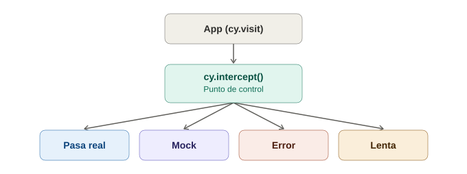

# Interceptar requests de red con `cy.intercept`

## La analogía general

Todo lo visto hasta ahora en Selenium/Appium se limitaba a interactuar con **lo que ya estaba dibujado en pantalla** — nunca era posible "escuchar" ni "modificar" las conversaciones que la app tenía por detrás con su servidor. Es como ser un espectador de teatro que solo puede ver lo que pasa en el escenario, sin acceso al guion que los actores reciben desde bambalinas.

`cy.intercept()` le da a Cypress un superpoder que Selenium/Appium nunca tuvieron de forma nativa: **pararse en medio de la conversación entre la app y su servidor**, y decidir qué hacer con esa conversación — escucharla, dejarla pasar tal cual, retrasarla, o incluso **reemplazar la respuesta por una inventada**. Es la diferencia entre ver la obra desde la butaca y ser **el apuntador que puede susurrarle al actor una línea completamente distinta a la que dice el guion real**.

---

## 1. El caso más simple: solo escuchar (espiar)

```javascript
cy.intercept('GET', '/api/usuarios').as('getUsuarios');

cy.visit('/dashboard');

cy.wait('@getUsuarios'); // espera a que esa petición específica responda

cy.get('[data-cy="tabla-usuarios"]').should('be.visible');
```

> **Analogía:** `cy.intercept()` aquí es como colocar un **micrófono oculto** en la línea telefónica entre la app y el servidor, sin alterar nada de la conversación — solo se registra. El `.as('getUsuarios')` es ponerle una **etiqueta con nombre** a esa grabación específica, para poder referirse a ella después ("reproduce la grabación que se etiquetó como 'getUsuarios'"). `cy.wait('@getUsuarios')` es literalmente decir "no sigas hasta que esa llamada telefónica específica haya terminado" — mucho más preciso que esperar un tiempo fijo, porque se espera la conversación exacta, no un número arbitrario de segundos.

---

## 2. El superpoder real: simular (mockear) la respuesta

```javascript
cy.intercept('GET', '/api/usuarios', {
  statusCode: 200,
  body: [
    { id: 1, nombre: 'Ana' },
    { id: 2, nombre: 'Luis' },
  ],
}).as('getUsuariosFalsos');

cy.visit('/dashboard');
cy.wait('@getUsuariosFalsos');

cy.get('[data-cy="tabla-usuarios"]').should('contain', 'Ana');
```

> **Analogía:** esto es el equivalente a que el **apuntador le entregue al actor un guion completamente distinto**, sin que el actor (la app) se dé cuenta de que no está hablando con el servidor real. La aplicación **cree** que recibió una respuesta legítima del backend, pero en realidad esa respuesta la inventó Cypress. Esto permite probar cómo se comporta la interfaz ante datos específicos (una lista vacía, un usuario con nombre muy largo, exactamente 3 productos) **sin depender de que esos datos existan de verdad en una base de datos**.

---

## 3. Por qué esto es tan valioso: simular errores y casos límite

```javascript
// Simular que el servidor está caído
cy.intercept('GET', '/api/usuarios', { forceNetworkError: true }).as('errorRed');

// Simular un error 500
cy.intercept('GET', '/api/usuarios', { statusCode: 500 }).as('errorServidor');

// Simular una respuesta lenta (para probar spinners de carga)
cy.intercept('GET', '/api/usuarios', (req) => {
  req.reply((res) => {
    res.delay = 3000; // responde 3 segundos después
    res.send({ statusCode: 200, body: [] });
  });
}).as('respuestaLenta');
```

> **Analogía:** en el mundo real, es casi imposible **pedirle al servidor de producción que se caiga a propósito** solo para comprobar que la app muestra el mensaje de error correcto. Con `cy.intercept()`, se puede **fabricar la caída del servidor bajo demanda**, tantas veces como se quiera, sin tocar nada real — como practicar un simulacro de incendio con humo artificial, en vez de esperar a que ocurra un incendio de verdad para ver si el protocolo funciona.

Esto conecta directamente con algo que en Selenium era mucho más difícil: probar estados de error, timeouts, o respuestas lentas de forma **determinista y repetible**, sin depender de que el backend real coopere.

---

## 4. Interceptar sin modificar, solo para esperar de forma confiable

Una de las razones más comunes para usar `cy.intercept()` no es mockear nada — es simplemente tener un punto de sincronización confiable:

```javascript
cy.intercept('POST', '/api/login').as('loginRequest');

cy.get('[data-cy="btn-login"]').click();

cy.wait('@loginRequest').its('response.statusCode').should('eq', 200);

cy.get('[data-cy="welcome-message"]').should('be.visible');
```

> **Analogía:** en vez de asumir "con 2 segundos alcanza para que el login procese" (un tiempo fijo, como el `cy.wait(2000)` que ya se vio que es un antipatrón), esto es literalmente **esperar a que llegue la carta de confirmación específica del banco**, sin importar si tardó 1 segundo o 4 — la espera es exacta, atada al evento real, no a un reloj arbitrario.

---

## 5. Comparación con lo que Selenium/Appium NO pueden hacer nativamente

| | Selenium / Appium | Cypress |
|---|---|---|
| Ver qué peticiones de red hace la app | No, requiere herramientas externas (proxy, DevTools Protocol) | Sí, nativo con `cy.intercept()` |
| Simular una respuesta falsa del servidor | No de forma nativa | Sí, directamente en el test |
| Simular un error de servidor (500, timeout) | Muy difícil sin herramientas adicionales | Trivial, una línea de código |
| Esperar una petición específica en vez de un tiempo fijo | Requiere herramientas externas de red | `cy.wait('@alias')`, nativo |

Esta es la razón concreta por la que se mencionó, desde la primera nota de Cypress, que su arquitectura (viviendo dentro del navegador) le permite hacer cosas que Selenium simplemente no puede — interceptar la red es el ejemplo más claro y práctico de esa diferencia.

---

## 6. Un cuidado importante: no abusar del mock

```javascript
// ⚠️ Si TODO se mockea, ¿qué se está probando realmente?
cy.intercept('GET', '/api/**', { fixture: 'todo-falso.json' });
```

> **Analogía:** si el apuntador le entrega al actor **un guion completamente distinto en cada escena de la obra**, en algún punto ya no se está evaluando si la obra real funciona — se está evaluando una obra de teatro imaginaria que nunca sucederá en producción. El mock es poderoso para **aislar y probar casos específicos** (un error, una lista vacía, un dato límite), pero un test end-to-end real también necesita, en algún punto, hablar con el backend de verdad para confirmar que la integración completa funciona.

**Regla práctica:** usar `cy.intercept()` sin mockear (solo para esperar/espiar) en los tests de flujo principal, y reservar el mockeo completo para tests específicos de casos límite (errores, estados vacíos, datos particulares).

---

## 7. Fixtures — los datos de prueba que alimentan el mock

```javascript
// cypress/fixtures/usuarios.json
[
  { "id": 1, "nombre": "Ana" },
  { "id": 2, "nombre": "Luis" }
]
```

```javascript
cy.intercept('GET', '/api/usuarios', { fixture: 'usuarios.json' }).as('getUsuarios');
```

> **Analogía:** en vez de escribir el guion falso directamente dentro de la escena (inline en el test), se guarda en un **archivo de guion reutilizable** que cualquier escena puede pedir prestado. Si mañana se necesita la misma lista de usuarios falsos en otros 5 tests, no se repite 5 veces — todos apuntan al mismo archivo `usuarios.json`.

---

## 8. Diagrama del flujo de `cy.intercept()`



*(Diagrama ilustrativo: `cy.intercept()` se coloca entre la app y el servidor, y desde ahí puede dejar pasar la petición real, responder con un mock de fixture, simular un error, o simular una respuesta lenta.)*

---

## 9. Tabla resumen

| Uso de `cy.intercept()` | Para qué sirve |
|---|---|
| Solo con `.as()`, sin respuesta | Espiar y sincronizar (`cy.wait('@alias')`) sin modificar nada |
| Con `body`/`statusCode` | Mockear una respuesta específica y controlada |
| Con `forceNetworkError` | Simular que el servidor no responde en absoluto |
| Con `delay` | Simular lentitud de red, útil para probar spinners/loaders |
| Con `fixture` | Reutilizar datos de prueba guardados en archivo, en vez de inline |

---

## 10. Por qué esto importa antes del primer test funcional

`cy.intercept()` conecta directamente con el reintento automático ya visto: `cy.wait('@alias')` se apoya en el mismo mecanismo de reintentos que `should()`, aplicado ahora a una petición de red en vez de a un elemento del DOM. Con selectors, comandos, retry-ability e intercept ya cubiertos, solo queda un tema para cerrar el círculo de Cypress: un test end-to-end real que junte todas estas piezas.
