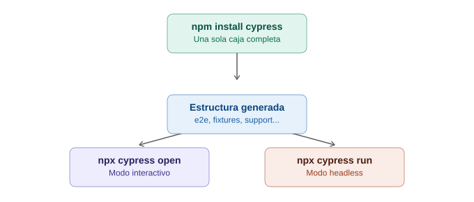

# Instalación y setup — Cypress

## La analogía general

Recuerda el "taller de electricista" que había que montar para Appium: Node.js, Appium Server, kit de Android, kit de iOS, certificados... una lista larga antes de poder hacer algo. Instalar Cypress es radicalmente distinto — es como comprar **un electrodoméstico todo-en-uno que ya viene armado, con manual incluido y todos los accesorios en la misma caja**. No hay drivers que descargar por separado, no hay que decidir entre 5 versiones de automation name, no hay certificados que firmar. Se abre la caja (`npm install`), se enchufa, y funciona.

---

## 1. La instalación en sí — una sola línea

```bash
npm install cypress --save-dev
```

> **Analogía:** comparado con el "taller completo" que había que montar para Appium (Node.js + Appium Server + drivers + SDK + Xcode + certificados), esto es literalmente **una sola caja que trae todo adentro**. Cypress empaqueta su propio navegador de pruebas, su propia interfaz visual, y su propio motor de ejecución — no hay piezas sueltas de terceros que coordinar.

Para abrir la aplicación de Cypress (la interfaz visual interactiva):

```bash
npx cypress open
```

> **Analogía:** es como encender el electrodoméstico por primera vez y que la pantalla muestre un menú visual — no hay que memorizar comandos de terminal para empezar a ver algo funcionando. La primera vez que se corre esto, Cypress **genera automáticamente toda la estructura de carpetas** que se va a necesitar, con archivos de ejemplo incluidos.

---

## 2. La estructura de carpetas que Cypress crea sola

```
cypress/
├── e2e/                 # aquí van los archivos de test (.cy.js)
├── fixtures/            # datos de prueba estáticos (JSON)
├── support/
│   ├── commands.js      # custom commands (tema futuro)
│   └── e2e.js           # configuración global que corre antes de cada test
├── downloads/           # archivos descargados durante los tests
├── screenshots/         # capturas automáticas en fallos
└── videos/              # grabación de la ejecución completa
cypress.config.js
```

> **Analogía:** es exactamente como cuando se compra un mueble de esos que vienen "listos para armar" (RTA) — no se entrega solo la madera suelta, se entregan **compartimentos ya etiquetados**: "aquí van los tornillos" (`fixtures/`), "aquí va el manual" (`support/`), "aquí va el producto final" (`e2e/`). No hay que decidir por cuenta propia cómo organizar el proyecto desde cero, como sí pasaba con Selenium/Appium, donde la estructura de carpetas la definía completamente el desarrollador.

**Comparación directa:** en Selenium, el desarrollador decidía dónde iban sus Page Objects, sus utils, sus reportes — nadie lo imponía. Cypress, en cambio, **tiene una convención fuerte de carpetas** y espera que se respete; a cambio, ahorra esa decisión.

---

## 3. `cypress.config.js` — el panel de control central

```javascript
const { defineConfig } = require("cypress");

module.exports = defineConfig({
  e2e: {
    baseUrl: "https://mi-app-de-pruebas.com",
    viewportWidth: 1280,
    viewportHeight: 720,
    defaultCommandTimeout: 6000,
  },
});
```

> **Analogía:** es el panel de configuración central del electrodoméstico — un solo lugar donde se ajusta "la temperatura por defecto" (`baseUrl`), "el tamaño del plato" (`viewportWidth`/`viewportHeight`), y "cuánto tiempo esperar antes de avisar que algo salió mal" (`defaultCommandTimeout`). En Selenium, configuraciones equivalentes solían estar repartidas entre `ChromeOptions`, el `WebDriverWait` de cada test, y variables sueltas — aquí todo vive centralizado en un solo archivo.

`baseUrl` es particularmente útil: una vez configurado, ya no se escribe la URL completa en cada test — solo la ruta relativa.

```javascript
// sin baseUrl configurado
cy.visit("https://mi-app-de-pruebas.com/login");

// con baseUrl configurado
cy.visit("/login");
```

---

## 4. Modo interactivo vs modo headless — dos formas de correr lo mismo

### Modo interactivo (para desarrollar y depurar)

```bash
npx cypress open
```

Abre una interfaz visual donde se ve el navegador ejecutando el test **en tiempo real**, con un panel lateral mostrando cada comando ejecutado, cada `cy.get()`, cada aserción — y se puede hacer clic en cualquier paso para ver exactamente cómo estaba el DOM en ese momento exacto.

> **Analogía:** es como cocinar con la puerta del horno de vidrio — se ve exactamente lo que está pasando adentro en cada segundo, sin necesidad de abrir la puerta y arriesgarse a que el pastel se baje. Selenium, en comparación, es más como un horno de puerta opaca: se corre el test y solo se conoce el resultado al final (a menos que se agreguen capturas de pantalla manualmente, como ya se vio).

### Modo headless (para CI/CD y corridas rápidas)

```bash
npx cypress run
```

Corre todos los tests sin abrir ninguna interfaz visual, mostrando el resultado en la terminal — pensado para pipelines automatizados donde nadie está mirando en vivo.

> **Analogía:** es la diferencia entre ver el horno de vidrio en vivo (modo interactivo) y simplemente **poner el temporizador y volver cuando suene** (modo headless) — el resultado es el mismo pastel, pero en un caso se supervisa paso a paso y en el otro solo importa el resultado final, generalmente porque se están corriendo muchos "pasteles" (tests) a la vez en un servidor.

---

## 5. TypeScript — soporte de fábrica (opcional pero recomendado)

A diferencia de Selenium, donde el lenguaje se elige desde el principio (Java, Python, etc.), en Cypress **siempre es JavaScript por debajo**, pero se puede escribir en TypeScript si se prefiere tipado:

```bash
# solo se necesita el archivo con extensión .ts, Cypress lo detecta solo
mv cypress/e2e/login.cy.js cypress/e2e/login.cy.ts
```

> **Analogía:** es como pedir el mismo electrodoméstico, pero con **etiquetas más detalladas en cada botón** — el aparato hace exactamente lo mismo por dentro, pero TypeScript avisa de antemano si se está a punto de apretar un botón que no existe, en vez de enterarse solo cuando ya está corriendo.

---

## 6. Tabla comparativa con la instalación de Selenium/Appium

| | Selenium | Appium | Cypress |
|---|---|---|---|
| Pasos de instalación | Dependencia de Maven/Gradle/pip + drivers de navegador | Node.js + Appium Server + drivers + SDK Android/Xcode | `npm install cypress` |
| Estructura de carpetas | La define el desarrollador | La define el desarrollador | Generada automáticamente por Cypress |
| Configuración centralizada | Repartida (capabilities, waits, etc.) | Repartida (capabilities) | Un solo archivo `cypress.config.js` |
| Ver el test corriendo en vivo con inspección de cada paso | No de forma nativa (requiere plugins) | No de forma nativa | Sí, de fábrica (modo interactivo) |
| Tiempo hasta el primer test funcionando | Horas (drivers, configuración, IDE) | Puede ser días (todo el setup de mobile) | Minutos |

---

## 7. Errores comunes al iniciar

| Síntoma | Causa típica |
|---|---|
| `npx cypress open` no abre nada | Instalación corrupta — probar `npx cypress install` para forzar la descarga del binario |
| Cypress no encuentra la app | Falta configurar `baseUrl`, o el servidor de la app no está corriendo antes de lanzar Cypress |
| Los tests corren distinto en headless que en modo interactivo | Diferencias de viewport/tamaño de ventana entre ambos modos — conviene fijar `viewportWidth`/`viewportHeight` en la config |

---

## 8. Diagrama del flujo de instalación



*(Diagrama ilustrativo: una sola instalación de npm genera automáticamente toda la estructura de carpetas, que luego se puede correr en modo interactivo para desarrollar o en modo headless para CI/CD.)*

---

## 9. Por qué esto importa antes de escribir el primer test

La facilidad de instalación no es solo comodidad — es una consecuencia directa de la arquitectura ya vista: como Cypress no depende de coordinar drivers externos de terceros (WebDriver, UiAutomator2, XCUITest), no hay piezas de otros fabricantes que puedan desincronizarse entre versiones. Todo el "electrodoméstico" viene armado y probado por el mismo equipo, en la misma caja.
