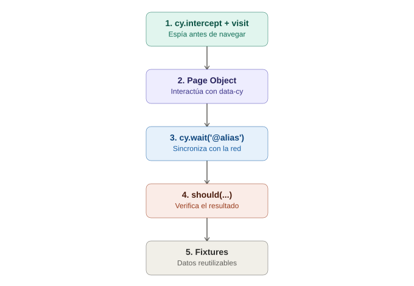

# El primer test funcional completo — Cypress end-to-end

## La analogía general

Ya se aprendió, por separado, a **usar el mismo idioma universal que Selenium pero viviendo dentro del navegador** (arquitectura), **instalar el electrodoméstico completo** (setup), **leer capítulos y escenas** (`describe`/`it`), **identificar con el gafete correcto** (selectors), **confiar en la paciencia automática** (retry-ability), y **escuchar y manipular la línea telefónica con el servidor** (`cy.intercept`). Es momento de **montar la obra de teatro completa**, con todos los actores en su lugar, en vez de ensayar cada escena por separado.

---

## 1. El escenario: login + verificación de dashboard

Se va a construir un test completo que:
1. Visita la página de login.
2. Intercepta la petición de login para sincronizar correctamente (sin tiempos fijos).
3. Escribe usuario y contraseña usando selectors `data-cy`.
4. Envía el formulario.
5. Verifica que aparece el mensaje de bienvenida.

```javascript
describe('Login de usuario', () => {
  beforeEach(() => {
    cy.intercept('POST', '/api/login').as('loginRequest');
    cy.visit('/login');
  });

  it('permite iniciar sesión con credenciales válidas', () => {
    cy.get('[data-cy="username"]').type('usuario123');
    cy.get('[data-cy="password"]').type('clave123');
    cy.get('[data-cy="btn-login"]').click();

    cy.wait('@loginRequest').its('response.statusCode').should('eq', 200);

    cy.get('[data-cy="welcome-message"]')
      .should('be.visible')
      .and('contain', 'Bienvenido');
  });

  it('muestra un error con clave incorrecta', () => {
    cy.get('[data-cy="username"]').type('usuario123');
    cy.get('[data-cy="password"]').type('clave-mala');
    cy.get('[data-cy="btn-login"]').click();

    cy.wait('@loginRequest').its('response.statusCode').should('eq', 401);

    cy.get('[data-cy="error-message"]').should('be.visible');
  });
});
```

> **Analogía:** este es el ensayo completo de la obra, de principio a fin. `beforeEach` es **preparar el escenario antes de cada función** (colocar el micrófono oculto del `cy.intercept`, y abrir el telón con `cy.visit`). Cada `it` es **una función completa de la obra**, con su propio desenlace. Nada de esto se ensaya aislado — se ve la secuencia completa tal como la vería el público (el usuario real).

---

## 2. Por qué el orden importa: `cy.intercept` antes de `cy.visit`

```javascript
// ✅ Correcto: el espía se coloca ANTES de que la conversación empiece
cy.intercept('POST', '/api/login').as('loginRequest');
cy.visit('/login');

// ❌ Incorrecto: si la petición ya se disparó, ya es tarde para escucharla
cy.visit('/login');
cy.intercept('POST', '/api/login').as('loginRequest');
```

> **Analogía:** es como intentar **poner el micrófono oculto después de que la llamada telefónica ya terminó** — no sirve de nada escuchar una conversación que ya sucedió. El micrófono siempre tiene que estar colocado antes de que se marque el número.

---

## 3. Aplicando Page Object Model (el mismo patrón, distinto idioma)

Igual que con Selenium y Appium, un test real no debería tener selectors sueltos por todo el archivo:

```javascript
// cypress/support/pages/LoginPage.js
class LoginPage {
  visitar() {
    cy.visit('/login');
  }

  ingresarUsuario(usuario) {
    cy.get('[data-cy="username"]').type(usuario);
  }

  ingresarClave(clave) {
    cy.get('[data-cy="password"]').type(clave);
  }

  enviar() {
    cy.get('[data-cy="btn-login"]').click();
  }

  loginExitoso(usuario, clave) {
    this.ingresarUsuario(usuario);
    this.ingresarClave(clave);
    this.enviar();
  }
}

export default new LoginPage();
```

```javascript
// cypress/e2e/login.cy.js
import LoginPage from '../support/pages/LoginPage';

describe('Login de usuario', () => {
  beforeEach(() => {
    cy.intercept('POST', '/api/login').as('loginRequest');
    LoginPage.visitar();
  });

  it('permite iniciar sesión con credenciales válidas', () => {
    LoginPage.loginExitoso('usuario123', 'clave123');
    cy.wait('@loginRequest');
    cy.get('[data-cy="welcome-message"]').should('contain', 'Bienvenido');
  });
});
```

> **Analogía:** es exactamente el mismo "GPS con la ruta guardada" ya visto en Selenium y Appium — el test (el cliente) solo pide "haz login exitoso con estas credenciales", sin saber ni importarle qué selector específico usa cada campo. Si mañana cambia el atributo `data-cy` de un campo, solo se corrige un lugar (`LoginPage.js`), no cada test que hace login.

---

## 4. Usando fixtures para datos reutilizables

```javascript
// cypress/fixtures/usuario-valido.json
{ "usuario": "usuario123", "clave": "clave123" }
```

```javascript
it('permite iniciar sesión con datos desde fixture', () => {
  cy.fixture('usuario-valido.json').then((datos) => {
    LoginPage.loginExitoso(datos.usuario, datos.clave);
    cy.wait('@loginRequest');
    cy.get('[data-cy="welcome-message"]').should('be.visible');
  });
});
```

> **Analogía:** en vez de tener las credenciales de prueba escritas directamente en el guion de cada escena, se guardan en una **libreta de datos aparte** que cualquier escena puede consultar — si las credenciales de prueba cambian, se actualiza un solo archivo, no cada test que las use.

---

## 5. El resultado: un test que se lee casi como una historia

```javascript
LoginPage.loginExitoso('usuario123', 'clave123');
cy.wait('@loginRequest');
cy.get('[data-cy="welcome-message"]').should('contain', 'Bienvenido');
```

> **Analogía final:** tres líneas que se leen casi en español natural: "hacer login exitoso, esperar que el login responda, confirmar el mensaje de bienvenida". Ningún detalle técnico de selectors, timeouts o mocks está a la vista — todo ese conocimiento vive escondido en las capas de abajo (Page Object, intercept configurado en el `beforeEach`), exactamente como se buscaba lograr con el mismo patrón en Selenium y Appium.

---

## 6. Errores comunes al armar el primer test completo

| Síntoma | Causa típica |
|---|---|
| `cy.wait('@loginRequest')` nunca resuelve | El `cy.intercept()` se declaró después de que la petición ya se disparó, o la URL/método no coincide exactamente |
| El test pasa localmente pero falla en CI | Diferencias de velocidad — revisar si el timeout por defecto alcanza en el entorno de CI |
| El Page Object mezcla selectors con aserciones | Igual que en Selenium: las aserciones van en el test, el Page Object solo expone acciones e información |

---

## 7. Diagrama del flujo completo



*(Diagrama ilustrativo: el intercept se coloca antes de visitar la página, luego se interactúa a través del Page Object usando selectors data-cy, se espera la petición interceptada, y finalmente se verifica el resultado con una aserción.)*

---

## 8. Cierre del círculo de fundamentos de Cypress

Con este tema se completan los fundamentos de Cypress: arquitectura, instalación, anatomía de un test, selectors, retry-ability, `cy.intercept`, y ahora un test end-to-end real que junta todas las piezas anteriores con Page Object Model y fixtures. Los siguientes pasos naturales para cuando se quiera profundizar más serían custom commands, Cypress + CI/CD, y Component Testing.
