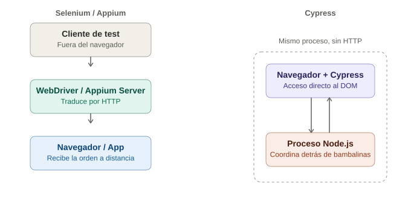

# ¿Qué es Cypress y cómo funciona?

## La analogía general

Con Selenium y Appium, viste que todo funciona como una llamada telefónica internacional: el código habla con un servidor externo (WebDriver/Appium Server), que traduce y le pasa las órdenes al navegador o al dispositivo. Hay **distancia** entre quien da la orden y quien la ejecuta — y esa distancia siempre implica latencia.

Cypress rompe completamente ese modelo. En vez de llamar por teléfono desde afuera, Cypress **se muda a vivir dentro de la casa** — corre en el mismo navegador, en el mismo hilo de ejecución que la aplicación web. Es la diferencia entre dirigir una obra de teatro **por radio desde otra ciudad** (Selenium) versus **estar parado en el escenario junto a los actores**, susurrándoles las indicaciones en tiempo real (Cypress).

---

## 1. La diferencia arquitectónica de fondo: no hay WebDriver

Esto es lo primero que hay que desaprender si se viene de Selenium/Appium: **Cypress no usa el protocolo WebDriver**. No hay un servidor intermedio traduciendo comandos — Cypress se inyecta directamente en el navegador y ejecuta JavaScript en el mismo contexto que la aplicación.

> **Analogía:** Selenium es como un operador de grúa controlando un brazo mecánico desde una cabina separada, mirando la construcción a través de una cámara — hay una máquina intermediaria entre la orden y la acción. Cypress es como un obrero que **está físicamente parado en la obra**, con las manos puestas directamente sobre los ladrillos. No necesita que nadie le traduzca nada porque ya está ahí, adentro.

Esto tiene una consecuencia enorme: como Cypress vive dentro del navegador, **tiene acceso directo y en tiempo real al DOM, a la red, y a los eventos de la aplicación** — no necesita "preguntar desde afuera" si algo cambió, lo ve cambiar directamente porque está presente en el mismo lugar donde ocurre.

---

## 2. Dos procesos trabajando en equipo: el navegador y Node.js

Cypress en realidad tiene dos piezas que colaboran:

- **El navegador** (donde corre la app y donde Cypress ejecuta los comandos de UI).
- **Un proceso de Node.js corriendo por detrás** (el "Test Runner"), que se encarga de todo lo que el navegador no puede hacer por sí solo: leer/escribir archivos, tareas del sistema operativo, y coordinar la ejecución general.

> **Analogía:** es como una obra de teatro con **un actor en el escenario** (el navegador, donde ocurre la acción visible) y **un director de escena detrás de bambalinas** (el proceso de Node.js) que maneja las luces, la utilería, y le pasa notas al actor cuando algo requiere coordinación externa. Ambos trabajan en el mismo edificio, comunicándose todo el tiempo, pero cada uno tiene un rol distinto.

---

## 3. Por qué es tan rápido comparado con Selenium

Al no tener que "salir" del navegador para preguntarle a un servidor externo qué hacer, Cypress elimina toda la latencia de red que sí existe en Selenium/Appium (cada `driver.findElement()` en Selenium implica una petición HTTP de ida y vuelta al WebDriver).

> **Analogía:** es la diferencia entre pedirle algo a alguien que está **parado al lado** (respuesta instantánea) versus pedírselo a alguien **por mensaje de texto a otra ciudad** (por rápido que sea el mensaje, siempre hay un viaje de ida y vuelta). Selenium hace ese "viaje" con cada comando; Cypress simplemente no tiene ese viaje que hacer.

---

## 4. La limitación que viene de este mismo diseño: los orígenes (dominios)

Aquí está el "precio" de vivir dentro del navegador: durante mucho tiempo, Cypress **no podía navegar fácilmente entre distintos dominios** en el mismo test (por ejemplo, la app propia y luego un proveedor externo de pago como PayPal), porque el navegador aplica reglas de seguridad estrictas (política de mismo origen) a cualquier script que corre dentro de una página — y Cypress es, técnicamente, un script corriendo ahí.

> **Analogía:** el obrero que está parado dentro de la obra (Cypress) puede hacer lo que quiera **dentro de esa propiedad** con total libertad y velocidad. Pero si el plano del proyecto de repente lo manda a **otra propiedad vecina con dueño distinto** (otro dominio), las reglas de seguridad de esa nueva propiedad no le permiten entrar tan fácilmente solo porque ya estaba trabajando al lado. Selenium, en cambio, como opera desde "afuera" con un control remoto genérico, nunca tuvo ese problema — para él, cualquier propiedad es igual de accesible desde su cabina de control externa.

Las versiones modernas de Cypress ya soportan mejor el manejo de múltiples dominios (`cy.origin()`), pero conceptualmente sigue siendo una limitación derivada directamente de su arquitectura — no es un descuido, es la consecuencia natural de vivir "adentro".

---

## 5. Comparación directa con lo que ya se conoce

| | Selenium / Appium | Cypress |
|---|---|---|
| Dónde corre el código de test | Fuera del navegador, habla por HTTP (WebDriver) | Dentro del navegador, mismo proceso que la app |
| Velocidad | Más lento (latencia de red en cada comando) | Mucho más rápido (sin viaje de ida y vuelta) |
| Multi-pestaña / multi-dominio | Soportado de forma nativa | Limitado por diseño (mejorando con `cy.origin()`) |
| Lenguajes soportados | Java, Python, JS, C#, etc. | Solo JavaScript/TypeScript |
| Acceso directo al DOM en tiempo real | No, todo pasa por comandos remotos | Sí, acceso directo |
| Interceptar tráfico de red nativamente | No (requiere herramientas externas) | Sí, con `cy.intercept()` (tema futuro) |

---

## 6. Qué significa esto para cómo se escriben los tests

Como Cypress vive dentro del navegador y observa el DOM en tiempo real, no necesita indicar explícitamente "espera a que aparezca este elemento" con la misma frecuencia que en Selenium — tiene un sistema de **reintentos automáticos** integrado (tema futuro), porque literalmente está viendo la página cambiar en vivo, en vez de tener que consultarla a distancia cada vez.

> **Analogía final:** Selenium necesita que se le diga "espera, quédate ahí, pregúntale cada rato si ya llegó" (los `WebDriverWait` ya conocidos) porque está lejos y no ve lo que pasa hasta que pregunta. Cypress, al estar parado ahí mismo, **ve el cambio ocurrir frente a sus ojos** apenas sucede — no necesita preguntar tantas veces porque nunca dejó de estar mirando.

---

## 7. Diagrama comparativo

*(Diagrama ilustrativo: Selenium/Appium como un cliente externo que habla por HTTP con un servidor intermediario antes de llegar al navegador/app; Cypress viviendo directamente dentro del navegador, coordinado por un proceso de Node.js detrás de bambalinas, sin ningún viaje de red de por medio.)*

---

## 8. Por qué esto importa antes de instalar Cypress

Entender esta diferencia arquitectónica de raíz evita mucha confusión más adelante: cuando se vea que Cypress no soporta ciertas cosas que en Selenium eran triviales (como cambiar libremente de pestaña), no será "un bug" ni "una limitación arbitraria" — será la consecuencia directa y esperada de la misma decisión de diseño que también le da a Cypress su velocidad y su capacidad de ver el DOM en tiempo real.
