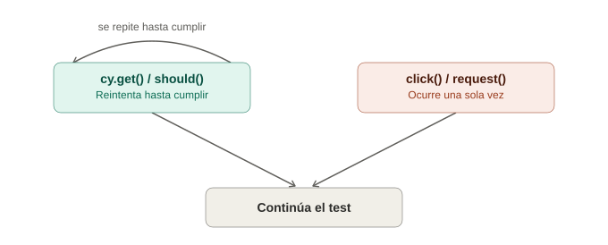

# Reintentos automáticos (retry-ability) en Cypress

## La analogía general

Ya se vio con Selenium que había que ser explícito y deliberado con las esperas: `WebDriverWait`, `expected_conditions`, elegir entre `presence_of_element_located` o `element_to_be_clickable`. Era como tener que decirle a un asistente, cada vez, "espera aquí, revisa cada cierto tiempo, y avísame cuando esto se cumpla" — un permiso explícito que había que pedir en cada ocasión.

Cypress hace algo radicalmente distinto: **casi todos sus comandos ya vienen con ese comportamiento incorporado por defecto**, sin que haya que pedirlo. Es como contratar a un asistente que **ya sabe, por su propia naturaleza, que debe tener paciencia** — no hace falta explicarle cada vez "espera a que esto pase"; simplemente lo hace, porque así fue entrenado desde el principio.

---

## 1. Qué significa exactamente "retry-ability"

Al escribir:

```javascript
cy.get('[data-cy="mensaje-exito"]').should('be.visible');
```

Cypress no revisa **una sola vez** si el elemento existe y es visible. Internamente, reintenta esta consulta completa (buscar el elemento + verificar la condición) **repetidamente**, hasta que se cumpla, o hasta agotar un tiempo límite configurado (por defecto, 4 segundos para la mayoría de aserciones).

> **Analogía:** es como tocar la puerta de un vecino que se sabe está en casa, pero tarda en abrir. En vez de tocar una sola vez y asumir "no está" si no responde de inmediato (lo que sería el comportamiento de Selenium sin `WebDriverWait`), Cypress **sigue tocando la puerta cada cierto instante, de forma automática**, durante un tiempo razonable, antes de finalmente rendirse y avisar que algo salió mal.

**El punto clave:** esto no aplica solo a `should()` — aplica a la mayoría de comandos de Cypress. `cy.get()` reintenta encontrar el elemento; `cy.click()` reintenta hasta que el elemento sea clickeable (visible, no cubierto, no deshabilitado); `cy.type()` espera a que el campo esté listo para recibir texto.

---

## 2. Comparación directa con `WebDriverWait`

```java
// Selenium — hay que ser explícito
WebDriverWait wait = new WebDriverWait(driver, Duration.ofSeconds(10));
WebElement mensaje = wait.until(EC.visibilityOfElementLocated(By.id("mensaje-exito")));
```

```javascript
// Cypress — el reintento ya está incluido, sin pedirlo
cy.get('[data-cy="mensaje-exito"]').should('be.visible');
```

> **Analogía:** en Selenium, cada vez que se quiere que alguien "tenga paciencia", hay que **redactar por escrito las instrucciones de paciencia** (crear el `WebDriverWait`, elegir la condición). En Cypress, la paciencia **ya viene de fábrica en el ADN del asistente** — no hace falta escribir esas instrucciones cada vez, porque el comportamiento por defecto ya asume que las cosas pueden tardar un poco en aparecer.

---

## 3. Qué comandos reintentan y cuáles no

Esto es fundamental y no siempre es intuitivo: **no todos los comandos de Cypress tienen retry-ability**.

### Comandos que SÍ reintentan (los que "consultan" el DOM)

```javascript
cy.get('[data-cy="boton"]');       // reintenta encontrar el elemento
cy.contains('Bienvenido');          // reintenta encontrar el texto
cy.get('...').should('be.visible'); // reintenta la aserción completa
```

### Comandos que NO reintentan (los que "actúan" una sola vez)

```javascript
cy.get('[data-cy="boton"]').click();  // el CLICK en sí no se reintenta
cy.request('/api/usuarios');           // una petición HTTP no se reintenta
```

> **Analogía:** es la diferencia entre **tocar la puerta repetidamente hasta que se abra** (retry-ability, aplicable a "buscar y verificar") versus **entrar y sentarse en el sofá una sola vez** (una acción puntual, que no tiene sentido "reintentar" — o se entra o no se entra, no hay un estado intermedio que reevaluar). Cypress reintenta la parte de "encontrar y confirmar que está listo", pero una vez que decide actuar (el clic en sí), esa acción ocurre una sola vez.

**Por qué esto importa:** el error más común de quien empieza con Cypress es pensar que `.click()` reintentará si la acción "no funcionó" — no es así. Lo que sí reintenta es la etapa previa: asegurarse de que el elemento sea clickeable antes de hacer clic.

---

## 4. Configurar los tiempos de espera

```javascript
// A nivel global, en cypress.config.js
module.exports = defineConfig({
  defaultCommandTimeout: 8000, // 8 segundos en vez de los 4 por defecto
});

// A nivel de un comando específico
cy.get('[data-cy="mensaje-lento"]', { timeout: 15000 }).should('be.visible');
```

> **Analogía:** es exactamente como decidir **cuánta paciencia extra** darle al asistente en una situación puntual — normalmente toca la puerta durante 4 segundos antes de rendirse, pero si se sabe que ese vecino en particular siempre tarda más en contestar (una petición de red lenta, un cálculo pesado), se le da un margen mayor solo para ese caso específico, sin cambiar el comportamiento general para todos los demás.

---

## 5. El error clásico: mezclar `cy.wait(tiempo fijo)` con la filosofía de Cypress

```javascript
// ❌ Antipatrón — el equivalente cypress de time.sleep()
cy.wait(3000);
cy.get('[data-cy="resultado"]').should('contain', 'Completado');

// ✅ Forma correcta — dejar que el retry-ability haga el trabajo
cy.get('[data-cy="resultado"]', { timeout: 10000 }).should('contain', 'Completado');
```

> **Analogía:** usar `cy.wait(3000)` a secas es exactamente el mismo error que usar `time.sleep()` en Selenium — es **plantarse frente a la puerta con los ojos cerrados durante exactamente 3 segundos**, sin importar si el vecino abrió al segundo 1 o si en realidad necesitaba 5. En cambio, dejar que el `should()` reintente con su propio timeout es como **tocar y verificar activamente cada instante** hasta que la puerta se abra — más rápido cuando todo va bien, y más tolerante cuando algo tarda más de lo esperado.

`cy.wait()` con un número fijo **sí existe** en Cypress, pero su uso legítimo es raro — casi siempre es preferible esperar una condición real (que el elemento aparezca, que una petición de red específica responda) en vez de un tiempo arbitrario.

---

## 6. Encadenar múltiples aserciones (cada una con su propio reintento)

```javascript
cy.get('[data-cy="carrito-contador"]')
  .should('be.visible')
  .and('have.text', '3')
  .and('have.class', 'contador-activo');
```

> **Analogía:** es como pedirle al asistente que confirme **tres cosas distintas sobre la misma puerta** antes de continuar: "confirma que está visible, confirma que dice el número correcto, y confirma que tiene la etiqueta correcta puesta" — y en cada una de esas tres verificaciones, el asistente vuelve a tener la misma paciencia de reintentar si hace falta, no solo en la primera.

---

## 7. Tabla resumen

| Concepto | Selenium | Cypress |
|---|---|---|
| Esperar explícitamente una condición | `WebDriverWait` + `ExpectedConditions` | Comportamiento por defecto en la mayoría de comandos |
| Configurar el timeout | Por instancia de `WebDriverWait` | Global (`cypress.config.js`) o por comando (`{ timeout: ... }`) |
| Esperar un tiempo fijo (antipatrón) | `Thread.sleep()` / `time.sleep()` | `cy.wait(numeroFijo)` |
| Qué se reintenta | Solo lo que se envuelva explícitamente en el wait | Consultas y aserciones (`get`, `contains`, `should`); las acciones en sí (`click`) no se repiten |

---

## 8. Errores comunes con retry-ability

| Síntoma | Causa típica |
|---|---|
| El test falla justo al límite del timeout, mostrando el estado "casi correcto" | El elemento sí cambia, pero más lento de lo esperado — aumentar el timeout específico de ese comando, no el global |
| `.click()` falla aunque el elemento "existía" | El retry-ability de `.click()` evalúa que sea clickeable (visible, no cubierto), no solo que exista — revisar si algo lo está tapando |
| Agregar `cy.wait(3000)` "arregla" el test de forma inconsistente | Síntoma de estar tapando un problema real de timing con un número mágico, en vez de esperar la condición correcta |
| Confusión sobre por qué un test "a veces" pasa y "a veces" no, incluso con retry-ability | El timeout por defecto (4s) puede no ser suficiente en un entorno de CI más lento que la máquina local — revisar si conviene subir `defaultCommandTimeout` globalmente |

---

## 9. Diagrama de comandos con y sin reintento



*(Diagrama ilustrativo: los comandos de consulta y aserción reintentan en un ciclo hasta cumplir la condición o agotar el timeout, mientras que las acciones puntuales como el clic ocurren una sola vez, una vez que el elemento fue confirmado como listo.)*

---

## 10. Por qué esto importa antes de ver `cy.intercept`

Entender el retry-ability es la base para el próximo tema: interceptar peticiones de red. Cuando se controle el tráfico de red con `cy.intercept`, la forma correcta de esperar una respuesta específica **también se apoya en este mismo mecanismo de reintentos**, en vez de usar tiempos fijos — es la misma filosofía aplicada a un caso más avanzado.
