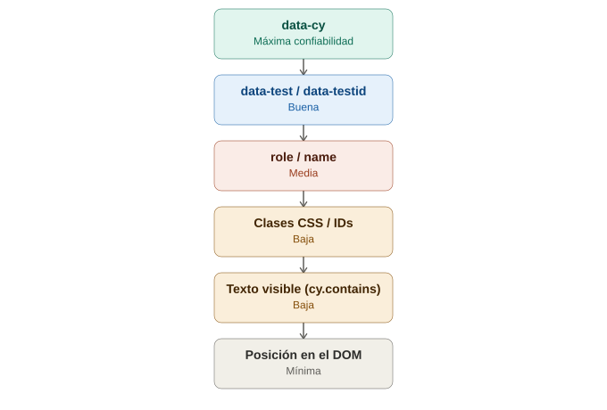

# Selectors y buenas prácticas de selección en Cypress

## La analogía general

Ya se vio con Appium que no todos los atributos son igual de confiables para encontrar un elemento — algunos son como el pasaporte universal (`accessibility id`) y otros como "la tercera persona sentada en la fila" (XPath, frágil). Cypress tiene exactamente el mismo problema de fondo, pero con una particularidad: como los tests viven **dentro del mismo código fuente de la app** (JavaScript/TypeScript, corriendo en el mismo navegador), es todavía más tentador usar atajos frágiles — y Cypress, de forma muy explícita en su propia documentación oficial, indica **qué NO hacer**, casi como un padre que advierte con nombre y apellido cuáles son los malos hábitos antes de que se adquieran.

---

## 1. La jerarquía de confiabilidad, según la propia documentación de Cypress

Cypress publica su propia "pirámide de buenas prácticas" para selectors, ordenada de mejor a peor:

```javascript
// 🟢 MEJOR — atributo dedicado exclusivamente a testing
cy.get('[data-cy="btn-login"]');

// 🟡 ACEPTABLE — atributos de datos genéricos
cy.get('[data-test="btn-login"]');
cy.get('[data-testid="btn-login"]');

// 🟠 RIESGOSO — depende del framework/accesibilidad, puede cambiar por otras razones
cy.get('[role="button"]');
cy.get('[name="login"]');

// 🔴 MAL — depende de estilos visuales
cy.get('.btn-primary.large');
cy.get('#login-btn');

// ⛔ PEOR — depende del contenido visible o de la estructura del DOM
cy.contains('Iniciar sesión');
cy.get('form > div > button:nth-child(2)');
```

> **Analogía:** es exactamente la misma idea que la ficha policial de Appium Inspector — `data-cy` es el número de identificación oficial (creado específicamente para ser encontrado, nunca cambia por accidente), mientras que una clase CSS como `.btn-primary` es como identificar a alguien por **el color de su chaqueta** — funciona hoy, pero en cuanto el diseñador cambie el color del botón (algo que pasa constantemente y no tiene nada que ver con la lógica de negocio), el test se rompe sin que nada "realmente" haya cambiado en la funcionalidad.

---

## 2. Por qué `data-cy` específicamente (no solo "cualquier atributo de datos")

Cypress recomienda que el atributo de testing sea **exclusivo para testing**, distinto de `data-test` o `data-testid` genéricos que a veces también usan otras herramientas (frameworks de analítica, otras suites de test, etc.).

```html
<!-- En el código de la app (React, Vue, lo que sea) -->
<button data-cy="btn-login" className="btn btn-primary btn-lg">
  Iniciar sesión
</button>
```

> **Analogía:** es como ponerle a un empleado un **gafete que dice literalmente "SOLO PARA AUDITORÍA"**, en vez de reutilizar el gafete normal de la empresa que también usan otros departamentos. Si el equipo de marketing decide reorganizar el sistema de gafetes normales (`data-testid` usado también para analítica), la auditoría (los tests) no debería verse afectada — porque tiene su propio sistema de identificación, dedicado únicamente a ese propósito.

**Consecuencia práctica:** cuando un desarrollador ve `data-cy="btn-login"` en el HTML, sabe inequívocamente "esto existe porque QA lo necesita, no lo toques ni lo reutilices para otra cosa" — reduce el riesgo de que alguien cambie ese atributo pensando que es solo para estilos o analítica.

---

## 3. Por qué evitar clases CSS e IDs

```javascript
// ❌ Frágil: depende del framework de estilos
cy.get('.MuiButton-root.MuiButton-containedPrimary');

// ❌ Frágil: los IDs a veces se generan dinámicamente en frameworks modernos
cy.get('#button-a3f9c2');
```

> **Analogía:** las clases CSS son responsabilidad del **equipo de diseño**, no del equipo de QA — cambian constantemente por razones que no tienen nada que ver con si el botón "funciona" o no (un rediseño, una migración de Bootstrap a Tailwind, un cambio de librería de componentes). Es como basar la identificación de un sospechoso en **la marca de ropa que llevaba puesta ese día** — la ropa cambia todos los días, la identidad de la persona no.

Los IDs generados dinámicamente (comunes en React con librerías como Material UI) son incluso peores: pueden cambiar **en cada build**, sin que nadie haya tocado nada manualmente.

---

## 4. Por qué evitar buscar por texto visible (`cy.contains`)

```javascript
// ⛔ Frágil: depende del copy exacto, del idioma, de mayúsculas/minúsculas
cy.contains('Iniciar sesión').click();
```

> **Analogía:** es como identificar a alguien por **el nombre que gritó una vez en una fiesta** — si al día siguiente decide presentarse con un apodo distinto, o si la fiesta ahora es en otro idioma (la app soporta inglés y español), ese método de identificación deja de funcionar. Un cambio de copy (de "Iniciar sesión" a "Ingresar", por ejemplo) es una decisión de producto/diseño completamente independiente de la lógica del botón — pero rompería el test igual.

**Cuándo SÍ es razonable usar `cy.contains`:** cuando el test está **verificando específicamente ese texto** como parte del resultado esperado (por ejemplo, confirmar que apareció el mensaje "Bienvenido, usuario123") — ahí el texto es el objeto de la prueba, no un simple método de localización accesorio.

---

## 5. El problema de la estructura del DOM (selectors por posición)

```javascript
// ⛔ Extremadamente frágil
cy.get('form > div:nth-child(3) > button');
```

> **Analogía:** es el equivalente exacto al "tercer sospechoso de la segunda fila" ya visto con XPath en Appium/Selenium — cualquier cambio de maquetación (agregar un campo nuevo al formulario, envolver algo en un `<div>` extra) desplaza la posición y rompe el selector, sin que la funcionalidad real del botón haya cambiado en absoluto.

---

## 6. Cómo pedirle esto al equipo de desarrollo (un problema real, no solo teórico)

A diferencia de Selenium/Appium, donde el equipo de QA suele trabajar sobre una app ya existente sin poder modificarla, en Cypress **es común y esperado** pedirle al equipo de desarrollo que agregue los atributos `data-cy` directamente en el código fuente — porque QA y desarrollo suelen compartir el mismo repositorio de JavaScript/TypeScript.

> **Analogía:** es la diferencia entre inspeccionar una casa ajena en la que no se puede tocar nada (Selenium sobre una web de terceros) versus estar **construyendo la casa junto con el arquitecto**, donde se le puede pedir desde el principio "por favor deja una marca especial en cada puerta que se va a necesitar revisar después". Como Cypress vive tan cerca del código de la aplicación, pedir esta colaboración es mucho más natural y común que en el mundo de Selenium.

---

## 7. Tabla resumen de la jerarquía completa

| Estrategia | Confiabilidad | Por qué |
|---|---|---|
| `[data-cy="..."]` | 🟢 Máxima | Dedicado exclusivamente a testing, nunca cambia por razones de diseño/negocio |
| `[data-test]` / `[data-testid]` | 🟡 Buena | Similar, pero puede ser compartido con otras herramientas (analítica, otros frameworks de test) |
| `[role]` / `[name]` | 🟠 Media | Útil para accesibilidad, pero puede cambiar por razones ajenas al testing |
| Clases CSS / IDs | 🔴 Baja | Cambian con cualquier rediseño o migración de librería de estilos |
| Texto visible (`cy.contains`) | 🔴 Baja (salvo que sea el objeto de la prueba) | Cambia con el copy, el idioma, mayúsculas |
| Posición en el DOM | ⛔ Mínima | Se rompe con cualquier cambio de maquetación |

---

## 8. Ejemplo completo: el mismo botón, de mejor a peor selector

```javascript
// 🟢 Ideal
cy.get('[data-cy="btn-login"]').click();

// 🟡 Aceptable si no hay data-cy disponible
cy.get('[data-testid="btn-login"]').click();

// 🔴 Evitar
cy.get('.btn.btn-primary.btn-lg').click();
cy.get('#login-submit-button').click();
cy.contains('Iniciar sesión').click();
```

---

## 9. Diagrama de la jerarquía de confiabilidad



*(Diagrama ilustrativo: las estrategias de selector ordenadas de mayor a menor confiabilidad, desde `data-cy` dedicado exclusivamente a testing hasta la posición en el DOM como opción menos recomendada.)*

---

## 10. Por qué esto importa antes de ver comandos y aserciones en detalle

Elegir bien el selector es la base sobre la que se apoya todo lo demás: un comando perfectamente escrito (`type`, `click`, `check`) y una aserción bien pensada no sirven de nada si el selector que los antecede es frágil y se rompe con el primer cambio de diseño. Por eso este tema se ubica justo después de la anatomía de un test — antes de profundizar en comandos y reintentos automáticos, conviene tener claro sobre qué base se va a construir cada `cy.get(...)`.
