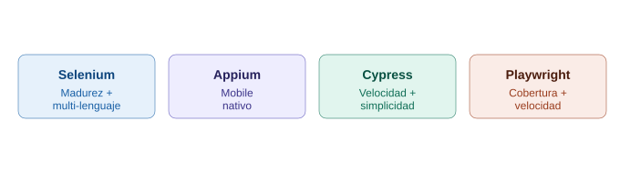

# Comparativa a 4 bandas: Selenium vs Appium vs Cypress vs Playwright

## La analogía general

Ya se conoce a los cuatro personajes por separado: **Selenium**, la agencia de seguridad global con sucursales en todo el mundo. **Appium**, la división hermana de esa misma agencia, especializada en proteger vehículos en movimiento (mobile). **Cypress**, el guardaespaldas personal que vive dentro de una sola casa. **Playwright**, el especialista con llaves maestras que conserva el alcance de la agencia grande pero opera con la velocidad del guardaespaldas personal. Esta nota los pone a los cuatro en la misma sala de decisión.

---

## 1. Resumen ejecutivo — decisión rápida

| Si la prioridad es... | Elegir... |
|---|---|
| Testing mobile nativo (Android/iOS) | **Appium** (no hay alternativa real entre las otras tres) |
| Velocidad máxima + simplicidad de setup | **Cypress** |
| Multi-navegador real (incluye Safari/WebKit) + multi-lenguaje + velocidad | **Playwright** |
| Ecosistema más maduro, máxima compatibilidad con sistemas legacy | **Selenium** |
| Equipo 100% JavaScript/TypeScript, proyecto nuevo pequeño | **Cypress** o **Playwright** |
| Equipo multi-lenguaje (Java/Python/C#), necesita mobile también | **Selenium + Appium** |

---

## 2. Arquitectura — la raíz de todo lo demás

| | Selenium | Appium | Cypress | Playwright |
|---|---|---|---|---|
| Protocolo | WebDriver (HTTP) | WebDriver (HTTP), vía UiAutomator2/XCUITest | Ninguno — vive dentro del navegador | CDP directo (Chromium) + protocolos propios (Firefox/WebKit) |
| Corre fuera del navegador/app | Sí | Sí | No | Sí |
| Plataforma | Web (navegador) | Mobile (Android/iOS nativo) | Web (navegador) | Web (navegador) |

> **Analogía:** Selenium y Appium usan el mismo "idioma de recepción" (WebDriver) — uno para hablar con navegadores, el otro con dispositivos móviles. Cypress vive dentro de la casa. Playwright entra con llaves maestras por la puerta de servicio. Appium es, literalmente, la única de las cuatro que **no compite** por el mismo trabajo que las otras tres — automatiza un tipo de aplicación completamente distinto.

---

## 3. Lenguajes soportados

| | Selenium | Appium | Cypress | Playwright |
|---|---|---|---|---|
| Lenguajes | Java, Python, JS/TS, C#, Ruby, Kotlin | Java, Python, JS/TS, C#, Ruby (mismos clientes que Selenium) | Solo JS/TS | JS/TS, Python, .NET, Java |

Selenium y Appium comparten prácticamente el mismo ecosistema de clientes (tiene sentido, usan el mismo protocolo). Cypress es la única completamente cerrada a un solo lenguaje. Playwright, aunque más joven, ya cubre casi tantos lenguajes como Selenium.

---

## 4. Velocidad de ejecución

| | Velocidad relativa |
|---|---|
| Selenium | 🟡 Media (latencia de WebDriver en cada comando) |
| Appium | 🟡 Media (mismo protocolo, más la capa nativa del dispositivo) |
| Cypress | 🟢 Alta (sin viaje de red, vive dentro del navegador) |
| Playwright | 🟢 Alta (CDP directo, sin la sobrecarga de WebDriver) |

Cypress y Playwright ganan aquí por razones distintas: Cypress porque no sale del navegador, Playwright porque usa un canal de comunicación más directo que WebDriver aunque sí sea externo.

---

## 5. Cobertura de navegadores/plataformas

| | Cobertura |
|---|---|
| Selenium | Chrome, Firefox, Safari (real), Edge, navegadores legacy |
| Appium | Android nativo, iOS nativo, apps híbridas, web móvil |
| Cypress | Chrome, Edge, Firefox bien soportados; Safari/WebKit limitado |
| Playwright | Chromium, Firefox, WebKit (real) — los tres instalados de fábrica |

Playwright es la única que iguala a Selenium en cobertura real de WebKit/Safari sin depender de un navegador de terceros — y lo hace con instalación automática, algo que a Selenium le toma configuración manual de drivers.

---

## 6. Multi-dominio y multi-contexto

| | Soporte |
|---|---|
| Selenium | Nativo, sin restricciones |
| Appium | No aplica (no navega por "dominios" en el sentido web) |
| Cypress | Limitado por arquitectura (mejorando con `cy.origin()`) |
| Playwright | Nativo, con `BrowserContext` para sesiones aisladas en paralelo |

---

## 7. Interceptar red / mocking

| | Soporte nativo |
|---|---|
| Selenium | No (requiere herramientas externas) |
| Appium | No aplica de la misma forma (apps nativas no siempre usan HTTP visible del mismo modo) |
| Cypress | Sí, `cy.intercept()` |
| Playwright | Sí, `page.route()` — con más granularidad (modificar y continuar, no solo espiar/reemplazar) |

---

## 8. Setup y curva de aprendizaje

| | Tiempo hasta el primer test |
|---|---|
| Selenium | Horas (drivers, configuración, IDE) |
| Appium | Días (Node.js, Appium Server, SDK Android/Xcode, emuladores) |
| Cypress | Minutos (`npm install cypress`) |
| Playwright | Minutos (`npm init playwright@latest`, navegadores incluidos) |

---

## 9. Ecosistema y madurez

| | Año de origen | Madurez de comunidad |
|---|---|---|
| Selenium | 2004 | Máxima — dos décadas de casos resueltos |
| Appium | 2011 | Alta, estándar de facto en mobile |
| Cypress | 2017 | Alta, comunidad JS muy activa |
| Playwright | 2020 | Creciendo muy rápido, respaldado por Microsoft |

---

## 10. Tabla de decisión final ampliada

| Escenario | Recomendación |
|---|---|
| Necesidad de automatizar una app Android/iOS nativa | **Appium** (sin alternativa entre estas cuatro) |
| App web moderna, equipo 100% JS/TS, prioridad en velocidad de desarrollo | **Cypress** |
| Necesidad de Safari real + multi-lenguaje + velocidad, sin las limitaciones de Cypress | **Playwright** |
| Equipo QA con background en Java/Python que no migrará todo a JS, y también necesita mobile | **Selenium + Appium** |
| Suite gigante corriendo en paralelo contra muchos navegadores/SOs, infraestructura ya madura en Selenium Grid | **Selenium** |
| Proyecto nuevo desde cero, sin deuda técnica previa, solo web | **Playwright** (cobertura de Selenium + velocidad de Cypress) |

---

## 11. Diagrama comparativo

*(Diagrama ilustrativo: las cuatro herramientas agrupadas por su fortaleza distintiva — Appium para mobile nativo, Cypress para velocidad y simplicidad, Playwright para cobertura+velocidad combinadas, y Selenium para madurez y alcance multi-lenguaje.)*

---

## 12. Una aclaración importante sobre esta comparativa

Appium no es realmente "competencia" de las otras tres — automatiza un tipo de aplicación distinto (apps nativas móviles) que Selenium, Cypress y Playwright no pueden tocar por sí solas. Se incluye aquí porque es parte del mismo ecosistema de decisiones que un equipo de QA enfrenta ("¿qué herramientas necesito para cubrir web + mobile?"), no porque compita directamente por el mismo trabajo que las otras tres.
