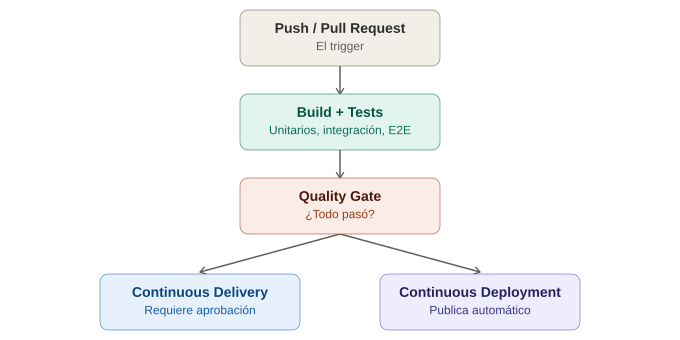

# CI/CD — Conceptos generales

## La analogía general

Imagina dos fábricas de autos. En la primera, cada trabajador ensambla su parte y **al final de la semana**, alguien revisa el auto completo — si algo no encaja, hay que desarmar media semana de trabajo para encontrar el error. En la segunda fábrica, **cada pieza que se instala pasa por un control de calidad automático en el momento**, antes de seguir a la siguiente estación — si algo falla, se detecta en minutos, no en días, y se sabe exactamente qué pieza fue.

CI/CD es esa segunda fábrica aplicada a software: en vez de que alguien revise manualmente "si todo funciona" una vez cada mucho tiempo, cada cambio de código pasa automáticamente por una línea de ensamblaje que lo compila, lo prueba, y lo prepara para entregarse — todo el tiempo, con cada cambio.

---

## 1. CI — Integración Continua

**Integración Continua (Continuous Integration)** significa que cada vez que alguien sube un cambio de código, ese cambio se **integra automáticamente** con el resto del proyecto y se verifica que todo siga funcionando — sin esperar a que se acumulen semanas de cambios.

> **Analogía:** es como si cada trabajador, al terminar su pieza, la conectara **inmediatamente** al resto del auto en construcción para confirmar que encaja, en vez de guardarla en una bodega hasta el final del mes. Si diez personas modifican piezas distintas la misma semana y nadie las conecta hasta el viernes, descubrir qué pieza de quién no encaja con cuál es una pesadilla — CI evita exactamente ese escenario.

En la práctica, CI típicamente dispara:
1. Compilar el código.
2. Correr los tests automatizados (aquí es donde todo lo ya aprendido — Selenium, Cypress, Playwright, Appium — entra en juego).
3. Avisar inmediatamente si algo se rompió.

---

## 2. CD — Entrega y Despliegue Continuo (dos cosas distintas, mismo nombre confuso)

**CD** puede significar dos cosas relacionadas pero no idénticas:

### Continuous Delivery (Entrega Continua)

El código queda **siempre listo para desplegarse a producción**, pero el paso final de "publicarlo de verdad" requiere una **aprobación humana**.

> **Analogía:** el auto queda completamente terminado y estacionado en el andén de salida, listo para que alguien firme el papeleo y lo entregue al cliente — pero esa firma final todavía la da una persona, no la máquina.

### Continuous Deployment (Despliegue Continuo)

Un paso más allá: si todo pasó los controles de calidad, el cambio **se publica automáticamente a producción**, sin que nadie tenga que aprobarlo manualmente.

> **Analogía:** el auto no solo queda listo en el andén — la fábrica misma lo despacha directo al cliente en cuanto pasa el último control de calidad, sin esperar la firma de un supervisor.

| | ¿Listo para producción? | ¿Se publica solo? |
|---|---|---|
| Continuous Delivery | Sí | No, requiere aprobación |
| Continuous Deployment | Sí | Sí, automático |

---

## 3. Por qué esto importa específicamente para testing automatizado

Sin CI/CD, la automatización de pruebas pierde buena parte de su valor real.

> **Analogía:** tener un control de calidad automático **que solo se usa cuando alguien se acuerda de encenderlo manualmente** es casi tan malo como no tenerlo — el objetivo del control de calidad automático es que esté siempre encendido, en cada pieza, sin depender de que un humano recuerde activarlo.

Si los tests de Selenium/Cypress/Playwright solo corren cuando alguien decide ejecutarlos manualmente en su laptop:
- No hay garantía de que corran **antes** de que un cambio roto llegue al resto del equipo.
- "Funciona en mi máquina" deja de significar nada — el pipeline es el único lugar donde "funciona" tiene un significado objetivo y compartido.
- No queda un historial confiable de cuándo empezó a fallar algo.

CI/CD convierte los tests de "una herramienta que alguien usa de vez en cuando" a **un guardián automático que nunca se salta un turno**.

---

## 4. Anatomía básica de un pipeline

| Término | Qué significa |
|---|---|
| **Pipeline** | La secuencia completa de pasos automatizados, de principio a fin |
| **Trigger** | Qué dispara el pipeline (un `push`, un Pull Request, un horario programado) |
| **Stage** | Una etapa lógica del pipeline (ej. "build", "test", "deploy") |
| **Job** | Una tarea concreta dentro de una etapa (ej. "correr tests de Chrome") |
| **Runner / Agent** | La máquina (real o virtual) donde efectivamente se ejecutan los jobs |
| **Artifact** | Un archivo que un job genera y que otro job (o una persona) puede usar después (ej. un reporte HTML de Allure, un `.apk` compilado) |

> **Analogía:** el **trigger** es la campana que anuncia que llegó una pieza nueva a la línea. Cada **stage** es una sección distinta de la fábrica (pintura, ensamblaje, control de calidad). Cada **job** es una estación específica dentro de esa sección. El **runner** es el operario (o robot) que efectivamente hace el trabajo en esa estación. Los **artifacts** son las piezas o reportes que quedan disponibles para la siguiente estación, o para que un supervisor los revise después.

---

## 5. Dónde entra específicamente la automatización de pruebas

Un pipeline típico con testing bien integrado se ve así:

```
push/PR → instalar dependencias → compilar → tests unitarios
   → tests de integración → tests E2E (Selenium/Cypress/Playwright)
   → generar reporte → (si todo pasó) → desplegar
```

> **Analogía:** los controles de calidad no van todos al final — hay uno rápido y barato justo después de cada pieza pequeña (tests unitarios), uno intermedio cuando varias piezas ya se ensamblaron juntas (tests de integración), y uno final y más costoso que prueba el auto completo manejándolo de verdad (tests E2E) — exactamente la misma lógica ya vista en la nota de la pirámide de testing, ahora aplicada dentro de un pipeline real.

### "Quality gates" — el pipeline como guardián

Un **quality gate** es una regla que impide que el código avance si algo falla — por ejemplo, no permitir hacer merge a la rama principal si los tests E2E no pasaron.

> **Analogía:** es el inspector parado en la puerta de la siguiente sección de la fábrica, con la autoridad de **detener la línea completa** si la pieza que llega no pasó su control — nadie puede "saltarse" ese inspector solo porque tiene prisa.

---

## 6. Conexión con lo que ya está en este repositorio

Ya se tocó esto sin llamarlo por su nombre completo:

- El **tutorial de Selenium con Gradle** generó un archivo `.github/workflows/*.yml` real — eso es literalmente un pipeline de CI/CD.
- **Playwright**, durante la instalación, pregunta si se quiere generar automáticamente un workflow de GitHub Actions — mismo concepto, integrado de fábrica.
- La nota de **generación de reportes con Allure** cobra su verdadero sentido dentro de un pipeline: nadie está mirando la terminal en vivo, así que el reporte HTML es el `artifact` que alguien revisa después.

La carpeta `ci-cd/` de este repo (todavía vacía) es donde se profundizará en la **implementación concreta** de estos conceptos: cómo se ve un pipeline real paso a paso en GitHub Actions, Jenkins, y GitLab CI.

---

## 7. Tabla resumen

| Concepto | Una frase para recordarlo |
|---|---|
| CI | Cada cambio se integra y verifica automáticamente, todo el tiempo |
| Continuous Delivery | Siempre listo para publicar, pero alguien aprieta el botón final |
| Continuous Deployment | Se publica solo, sin intervención humana |
| Pipeline | La línea de ensamblaje completa |
| Quality gate | El inspector que puede detener la línea |
| Artifact | Lo que queda disponible después de que un job termina |

---

## 8. Diagrama del flujo conceptual



*(Diagrama ilustrativo: un push dispara el pipeline, que pasa por build, tests automatizados y un quality gate, antes de llegar a Continuous Delivery o Continuous Deployment según cómo esté configurado el proyecto.)*

---

## 9. Por qué esto importa antes de ver implementaciones específicas

Con estos conceptos claros, las próximas notas de `ci-cd/` (GitHub Actions, Jenkins, GitLab CI) van a ser mucho más fáciles de seguir — en vez de memorizar sintaxis de un archivo `.yml` sin entender por qué existe cada sección, ya se sabe que un `job` de "test" dentro de un `stage` es exactamente el control de calidad automático de la fábrica, solo que ahora escrito en YAML.
