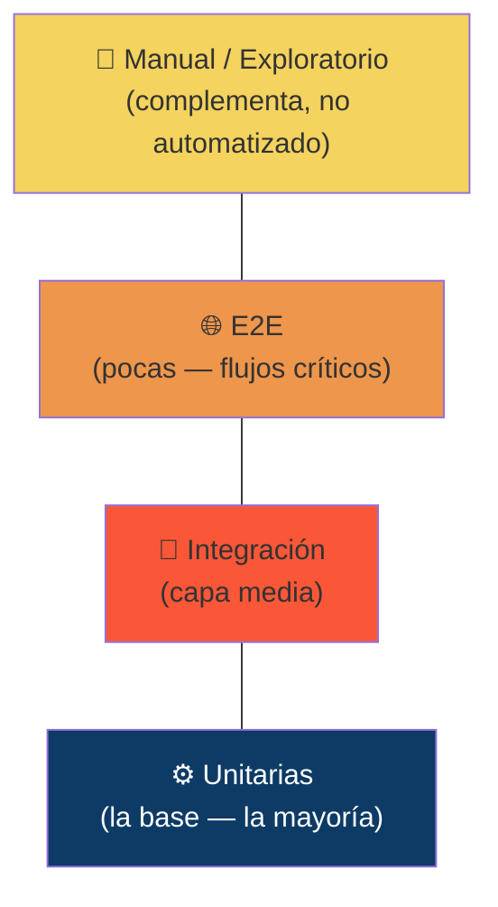
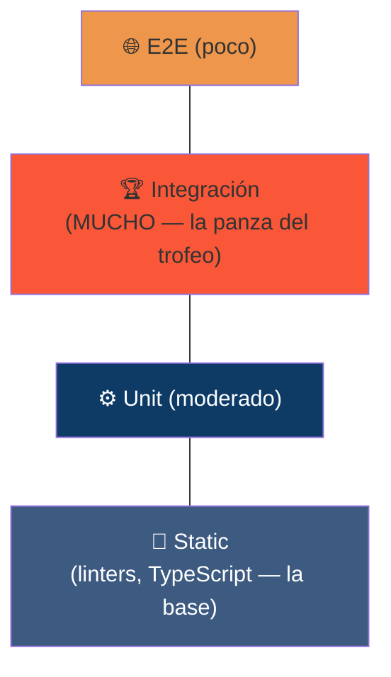

# Pirámide de Testing

La pirámide de testing es un modelo visual que ayuda a decidir **cuántas pruebas de cada tipo conviene tener y en qué proporción**. La idea viene originalmente de Mike Cohn (libro *Succeeding with Agile*, 2009), pensada para guiar cómo distribuir el esfuerzo de automatización.

## Origen y propósito

Mike Cohn propuso esta pirámide para resolver un problema muy común: equipos que automatizan sobre todo pruebas end-to-end (a través de la interfaz) porque son las más "intuitivas" de escribir, y terminan con suites lentísimas, frágiles y carísimas de mantener.

La pirámide invierte esa tendencia: **cuanto más abajo, más pruebas; cuanto más arriba, menos.**

## Cada capa en detalle

### 1. Pruebas unitarias (la base, la mayoría)
Prueban una función, método o clase de forma aislada, sin depender de la base de datos, la red ni otros módulos (se usan *mocks* o *stubs* para simular esas dependencias).

- Las más rápidas (milisegundos)
- Las más baratas de escribir
- Feedback más preciso: si falla una prueba unitaria, sabes exactamente qué línea de código romper

**Herramientas típicas:** Jest, JUnit, pytest, NUnit.

### 2. Pruebas de integración (capa media)
Verifican que varios módulos funcionen bien juntos: por ejemplo, que tu código se comunique correctamente con la base de datos, con una API externa, o entre dos microservicios.

- Más lentas que las unitarias (a veces necesitan levantar una base de datos real o un contenedor Docker)
- Más costosas de mantener, porque dependen de más piezas moviéndose a la vez

### 3. Pruebas end-to-end / E2E (cerca de la punta, pocas)
Simulan el flujo completo de un usuario real: abrir el navegador, hacer login, agregar un producto al carrito, pagar.

- Las más parecidas a lo que haría un humano
- Las más lentas (segundos o minutos por prueba)
- Las más frágiles (un cambio de UI las rompe aunque la lógica funcione bien)
- Las más caras de mantener

**Herramientas:** Playwright, Cypress, Selenium.

### 4. Manual / exploratorio (capa complementaria, arriba)
No reemplaza a las anteriores, las complementa. Aquí es donde un humano usa criterio, intuición y creatividad para encontrar bugs que ningún script buscaría, y para evaluar cosas subjetivas como "¿esto se siente bien de usar?".

## Errores comunes con la pirámide

- **El "cono de helado" (ice cream cone):** el anti-patrón más citado. Ocurre cuando un equipo tiene muchas pruebas manuales/E2E y pocas o ninguna unitaria — la pirámide invertida. Resultado: feedback lento, suites frágiles, ciclos de release largos.
- **Tratarla como receta exacta:** no existe una proporción mágica (¿70/20/10? ¿80/15/5?). La proporción correcta depende del tipo de proyecto. Un backend con lógica de negocio compleja necesita muchísimas unitarias; una app con mucha lógica de integración con terceros (pagos, APIs externas) puede necesitar más peso en integración.
- **Confundir "pocas" con "cero":** la pirámide no dice "no hagas E2E", dice que sean pocas y estratégicas (cubrir los flujos críticos de negocio, no cada combinación posible).

## Variante moderna: el "trophy" de testing

Kent C. Dodds propuso una alternativa llamada **testing trophy**, pensada especialmente para frontend moderno:

La diferencia clave: argumenta que en aplicaciones modernas (React, Vue, etc.) las pruebas de **integración** dan mejor retorno que las unitarias puras, porque prueban componentes trabajando juntos tal como los usa el usuario real, sin la fragilidad de una E2E completa.

Es una crítica interesante a la pirámide clásica, aunque no todos los equipos coinciden.

---

## Referencias
- Mike Cohn, *Succeeding with Agile* (2009)
- Kent C. Dodds, "The Testing Trophy"
