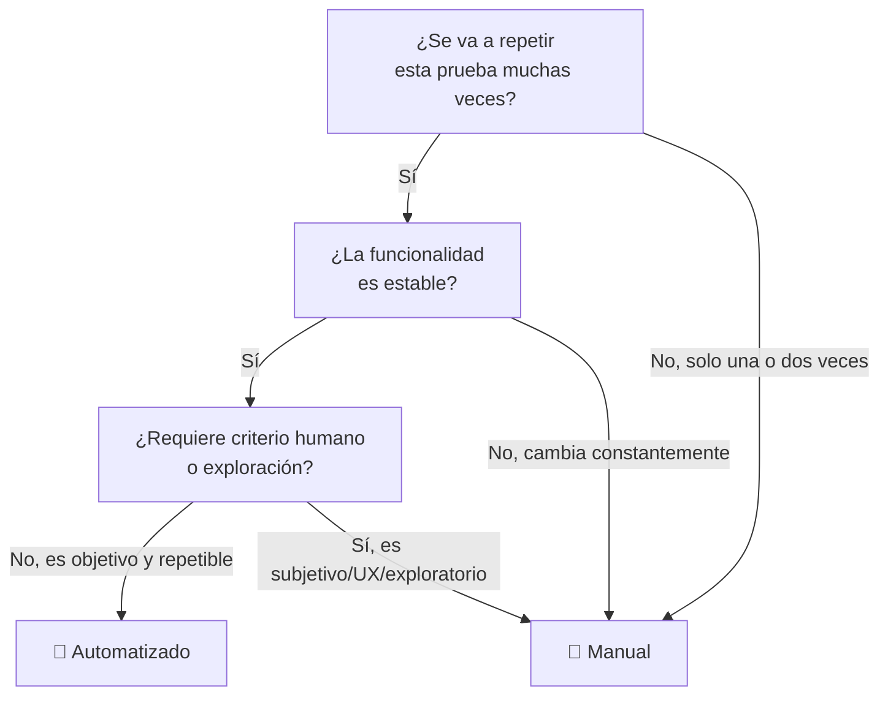

# Testing Manual vs Automatizado

## Definiciones

**Testing manual:** es el proceso de probar un software ejecutando casos de prueba a mano, sin scripts ni herramientas de automatización. Una persona (QA tester) interactúa con la aplicación como lo haría un usuario real, siguiendo pasos definidos y comparando el resultado obtenido con el esperado.

**Testing automatizado:** consiste en escribir scripts o usar herramientas que ejecutan las pruebas automáticamente, comparan resultados y reportan fallos sin intervención humana directa durante la ejecución. Requiere una inversión inicial de código/configuración, pero luego se puede repetir cuantas veces se quiera.

## Diferencias clave

| Aspecto | Manual | Automatizado |
|---|---|---|
| Velocidad de ejecución | Lenta | Rápida (una vez creado) |
| Costo inicial | Bajo | Alto (tiempo de desarrollo del script) |
| Costo a largo plazo | Alto (se repite el esfuerzo cada vez) | Bajo (se reutiliza) |
| Precisión | Sujeta a error humano | Consistente, siempre igual |
| Cobertura de regresión | Difícil de mantener a gran escala | Ideal para esto |
| Exploración/UX | Muy buena (intuición, criterio humano) | Limitada, no "ve" ni "siente" la experiencia |
| Mantenimiento | Bajo (no hay código que romper) | Requiere actualizar scripts si la UI/lógica cambia |
| Escalabilidad | Baja | Alta |
| Detección de bugs "raros" o visuales | Buena | Mala, a menos que se diseñe específicamente para eso |

## Cuándo automatizar

- **Pruebas de regresión** — cosas que se repiten en cada release (login, checkout, flujos críticos)
- **Casos muy repetitivos** — ejecutar la misma prueba con múltiples combinaciones de datos (data-driven testing)
- **Pruebas de carga/rendimiento** — imposibles de hacer manualmente a gran escala
- **CI/CD** — cuando quieres feedback rápido en cada commit/deploy
- **Funcionalidad estable** — features que no cambian mucho, donde el costo de mantenimiento del script es bajo
- **APIs y pruebas unitarias/integración** — suelen automatizarse casi por defecto, son rápidas de escribir y muy estables

## Cuándo NO automatizar (o priorizar manual)

- **Exploratory testing** — cuando buscas bugs inesperados usando intuición y creatividad, algo que un script no puede hacer
- **Usabilidad/UX** — evaluar si algo "se siente bien" requiere criterio humano
- **Funcionalidad que cambia constantemente** — si la UI o lógica está en desarrollo activo, automatizar ahora significa reescribir el script todo el tiempo (alto costo, poco retorno)
- **Pruebas de un solo uso** — si solo vas a correr la prueba una o dos veces, no vale la pena el esfuerzo de automatizar
- **Casos con juicio subjetivo** — por ejemplo, revisar si un diseño se ve "profesional" o si un mensaje de error es "claro"
- **Presupuesto o tiempo limitado en un proyecto pequeño** — a veces el ROI de automatizar no se justifica

## Resumen visual

---

> *Regla general: automatiza lo repetitivo y estable; deja lo exploratorio, subjetivo y cambiante en manos de una persona.*
