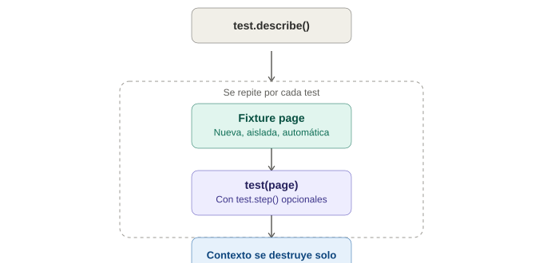

# Anatomía de un test en Playwright

## La analogía general

Ya se vieron dos estructuras distintas: Selenium usa clases con `@Test` (JUnit/TestNG, un framework externo), y Cypress usa `describe`/`it` (basado en Mocha, integrado). Playwright Test tiene **su propio test runner construido desde cero específicamente para testing de navegador** — no reutiliza Mocha ni JUnit, sino que diseñó su propia sintaxis pensando en las necesidades exactas de testing E2E moderno desde el primer día.

Es como comparar tres formas de organizar un evento: Selenium contrata **un maestro de ceremonias externo** (JUnit) que sabe organizar cualquier tipo de evento. Cypress usa **un maestro de ceremonias que ya vivía en el salón** (Mocha, integrado). Playwright **entrenó a su propio maestro de ceremonias desde cero**, específicamente para este tipo de evento — con herramientas hechas a medida que ni el externo ni el prestado tenían.

---

## 1. La estructura básica: `test()` en vez de `it()`

```typescript
import { test, expect } from '@playwright/test';

test('permite iniciar sesión con credenciales válidas', async ({ page }) => {
  await page.goto('/login');
  await page.getByLabel('Usuario').fill('usuario123');
  await page.getByLabel('Contraseña').fill('clave123');
  await page.getByRole('button', { name: 'Iniciar sesión' }).click();

  await expect(page.getByText('Bienvenido')).toBeVisible();
});
```

> **Analogía:** en Cypress se decía `it('hace algo...')`, aquí se dice `test('hace algo...')` — el concepto de "una escena autocontenida" es exactamente el mismo, solo cambia la palabra clave. La diferencia real y más importante está en el segundo argumento: `async ({ page }) => {...}` — eso es una **fixture inyectada automáticamente**, y es la pieza central de todo el sistema de Playwright Test.

---

## 2. El parámetro `page` — la fixture que lo cambia todo

```typescript
test('ejemplo', async ({ page }) => {
  // "page" ya viene lista, con su propio navegador nuevo, aislado
});
```

Playwright Test **crea automáticamente una página nueva, en un contexto de navegador aislado, para cada test** — sin que se tenga que escribir ningún `setUp()`/`beforeEach()` para lograrlo.

> **Analogía:** en Selenium, había que escribir explícitamente en `@BeforeEach` "abre un navegador nuevo" y en `@AfterEach` "cierra el navegador". Aquí, es como si el maestro de ceremonias **ya tuviera preparada una habitación limpia y vacía para cada invitado que llega**, sin que nadie tenga que pedirlo — la fixture `page` llega ya lista, y se destruye sola al terminar el test, sin código de limpieza explícito.

Esto es fundamentalmente distinto a Cypress también: en Cypress, `cy.visit()` reutiliza el mismo navegador entre tests dentro de un mismo archivo (a menos que se limpie manualmente el estado). En Playwright, **cada test obtiene un contexto de navegador completamente aislado por defecto** — nunca hay contaminación de cookies o localStorage entre tests, sin que haga falta pedirlo.

---

## 3. `expect()` — aserciones web-first, no genéricas

```typescript
await expect(page.getByText('Bienvenido')).toBeVisible();
await expect(page.getByRole('button')).toBeEnabled();
await expect(page.locator('.carrito-contador')).toHaveText('3');
```

> **Analogía:** en Cypress, `should()` reintentaba automáticamente (retry-ability). El `expect()` de Playwright hace exactamente lo mismo — es una aserción que **reintenta sola hasta que se cumple o hace timeout** — pero está diseñada específicamente para "cosas de la web" desde el inicio (`toBeVisible`, `toBeEnabled`, `toHaveText`), en vez de ser una librería de aserciones genérica (como Chai en Cypress) adaptada después para casos de UI.

---

## 4. Fixtures del ciclo de vida: `test.beforeEach`, `test.afterEach`

```typescript
test.describe('Carrito de compras', () => {
  test.beforeEach(async ({ page }) => {
    await page.goto('/carrito');
  });

  test('agrega un producto', async ({ page }) => {
    await page.getByTestId('producto-1').click();
    await expect(page.getByTestId('carrito-contador')).toHaveText('1');
  });

  test.afterEach(async ({ page }) => {
    // limpieza si se necesita
  });
});
```

> **Analogía:** `test.describe` agrupa, igual que en Cypress — es el mismo "capítulo del libro". La diferencia sutil es que aquí `beforeEach`/`afterEach` van prefijados con `test.`, porque **son parte del mismo objeto/API** que el propio `test()`, no funciones globales sueltas como en Mocha/Cypress.

| Cypress | Playwright |
|---|---|
| `describe(...)` | `test.describe(...)` |
| `it(...)` | `test(...)` |
| `beforeEach(...)` | `test.beforeEach(...)` |
| `afterEach(...)` | `test.afterEach(...)` |
| `cy` (objeto global) | `page` (fixture inyectada por parámetro) |

---

## 5. Fixtures personalizadas — el verdadero superpoder

Esto no existe de forma tan elegante ni en Selenium ni en Cypress: se pueden crear **fixtures propias**, reutilizables entre tests, que se inyectan de la misma forma que `page`.

```typescript
// fixtures.ts
import { test as base } from '@playwright/test';

type MisFixtures = {
  paginaLogueada: void;
};

export const test = base.extend<MisFixtures>({
  paginaLogueada: async ({ page }, use) => {
    await page.goto('/login');
    await page.getByLabel('Usuario').fill('usuario123');
    await page.getByLabel('Contraseña').fill('clave123');
    await page.getByRole('button', { name: 'Iniciar sesión' }).click();
    await use(); // aquí corre el test
  },
});
```

```typescript
// test.spec.ts
import { test } from './fixtures';

test('ver el dashboard ya logueado', async ({ page, paginaLogueada }) => {
  // el login ya ocurrió automáticamente antes de llegar aquí
  await expect(page.getByText('Bienvenido')).toBeVisible();
});
```

> **Analogía:** es como si, en vez de repetir "por favor haz login" al principio de cada escena de la obra, se pudiera **entrenar a un asistente de escenario específico** que automáticamente prepara a cualquier actor que lo necesite ya "logueado" antes de que empiece su escena — y ese mismo asistente se puede reutilizar en decenas de escenas distintas, sin repetir el procedimiento de login en cada una.

---

## 6. Anidamiento con `test.step` — pasos legibles dentro de un test

```typescript
test('flujo completo de compra', async ({ page }) => {
  await test.step('Agregar producto al carrito', async () => {
    await page.getByTestId('producto-1').click();
  });

  await test.step('Ir al checkout', async () => {
    await page.getByRole('link', { name: 'Checkout' }).click();
  });

  await test.step('Confirmar la compra', async () => {
    await page.getByRole('button', { name: 'Confirmar' }).click();
  });
});
```

> **Analogía:** es el equivalente al `@Step` de Allure ya visto en Selenium — pero aquí **viene integrado de fábrica**, sin necesitar una librería externa. En el reporte final, cada `test.step` aparece como una sub-escena claramente marcada, en vez de un bloque de código sin divisiones internas.

---

## 7. Tabla comparativa completa

| Concepto | Selenium + JUnit | Cypress | Playwright |
|---|---|---|---|
| Un test individual | `@Test` | `it(...)` | `test(...)` |
| Agrupar tests | Clase de test | `describe(...)` | `test.describe(...)` |
| Antes de cada test | `@BeforeEach` | `beforeEach()` | `test.beforeEach()` |
| Acceso al navegador | `driver` (variable manual) | `cy` (global) | `page` (fixture inyectada, aislada por test) |
| Aserciones | Framework externo (JUnit/AssertJ) | Integradas (Chai vía `should`) | Integradas, web-first (`expect`) |
| Pasos legibles dentro de un test | Requiere Allure (`@Step`) | No nativo | `test.step()`, de fábrica |
| Fixtures personalizadas reutilizables | Manual (helpers/BasePage) | Custom commands | Sistema de fixtures nativo (`test.extend`) |

---

## 8. Errores comunes al empezar

| Síntoma | Causa típica |
|---|---|
| El test falla con "page is not defined" o similar | Falta desestructurar `{ page }` en los parámetros del test |
| Un test afecta a otro test | Raro en Playwright por el aislamiento por defecto — revisar si se está compartiendo estado fuera del contexto de `page` (ej. una base de datos externa) |
| Confusión sobre por qué no hace falta cerrar el navegador manualmente | El framework limpia el contexto automáticamente al terminar cada test, a diferencia de Selenium |

---

## 9. Diagrama de la anatomía de un test



*(Diagrama ilustrativo: test.describe() agrupa el bloque, y por cada test se crea automáticamente una fixture page aislada, se ejecuta el test con sus test.step() opcionales, y el contexto se destruye solo al terminar.)*

---

## 10. Por qué esto importa antes de ver locators y auto-waiting

Entender que `page` es una fixture aislada por test (no un objeto global compartido como `cy` o `driver`) es la base para el siguiente tema: los locators de Playwright se construyen siempre a partir de `page`, y el auto-waiting que viene después se apoya en esa misma fixture para saber en qué contexto exacto debe reintentar cada búsqueda.
