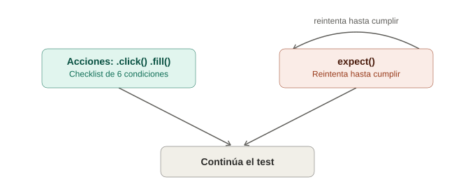

# Auto-waiting y web-first assertions en Playwright

## La analogía general

Ya se vio el retry-ability de Cypress: `should()` reintenta solo hasta que se cumple la condición. Playwright tiene un concepto hermano, pero **más profundo y automático**: no solo las aserciones reintentan — **cada acción individual** (`.click()`, `.fill()`, `.check()`) espera automáticamente a que el elemento esté en un estado "actionable" antes de actuar, sin que se tenga que envolver nada en un `should()` o `expect()` primero.

Es como la diferencia entre un asistente que **solo confirma que la puerta está abierta antes de entrar** (Cypress, principalmente en las aserciones) versus un asistente que, **antes de cualquier acción física** (entrar, tocar algo, sentarse), revisa automáticamente una lista completa de condiciones de seguridad — visible, estable, sin nada encima, habilitado — sin que nadie tenga que pedírselo explícitamente para cada acción individual.

---

## 1. Qué revisa exactamente el auto-waiting antes de actuar

Antes de un `.click()`, Playwright verifica automáticamente que el elemento:
1. Está **atado al DOM** (existe).
2. Es **visible**.
3. Es **estable** (no se está moviendo por una animación en curso).
4. **No está cubierto** por otro elemento.
5. Está **habilitado** (no `disabled`).
6. Recibe eventos (no tiene `pointer-events: none`).

```typescript
await page.getByRole('button', { name: 'Guardar' }).click();
// Playwright revisó las 6 condiciones anteriores ANTES de hacer clic,
// reintentando durante el timeout si alguna todavía no se cumplía
```

> **Analogía:** es como un protocolo de seguridad de un elevador antes de cerrar las puertas — revisa que no haya nada atascado, que el sensor de peso esté estable, que no haya una mano en el medio. Selenium exigía escribir manualmente ese checklist (`element_to_be_clickable`, esperar animaciones, etc.); Cypress lo automatiza parcialmente en sus comandos; Playwright lo hace de forma exhaustiva y explícita en **cada** acción, no solo en las de lectura/verificación.

---

## 2. Comparación con lo ya visto en Selenium y Cypress

| | Selenium | Cypress | Playwright |
|---|---|---|---|
| Qué se reintenta | Solo lo explícitamente envuelto en `WebDriverWait` | Consultas y aserciones (`get`, `should`) | Prácticamente todo: acciones Y aserciones |
| Verifica que no esté cubierto por otro elemento | Manual (`element_to_be_clickable` ayuda parcialmente) | Parcial | Sí, automático en cada acción |
| Espera a que termine una animación/transición CSS | No, hay que esperar manualmente | No, hay que esperar manualmente | Sí, verifica estabilidad automáticamente |
| Configuración necesaria para activarlo | Explícita, cada vez | Ninguna (en su ámbito) | Ninguna (más amplio que el de Cypress) |

El auto-waiting de Playwright es, en cierto sentido, "retry-ability de Cypress, pero aplicado también a las acciones, no solo a las consultas/aserciones" — resuelve exactamente el punto que en la nota de retry-ability se marcó como limitación de Cypress (`.click()` no se reintentaba a sí mismo, solo la búsqueda previa).

---

## 3. Web-first assertions — `expect()` con su propio retry

```typescript
await expect(page.getByText('Guardado correctamente')).toBeVisible();
await expect(page.getByRole('button', { name: 'Enviar' })).toBeDisabled();
await expect(page.getByTestId('contador')).toHaveText('3');
```

Cada una de estas aserciones **reintenta por su cuenta** hasta que la condición se cumple, o hasta agotar el timeout (5 segundos por defecto para `expect`).

> **Analogía:** son literalmente el mismo concepto de "tocar la puerta con paciencia" ya visto con `should()` de Cypress — la diferencia de nombre (`toBeVisible` en vez de `'be.visible'`) es solo de sintaxis, el comportamiento de fondo es equivalente.

### El antipatrón que también existe aquí

```typescript
// ❌ Antipatrón — el equivalente Playwright de time.sleep() / cy.wait(numero)
await page.waitForTimeout(3000);

// ✅ Correcto — esperar la condición real
await expect(page.getByText('Completado')).toBeVisible();
```

Exactamente la misma lección ya aprendida dos veces (Selenium con `Thread.sleep()`, Cypress con `cy.wait(numero)`): un tiempo fijo es frágil por definición, siempre es mejor esperar una condición verificable.

---

## 4. Configurar los timeouts

```typescript
// Global, en playwright.config.ts
export default defineConfig({
  expect: {
    timeout: 8000, // en vez de los 5000ms por defecto
  },
  use: {
    actionTimeout: 10000, // timeout para acciones (.click, .fill, etc.)
  },
});

// Puntual, en un test específico
await expect(page.getByText('Proceso lento')).toBeVisible({ timeout: 15000 });
```

> **Analogía:** igual que se vio con Cypress, es decidir cuánta paciencia extra darle al asistente en un caso puntual sin cambiar el comportamiento general — Playwright separa el timeout de **aserciones** (`expect.timeout`) del timeout de **acciones** (`actionTimeout`), algo un poco más granular que el `defaultCommandTimeout` único de Cypress.

---

## 5. Cuándo el auto-waiting NO es suficiente (esperas explícitas que sí existen)

```typescript
// Esperar a que la URL cambie
await page.waitForURL('**/dashboard');

// Esperar a que una petición de red específica responda
await page.waitForResponse(resp => resp.url().includes('/api/login') && resp.status() === 200);

// Esperar a que el estado de carga de la página termine
await page.waitForLoadState('networkidle');
```

> **Analogía:** el auto-waiting cubre "¿este elemento específico ya está listo?" — pero hay preguntas más amplias que no son sobre un elemento puntual, sino sobre **el estado general de la página** ("¿ya navegamos a la página correcta?", "¿ya terminó de cargar todo?"). Para esas preguntas de alcance más amplio, Playwright ofrece esperas explícitas dedicadas, en vez de forzar al auto-waiting de un elemento a cubrir un caso que no le corresponde.

---

## 6. Tabla resumen

| Concepto | Qué cubre |
|---|---|
| Auto-waiting en acciones | Que el elemento específico esté listo antes de `.click()`, `.fill()`, etc. |
| Web-first assertions (`expect`) | Que una condición sobre un elemento se cumpla, con reintentos |
| `page.waitForURL()` | Que la navegación haya cambiado a una URL específica |
| `page.waitForResponse()` | Que una petición de red específica haya respondido |
| `page.waitForLoadState()` | Que la página en general haya terminado de cargar |
| `page.waitForTimeout()` | Antipatrón — tiempo fijo, evitar salvo casos muy excepcionales |

---

## 7. Errores comunes

| Síntoma | Causa típica |
|---|---|
| El clic falla con "element is not stable" | Una animación CSS todavía en curso — normalmente se resuelve solo al reintentar, si persiste, revisar la duración de la transición |
| `expect().toBeVisible()` tarda el timeout completo y falla | El elemento nunca aparece — revisar si la lógica de negocio realmente lo muestra en ese escenario |
| Se agregó `waitForTimeout()` para "arreglar" un test inconsistente | Síntoma de tapar un problema real de timing en vez de esperar la condición correcta — igual que el antipatrón ya visto en Selenium y Cypress |

---

## 8. Diagrama de auto-waiting vs web-first assertions



*(Diagrama ilustrativo: las acciones como .click() verifican un checklist de 6 condiciones antes de actuar, mientras que expect() reintenta en un ciclo hasta cumplir la condición o agotar el timeout, y ambos caminos continúan hacia el resto del test.)*

---

## 9. Por qué esto importa antes de `page.route`

El mismo principio de "esperar la condición real, no un tiempo fijo" se aplica al interceptar red: `page.waitForResponse()` (ya mencionado arriba) es la base conceptual sobre la que se construye el siguiente tema — interceptar y manipular peticiones con `page.route()`.
