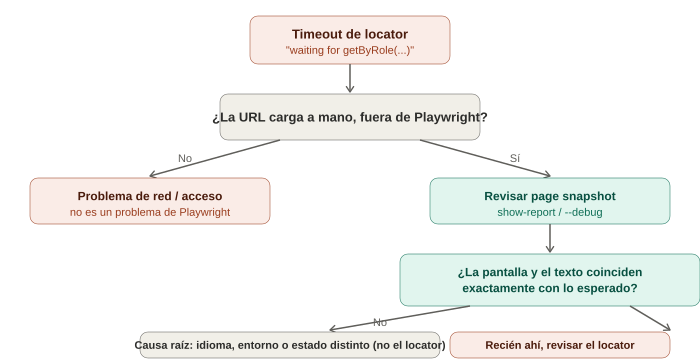

# Debugging real en Playwright — un caso de la vida diaria

## La analogía general

Todo lo visto hasta ahora (locators, auto-waiting, `page.route`) asume que el test **sabe exactamente qué esperar**. Pero en el trabajo real, la mayoría de los fallos no vienen de un locator mal escrito — vienen de que **el entorno le mostró al test algo distinto de lo que el humano vio al grabar el `codegen`**.

Es como la diferencia entre un actor que se sabe el guion perfecto (el test) y llegar al teatro un día en que, sin avisarle a nadie, **cambiaron el idioma de la función** — el actor sigue actuando bien, pero nadie en la sala entiende una palabra, porque el escenario cambió, no el actor.

Esta nota documenta un caso real de debugging, paso a paso, con las herramientas que Playwright da para no tener que adivinar.

---

## 1. El síntoma inicial: un timeout que parece un problema de locator

```typescript
test('test', async ({ page }) => {
  await page.goto('https://web.sandboxcw.net/config');
  await page.getByRole('textbox', { name: 'Código de Negocio' }).click(); // ❌ Timeout 30000ms
  await page.getByRole('textbox', { name: 'Código de Negocio' }).fill('1092');
  await page.getByRole('button', { name: 'Aceptar' }).click();
  await expect(page.getByRole('textbox', { name: 'Usuario' })).toBeVisible();
});
```

El error reportado es siempre el mismo, sin importar el navegador:

```
Error: locator.click: Test timeout of 30000ms exceeded.
Call log:
  - waiting for getByRole('textbox', { name: 'Código de Negocio' })
```

> **La trampa de este mensaje:** dice "waiting for" el locator, y es tentador asumir que el locator está mal escrito. Pero un timeout de 30 segundos esperando un locator también aparece cuando el locator está **perfectamente bien escrito para una versión de la página que no es la que cargó**. El mensaje no distingue entre "nunca va a existir" y "existe, pero con otro nombre".

---

## 2. Primer paso real de diagnóstico: dejar de adivinar, mirar la evidencia

Antes de cambiar una sola línea de código, Playwright ya generó evidencia del fallo. Dos comandos, sin modificar nada:

```bash
npx playwright show-report
```

Abre el reporte HTML con capturas de pantalla del momento exacto del fallo — se ve literalmente qué pantalla estaba cargada cuando el test intentó actuar.

```bash
npx playwright test --debug
```

Pausa el navegador **antes** de la línea que falla, con el Inspector abierto para avanzar paso a paso y ver el estado real del DOM.

> **Analogía:** es la diferencia entre discutir a ciegas "¿qué habrá pasado?" y tener una cámara de seguridad apuntando exactamente al lugar del incidente. El `error-context.md` que Playwright genera junto al reporte (una captura del DOM accesible en el momento del timeout) es esa cámara.

---

## 3. La pista que realmente resuelve el caso: el `page snapshot`

Cuando se corre con un reporter que incluye contexto de accesibilidad, Playwright puede mostrar algo así en el error:

```yaml
- generic:
  - paragraph: Enter the code of your business unit
  - generic:
    - textbox "Business code"
    - button "Accept"
```

Ahí está la causa completa: la página **sí cargó**, **sí existe el campo**, pero se llama `"Business code"`, no `"Código de Negocio"`. El test nunca tuvo un problema de red, ni de locator mal escrito — tuvo un problema de **idioma**.

> **Por qué pasa esto tan seguido:** cuando se graba con `codegen`, normalmente se usa el navegador con una sesión, cookies o configuración de idioma ya establecida (por ejemplo, español guardado de una visita anterior). El Chromium que Playwright lanza en modo test arranca **limpio**, sin esa preferencia, y la aplicación le muestra su idioma por defecto — que puede no ser el mismo con el que se grabó.

---

## 4. El fix inmediato (parche puntual)

```typescript
await page.getByRole('textbox', { name: 'Business code' }).click();
await page.getByRole('textbox', { name: 'Business code' }).fill('1092');
await page.getByRole('button', { name: 'Accept' }).click();
```

Esto hace pasar el test, pero **no resuelve la causa raíz** — el próximo test que se grabe con `codegen` va a tener el mismo problema si el entorno decide mostrar otro idioma.

---

## 5. El fix real: fijar el idioma explícitamente

```typescript
// playwright.config.ts
export default defineConfig({
  use: {
    locale: 'es-ES', // fuerza el idioma del navegador en cada test, sin depender del entorno
  },
});
```

Con esto, el test original (el que usaba `'Código de Negocio'`) vuelve a funcionar tal cual el `codegen` lo generó — porque ahora el navegador **siempre** pide contenido en español, sin importar qué máquina lo ejecute.

> **La lección de fondo:** un test no debería depender de un idioma "que la máquina recordaba". Cualquier configuración que afecte lo que el usuario ve (idioma, zona horaria, geolocalización) debe fijarse explícitamente en `playwright.config.ts`, no dejarse al azar del entorno donde se ejecuta.

---

## 6. Un desvío falso que vale la pena documentar: "parece un problema de red"

Antes de encontrar la causa real, este caso pasó por varias hipótesis descartadas — vale la pena dejarlas registradas porque son las primeras sospechas razonables ante *cualquier* timeout:

| Hipótesis descartada | Cómo se descartó |
|---|---|
| Problema de VPN/proxy corporativo | La URL cargaba perfectamente al abrirla a mano en un navegador normal |
| Certificado SSL no confiable | No aplicaba una vez confirmado que la página sí renderizaba contenido (no era una pantalla de error de certificado) |
| El Chromium de Playwright bloqueado por firewall/antivirus | Otros compañeros corrieron la misma prueba sin problema — descartaba algo específico del entorno de red |
| La página nunca navegó (quedó en `about:blank`) | Esto sí era real en un punto intermedio del troubleshooting, pero se resolvió aparte y no era la causa final del timeout del locator |

> **Por qué importa esta tabla:** en debugging real, rara vez se llega a la causa correcta al primer intento. Lo importante no es adivinar bien a la primera, sino **descartar metódicamente con evidencia** (¿carga a mano? ¿le pasa a otros? ¿qué dice el snapshot?) en vez de cambiar código a ciegas esperando que algo funcione.

---

## 7. Checklist de debugging para timeouts de locator

Cuando un `getByRole(...)` (o cualquier locator) hace timeout, revisar en este orden:

1. **¿La URL carga manualmente, fuera de Playwright, en un navegador normal?** Si no, es un problema de red/acceso, no de Playwright.
2. **¿El `page snapshot` del error muestra la pantalla esperada?** Si muestra una pantalla distinta (login, error, otro idioma), el locator está bien escrito para una página que no es la que cargó.
3. **¿El nombre accesible coincide exactamente?** Mayúsculas, espacios, idioma y texto exacto importan — `getByRole` compara el nombre accesible real, no una aproximación.
4. **¿Corriendo con `--debug`, la página se ve como se espera al pausar justo antes del fallo?**
5. Solo después de descartar los tres anteriores, sospechar del propio locator (rol incorrecto, elemento dentro de un iframe, etc.).

---

## 8. Diagrama del flujo de diagnóstico



*(Diagrama ilustrativo: ante un timeout de locator, el camino de diagnóstico va de la evidencia visual del reporte/snapshot hacia la causa raíz, en vez de saltar directo a cambiar el código del test.)*

---

## 9. Por qué esto conecta con todo lo anterior

Este caso no fue un problema de sintaxis de Playwright — el `getByRole` estaba perfectamente bien escrito según todo lo visto en la nota de locators. Fue un problema de **suposición**: asumir que el entorno de ejecución siempre se comporta igual que el entorno donde se grabó con `codegen`. La misma disciplina de "no asumir, verificar con evidencia" que ya se vio con el antipatrón de `waitForTimeout()` en auto-waiting aplica aquí a nivel de todo el entorno del test, no solo de un elemento puntual.
