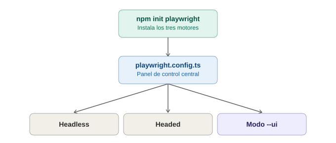

# Instalación y setup — Playwright

## La analogía general

Ya se vieron dos extremos de instalación: Selenium exige **montar un taller completo** (dependencias, drivers, configuración manual del navegador), y Cypress es **una sola caja que trae todo adentro, pero para un solo navegador**. Playwright es como comprar el mismo tipo de caja todo-en-uno de Cypress, pero que **viene con los tres electrodomésticos principales del mercado incluidos de fábrica** (Chromium, Firefox, WebKit) — no hay que ir a comprar cada motor por separado como con Selenium, ni queda uno limitado a un solo motor como con Cypress.

---

## 1. La instalación en sí — un solo comando que hace todo

```bash
npm init playwright@latest
```

Este único comando:
1. Crea la estructura del proyecto.
2. Instala el paquete de Playwright Test.
3. **Descarga automáticamente Chromium, Firefox y WebKit** — los binarios reales de los tres motores, no solo "soporte teórico".
4. Genera un archivo de configuración (`playwright.config.ts`) con ejemplos ya funcionando.
5. Crea un test de ejemplo que se puede correr de inmediato.

> **Analogía:** es como pedir el electrodoméstico todo-en-uno de Cypress, pero que al abrir la caja **vienen tres aparatos distintos certificados de fábrica** (uno para cada "tipo de cocina" — Chromium, Firefox, WebKit), en vez de tener que comprar cada uno por separado en tiendas distintas, como pasaba con los drivers de Selenium.

Durante la instalación, Playwright pregunta interactivamente:
- ¿TypeScript o JavaScript?
- ¿Nombre de la carpeta de tests?
- ¿Agregar un workflow de GitHub Actions?
- ¿Instalar los navegadores ahora?

> **Analogía:** es como si el electrodoméstico, al desempacarlo, **hiciera un par de preguntas rápidas sobre cómo configurarlo** (idioma del manual, dónde guardar los accesorios) antes de dejarlo listo para usar — a diferencia de Cypress, que simplemente genera la estructura sin preguntar nada.

---

## 2. Las cuatro preguntas de la instalación, explicadas a fondo

Ninguna de estas cuatro decisiones es trivial de descartar sin entenderla — aquí está el detalle de cada una.

### 2.1 ¿TypeScript o JavaScript?

**La diferencia de fondo:** JavaScript es el lenguaje "sin reglas de tipos" — se declara una variable y puede contener cualquier cosa, sin que nadie avise si más adelante se usa mal. TypeScript es JavaScript con una capa extra de **reglas declaradas explícitamente** sobre qué tipo de dato espera cada cosa — y esas reglas se revisan **antes** de correr el código, no durante.

> **Analogía:** escribir en JavaScript es como llenar un formulario a mano libre, sin campos delimitados — se puede escribir un número donde se esperaba un nombre, y nadie detiene eso hasta que alguien intente usar ese dato más adelante y todo explote. TypeScript es el mismo formulario, pero con **casillas que solo aceptan el tipo de dato correcto** — si se intenta escribir un número en la casilla de "nombre", el formulario lo señala en rojo *antes* de entregarlo, no después de que el destinatario intente leerlo y se confunda.

```typescript
// TypeScript — el editor avisa el error ANTES de correr el test
async function login(usuario: string, clave: string) {
  await page.getByLabel('Usuario').fill(usuario);
}
login(123, 'clave123'); // ❌ el editor marca error de inmediato: "123 no es un string"
```

```javascript
// JavaScript — el mismo error solo se descubre AL EJECUTAR el test
async function login(usuario, clave) {
  await page.getByLabel('Usuario').fill(usuario);
}
login(123, 'clave123'); // ⚠️ no hay aviso hasta correr el test y ver qué pasa
```

**Ventajas de TypeScript:** autocompletado más inteligente, errores de "typo" detectados antes de ejecutar (`.isVisble()` en vez de `.isVisible()`), refactors más seguros en suites grandes.

**Ventajas de JavaScript:** cero configuración adicional, curva de entrada más baja, menos fricción para prototipos rápidos.

| Situación | Elegir |
|---|---|
| El equipo ya usa TypeScript en el frontend de la app | TypeScript |
| Recién aprendiendo Playwright, enfoque en la lógica del test | JavaScript |
| Suite grande, mantenida por varias personas a largo plazo | TypeScript |
| Prototipo rápido, prueba de concepto | JavaScript |

### 2.2 ¿Nombre de la carpeta de tests?

Por defecto se sugiere `tests/`, pero se puede usar `e2e/`, `pruebas/`, o cualquier otro nombre.

> **Analogía:** es como elegir el nombre del cajón donde se van a guardar las herramientas — no cambia lo que las herramientas hacen, solo dónde se van a encontrar después. Lo importante es ser consistente: si el equipo ya tiene una convención en otros proyectos, conviene usar esa misma para no romper el patrón.

**Impacto real:** este nombre queda guardado en `playwright.config.ts` como `testDir`, así que cambiarlo después es tan simple como editar esa línea.

### 2.3 ¿Agregar un workflow de GitHub Actions?

Si se responde que sí, Playwright genera automáticamente `.github/workflows/playwright.yml` con un pipeline **ya funcional** que instala dependencias, navegadores, y corre la suite completa en cada push/PR.

> **Analogía:** es como si, al comprar el electrodoméstico, también se regalara **el contrato de mantenimiento ya redactado y firmado con el proveedor de electricidad de la zona** — no hay que investigar cómo conectar todo para que funcione en automático cada vez que alguien usa la cocina (cada `push` al repositorio).

**Cuándo decir que sí:** si el proyecto vive en GitHub y se usará GitHub Actions como CI/CD. **Cuándo decir que no:** si se usa otro proveedor (Jenkins, GitLab CI) — el archivo generado no serviría y habría que borrarlo o adaptarlo.

### 2.4 ¿Instalar los navegadores ahora?

Decide si Playwright descarga los binarios de Chromium, Firefox y WebKit **inmediatamente**, o si se prefiere posponerlo para correr `npx playwright install` después.

> **Analogía:** es literalmente preguntar "¿se traen los tres electrodomésticos ahora mismo, o se envían después, cuando haya espacio/tiempo para recibirlos?" — la diferencia real es el momento en que se ocupa ancho de banda y espacio en disco (los navegadores pesan varios cientos de MB en total).

**Cuándo decir que no:** con una conexión lenta y se quiere revisar primero la configuración, o si los navegadores se instalarán en un paso separado de un pipeline de CI (a veces se cachean por separado).

### Tabla resumen de las cuatro preguntas

| Pregunta | Impacto | ¿Se puede cambiar después? |
|---|---|---|
| TypeScript o JavaScript | Tipado y autocompletado | Sí, pero requiere reescribir archivos |
| Nombre de la carpeta de tests | Organización del proyecto | Sí, editando `testDir` en la config |
| Workflow de GitHub Actions | CI/CD listo de fábrica | Sí, se puede agregar/borrar el `.yml` después |
| Instalar navegadores ahora | Cuándo se descargan los binarios | Sí, con `npx playwright install` en cualquier momento |

---

## 3. La estructura de carpetas que Playwright crea sola

```
mi-proyecto/
├── tests/
│   └── example.spec.ts          # test de ejemplo ya funcional
├── tests-examples/
│   └── demo-todo-app.spec.ts    # ejemplo más completo, opcional
├── playwright.config.ts          # configuración central
├── package.json
└── .github/
    └── workflows/
        └── playwright.yml        # pipeline de CI ya armado (si se aceptó esa opción)
```

> **Analogía:** al igual que con Cypress, el mueble llega "listo para usar" con compartimentos ya organizados — pero aquí además **viene con un manual de instrucciones para instalarlo en la oficina remota** (el archivo `.github/workflows/playwright.yml`), algo que Cypress no genera automáticamente en su instalación básica.

---

## 4. `playwright.config.ts` — el panel de control central

```typescript
import { defineConfig, devices } from '@playwright/test';

export default defineConfig({
  testDir: './tests',
  fullyParallel: true,
  use: {
    baseURL: 'https://mi-app-de-pruebas.com',
    trace: 'on-first-retry',
  },
  projects: [
    { name: 'chromium', use: { ...devices['Desktop Chrome'] } },
    { name: 'firefox', use: { ...devices['Desktop Firefox'] } },
    { name: 'webkit', use: { ...devices['Desktop Safari'] } },
  ],
});
```

> **Analogía:** es el mismo concepto de panel de control central ya visto en Cypress (`baseUrl`, configuración de timeouts), pero con una sección extra que Cypress no tiene de forma tan directa: la lista de **`projects`**, que es literalmente decir "correr exactamente esta misma suite de tests en los tres electrodomésticos distintos, uno tras otro (o en paralelo)", sin duplicar una sola línea de código de test.

**`fullyParallel: true`** es otro punto a favor de Playwright — correr tests en paralelo es una opción de configuración nativa, mientras que en Selenium requería configurar Selenium Grid por separado.

---

## 5. Verificar la instalación de navegadores

```bash
npx playwright install
```

Este comando (que ya corre automáticamente durante el `init`, pero también se puede ejecutar manualmente después) descarga o actualiza los tres motores.

```bash
npx playwright install --with-deps
```

En Linux/CI, esta variante también instala las **dependencias del sistema operativo** que cada navegador necesita para funcionar en modo headless — algo que en Selenium/Appium solía requerir investigación manual de qué paquetes de sistema faltaban.

> **Analogía:** es como si, al instalar los tres electrodomésticos, también se revisara automáticamente **si las tomas de corriente de la casa son compatibles** con cada uno — en vez de descubrir a mitad de una cena importante (un pipeline de CI) que falta un adaptador específico.

---

## 6. Correr el primer test — tres formas

### Modo headless (por defecto, ideal para CI)

```bash
npx playwright test
```

### Modo UI — el equivalente al modo interactivo de Cypress, pero más rico

```bash
npx playwright test --ui
```

Abre una interfaz visual con **línea de tiempo, capturas de cada paso, y la posibilidad de viajar en el tiempo** entre los distintos pasos del test para ver exactamente el estado del DOM en cada momento.

### Modo con navegador visible (headed)

```bash
npx playwright test --headed
```

> **Analogía:** el modo headless es "poner el temporizador y volver cuando suene" (igual que en Cypress). El modo `--ui` es como tener **una grabación completa de cámara de seguridad con control de rebobinado**, no solo ver el horno de vidrio en vivo — se puede retroceder a cualquier instante exacto del test después de que terminó, no solo mientras corre.

---

## 7. Tabla comparativa de instalación con Selenium y Cypress

| | Selenium | Cypress | Playwright |
|---|---|---|---|
| Comando de instalación | Dependencia de Maven/Gradle/pip + drivers | `npm install cypress` | `npm init playwright@latest` |
| Navegadores instalados | Manual, uno por uno | Solo el navegador de Cypress | Automático: Chromium + Firefox + WebKit |
| Estructura de carpetas | La define el desarrollador | Autogenerada | Autogenerada, con ejemplo de CI incluido |
| Configuración multi-navegador | Manual (Selenium Grid) | Limitada | Nativa (`projects` en la config) |
| Modo de depuración visual | Requiere plugins | De fábrica (modo interactivo) | De fábrica, con línea de tiempo y "viaje en el tiempo" (`--ui`) |

---

## 8. Errores comunes al iniciar

| Síntoma | Causa típica |
|---|---|
| `npx playwright test` falla con error de navegador no encontrado | Los binarios no se descargaron — correr `npx playwright install` |
| Funciona en local pero falla en CI (Linux) | Faltan dependencias del sistema — usar `npx playwright install --with-deps` |
| El modo `--ui` no muestra nada | Build corrupta de la interfaz — reinstalar con `npm install -D @playwright/test` |

---

## 9. Diagrama del flujo de instalación



*(Diagrama ilustrativo: un solo comando de instalación descarga los tres motores de navegador, genera la configuración central con soporte multi-proyecto, y deja el proyecto listo para correr en modo headless, headed, o con la interfaz UI de depuración.)*

---

## 10. Por qué esto importa antes de escribir el primer test

Con la instalación resuelta en un solo paso —incluyendo los tres navegadores reales—, Playwright elimina buena parte de la fricción que existía tanto en Selenium (drivers manuales) como en la limitación de cobertura de Cypress (un solo navegador principal). El siguiente tema (anatomía de un test) se apoya directamente en la estructura que este comando ya dejó lista.
