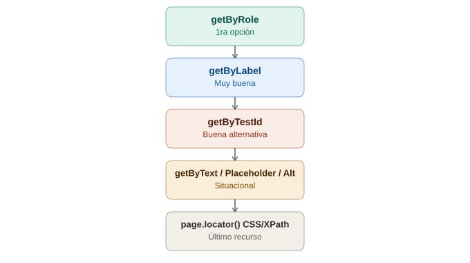

# Locators en Playwright

## La analogía general

Ya se vieron dos filosofías de locators: Selenium con estrategias explícitas por atributo (`By.id`, `By.cssSelector`, `By.xpath`), y Cypress recomendando fuertemente un atributo dedicado (`data-cy`). Playwright toma una tercera vía, más cercana a **cómo un usuario real o un lector de pantalla percibe la página** — en vez de preguntar "¿cuál es el ID de este botón?", Playwright pregunta **"¿qué rol tiene este elemento, y qué dice?"**, como lo haría alguien navegando con los ojos cerrados y solo un lector de accesibilidad.

Es como la diferencia entre identificar a alguien por su **número de empleado en una base de datos** (locators tradicionales por atributo) versus identificarlo por **su puesto de trabajo y lo que está diciendo en este momento** ("la persona que tiene el rol de gerente y está diciendo 'aprobado'") — este segundo método es exactamente cómo Playwright recomienda encontrar elementos.

---

## 1. `getByRole` — el locator recomendado por encima de todos

```typescript
await page.getByRole('button', { name: 'Iniciar sesión' }).click();
await page.getByRole('textbox', { name: 'Usuario' }).fill('usuario123');
await page.getByRole('checkbox', { name: 'Acepto los términos' }).check();
```

`getByRole` busca elementos por su **rol de accesibilidad** (`button`, `textbox`, `checkbox`, `link`, `heading`, etc.) combinado con su nombre accesible (el texto visible, o el `aria-label`).

> **Analogía:** es exactamente cómo un lector de pantalla para personas con discapacidad visual "ve" la página — no le importa si el botón tiene la clase `.btn-primary-lg`, le importa que **es un botón, y dice "Iniciar sesión"**. Playwright recomienda esto como primera opción precisamente porque, si funciona bien con un lector de accesibilidad, es una señal de que la página está bien construida — y de regalo, el test queda blindado contra cambios de diseño visual.

---

## 2. `getByText` — buscar por contenido visible

```typescript
await page.getByText('Bienvenido, usuario123').click();
await page.getByText('Iniciar sesión', { exact: true }).click();
```

> **Analogía:** ya se vio con `cy.contains()` en Cypress que buscar por texto es frágil si el texto cambia por copy o idioma — aquí aplica exactamente la misma advertencia. `getByText` es más apropiado para **verificar** que un mensaje apareció (el objeto de la prueba), no como método principal para encontrar botones de navegación.

---

## 3. `getByTestId` — el equivalente directo a `data-cy`

```typescript
await page.getByTestId('btn-login').click();
```

Por defecto, Playwright busca el atributo `data-testid` (configurable a otro nombre si se prefiere).

> **Analogía:** es el mismo "gafete exclusivo para auditoría" ya visto con `data-cy` en Cypress — un atributo que existe únicamente para que las pruebas lo encuentren, sin depender de accesibilidad ni de texto visible. Playwright lo pone como una opción sólida, pero **no como la primera recomendación** — prefiere que se intente primero con roles, porque eso además valida la accesibilidad de la app de regalo.

---

## 4. Otros locators disponibles

```typescript
await page.getByLabel('Usuario').fill('usuario123');        // por <label> asociado
await page.getByPlaceholder('Ingresa tu correo').fill('a@a.com'); // por placeholder
await page.getByAltText('Logo de la empresa').click();       // por alt de una imagen
await page.locator('.selector-css-cualquiera').click();      // CSS genérico, último recurso
```

> **Analogía:** son variaciones del mismo principio — preguntar por **cómo el elemento se presenta a un usuario real** (su etiqueta, su placeholder, su descripción de imagen) en vez de preguntar por detalles internos de implementación. `page.locator()` con CSS es la puerta de escape para cuando ninguna de las anteriores aplica — el equivalente exacto a las "clases CSS, último recurso" ya visto en Cypress.

---

## 5. La jerarquía recomendada, en una tabla

| Estrategia | Prioridad | Por qué |
|---|---|---|
| `getByRole` | 🟢 1ra opción | Refleja accesibilidad real, resistente a cambios de estilo |
| `getByLabel` | 🟢 Muy buena | Natural para formularios, ligada a la experiencia real del usuario |
| `getByTestId` | 🟡 Buena alternativa | Estable, pero no valida accesibilidad como `getByRole` |
| `getByText` / `getByPlaceholder` / `getByAltText` | 🟡 Situacional | Útil para verificar contenido, frágil como método principal de navegación |
| `page.locator()` con CSS/XPath | 🔴 Último recurso | Depende de implementación interna, se rompe con rediseños |

---

## 6. Encadenar y filtrar locators

```typescript
// Encontrar un elemento DENTRO de otro
const carrito = page.getByTestId('carrito');
await carrito.getByRole('button', { name: 'Eliminar' }).click();

// Filtrar entre varios resultados que coinciden
await page.getByRole('listitem').filter({ hasText: 'Producto A' }).click();

// Obtener el enésimo elemento de una lista de coincidencias
await page.getByRole('row').nth(2).click();
```

> **Analogía:** es como decir "busca al gerente, pero **específicamente el que está dentro de la sucursal norte**" (`carrito.getByRole(...)`), o "de todos los empleados con el rol de vendedor, dame **el que está hablando de 'Producto A'**" (`.filter()`) — Playwright permite acotar la búsqueda combinando varios criterios en cadena, en vez de escribir un selector único gigante y complicado.

---

## 7. Comparación con Selenium y Cypress

| | Selenium | Cypress | Playwright |
|---|---|---|---|
| Filosofía principal | Por atributo técnico (`id`, `css`, `xpath`) | Atributo dedicado (`data-cy`) | Por accesibilidad/percepción (`role`, `label`, `text`) |
| Locator recomendado #1 | Depende del caso, prioriza `id`/`css` | `data-cy` | `getByRole` |
| Valida accesibilidad de regalo | No | No | Sí, con `getByRole` |
| Sintaxis para "dentro de" | `findElement` anidado manual | `.within()` | Encadenado directo (`locator.getByRole(...)`) |
| Filtrar entre varios resultados | Manual con listas + lógica propia | Manual | `.filter()` nativo |

---

## 8. Diagrama de la jerarquía de locators



*(Diagrama ilustrativo: las estrategias de locator de Playwright ordenadas de mayor a menor prioridad, desde getByRole hasta el CSS/XPath genérico como último recurso.)*

---

## 9. Por qué esto conecta con auto-waiting (el siguiente tema)

Todos los locators de Playwright (`getByRole`, `getByTestId`, etc.) son **"lazy"** — no buscan el elemento inmediatamente al escribir la línea, sino que describen **una intención de búsqueda** que se resuelve recién cuando se usa una acción (`.click()`, `.fill()`) o una aserción (`expect(...)`). Esto es la base sobre la que funciona el auto-waiting, que se cubre a continuación.

```typescript
const boton = page.getByRole('button', { name: 'Enviar' }); // todavía no busca nada
await boton.click(); // AQUÍ se busca, se espera que esté listo, y se hace clic
```

> **Analogía:** `page.getByRole(...)` es como escribir en un papel **la descripción de a quién hay que buscar**, sin salir todavía a buscarlo. Recién cuando llega el momento de actuar (`.click()`), alguien sale físicamente con ese papel en mano a buscar a la persona descrita — y, como se verá en el siguiente tema, esa búsqueda tiene su propia paciencia incorporada.
