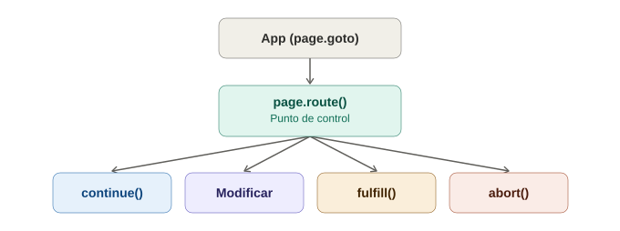

# Interceptar red con `page.route` en Playwright

## La analogía general

Ya se vio `cy.intercept()` en Cypress: colocar un micrófono oculto en la línea telefónica entre la app y el servidor, o incluso entregar un guion falso al actor. `page.route()` en Playwright hace exactamente lo mismo conceptualmente, pero con un control todavía más granular — es como si, en vez de solo escuchar o reemplazar la llamada completa, se tuviera acceso a **cada paso individual de la centralita telefónica**: se puede decidir dejar pasar la llamada, colgarla, redirigirla a otro número, modificar lo que dice el que llama antes de que llegue, o modificar la respuesta antes de que regrese — todo con el mismo mecanismo.

---

## 1. El caso más simple: interceptar y dejar pasar (para espiar)

```typescript
let capturoLaPeticion = false;

await page.route('**/api/usuarios', async (route) => {
  capturoLaPeticion = true;
  await route.continue(); // deja pasar la petición real, sin modificar nada
});

await page.goto('/dashboard');
```

> **Analogía:** `route.continue()` es decirle a la centralita "escuché la llamada, pero déjala pasar exactamente igual, no la toques" — el micrófono oculto sigue ahí, pero no interfiere con la conversación real.

---

## 2. El superpoder: reemplazar la respuesta completa

```typescript
await page.route('**/api/usuarios', async (route) => {
  await route.fulfill({
    status: 200,
    contentType: 'application/json',
    body: JSON.stringify([
      { id: 1, nombre: 'Ana' },
      { id: 2, nombre: 'Luis' },
    ]),
  });
});

await page.goto('/dashboard');
```

> **Analogía:** `route.fulfill()` es el mismo "apuntador que le entrega al actor un guion completamente distinto" ya visto con `cy.intercept()` mockeando — la app **cree** que habló con el servidor real, pero la respuesta la inventó el test.

---

## 3. Modificar la petición ANTES de que llegue al servidor real

Esto es algo que Cypress no ofrece con la misma naturalidad: interceptar y **modificar** la petición saliente, dejando que después sí llegue al servidor real, pero alterada.

```typescript
await page.route('**/api/usuarios', async (route) => {
  const headers = {
    ...route.request().headers(),
    'x-usuario-de-prueba': 'true',
  };
  await route.continue({ headers });
});
```

> **Analogía:** es como interceptar la carta antes de que salga del buzón, **agregarle un sello especial**, y luego sí dejar que el cartero la lleve a su destino real — a diferencia de simplemente escuchar (`continue` sin cambios) o reemplazar la respuesta completa (`fulfill`), aquí se modifica el mensaje saliente y se deja que el viaje real continúe.

---

## 4. Simular errores y latencia (igual que en Cypress, con su propia sintaxis)

```typescript
// Simular que el servidor está caído
await page.route('**/api/usuarios', (route) => route.abort('failed'));

// Simular un error 500
await page.route('**/api/usuarios', (route) =>
  route.fulfill({ status: 500, body: 'Error interno' })
);

// Simular una respuesta lenta
await page.route('**/api/usuarios', async (route) => {
  await new Promise((resolve) => setTimeout(resolve, 3000));
  await route.continue();
});
```

Misma idea ya vista en la nota de `cy.intercept`: fabricar la caída del servidor bajo demanda, sin depender de que el backend real coopere para probar estados de error.

---

## 5. Interceptar patrones completos, no solo una URL

```typescript
// Bloquear TODAS las imágenes para acelerar los tests (no siempre relevantes)
await page.route('**/*.{png,jpg,jpeg,svg}', (route) => route.abort());

// Interceptar cualquier llamada a un dominio de analítica externo
await page.route('**://analytics.terceros.com/**', (route) => route.abort());
```

> **Analogía:** es como decirle a la centralita "cualquier llamada que venga de este número externo específico, cuélgala automáticamente" — útil para eliminar ruido de servicios de terceros (analítica, publicidad) que no son el objetivo de la prueba, y que además pueden hacer que los tests sean más lentos o inestables por depender de servidores externos reales.

---

## 6. Esperar una petición sin interceptarla (el equivalente a `cy.wait`)

```typescript
const [response] = await Promise.all([
  page.waitForResponse('**/api/login'),
  page.getByRole('button', { name: 'Iniciar sesión' }).click(),
]);

expect(response.status()).toBe(200);
```

> **Analogía:** ya se mencionó `page.waitForResponse()` en la nota de auto-waiting — aquí se ve el patrón completo: se dispara la acción (el clic) **y** se espera la respuesta **al mismo tiempo** (`Promise.all`), en vez de esperar primero y hacer clic después, que llegaría tarde a la conversación.

---

## 7. Comparación con `cy.intercept` de Cypress

| | Cypress (`cy.intercept`) | Playwright (`page.route`) |
|---|---|---|
| Espiar sin modificar | Sí (`.as()` + sin respuesta) | Sí (`route.continue()`) |
| Mockear respuesta completa | Sí (`body`/`statusCode`) | Sí (`route.fulfill()`) |
| Modificar la petición saliente y dejarla continuar real | No de forma tan directa | Sí (`route.continue({ headers, ... })`) |
| Simular error de red | Sí (`forceNetworkError`) | Sí (`route.abort()`) |
| Interceptar por patrón de URL amplio (wildcards) | Sí | Sí, con sintaxis de glob similar |
| Esperar sin interceptar | `cy.wait('@alias')` | `page.waitForResponse()` |

En la práctica, ambas herramientas llegan a resultados equivalentes — la diferencia está en la sintaxis y en que Playwright ofrece el paso intermedio de "modificar y dejar pasar" con más naturalidad.

---

## 8. El mismo cuidado que con Cypress: no abusar del mock

Exactamente la misma advertencia ya vista: si absolutamente todo se intercepta y se reemplaza, se deja de probar la integración real de la app con su backend. `page.route()` es poderoso para aislar casos específicos (errores, estados vacíos, datos límite) — no para reemplazar por completo la necesidad de tests que sí hablen con un backend real en algún punto de la suite.

---

## 9. Tabla resumen

| Método | Para qué sirve |
|---|---|
| `route.continue()` | Dejar pasar la petición real, sin modificar (espiar) |
| `route.continue({ headers, ... })` | Modificar la petición saliente antes de que llegue al servidor real |
| `route.fulfill({...})` | Reemplazar la respuesta completa con datos inventados |
| `route.abort()` | Simular que la petición falla por completo |
| `page.waitForResponse()` | Esperar una respuesta específica sin interceptar nada |

---

## 10. Diagrama del flujo de `page.route`



*(Diagrama ilustrativo: page.route() se coloca entre la app y el servidor, y desde ahí puede dejar pasar la petición real, modificarla antes de continuar, reemplazar la respuesta con un mock, o abortarla simulando un error.)*

---

## 11. Por qué esto cierra el círculo antes del primer test funcional

Con locators, auto-waiting y `page.route` ya cubiertos, se tienen todas las piezas necesarias para escribir el primer test end-to-end real de Playwright — el mismo patrón de "login + assert" ya construido dos veces (Selenium, Cypress), ahora con las particularidades específicas de esta herramienta.
