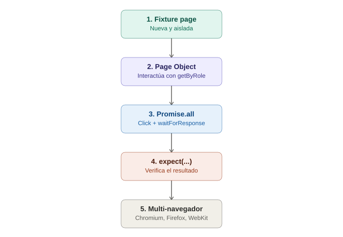

# El primer test funcional completo — Playwright end-to-end

## La analogía general

Ya se aprendió, por separado: la arquitectura híbrida (CDP directo), la instalación con los tres motores incluidos, la fixture `page` aislada por test, los locators por accesibilidad (`getByRole`), el checklist de auto-waiting antes de cada acción, y el control granular de red con `page.route`. Es momento de **unir todas las piezas en una sola función de la obra**, tal como se hizo con Selenium y Cypress — el mismo patrón de "login + assert", pero mostrando qué se ve distinto (y qué se simplifica) al usar Playwright.

---

## 1. El escenario: login + verificación de dashboard

```typescript
import { test, expect } from '@playwright/test';

test.describe('Login de usuario', () => {
  test.beforeEach(async ({ page }) => {
    await page.route('**/api/login', (route) => route.continue());
    await page.goto('/login');
  });

  test('permite iniciar sesión con credenciales válidas', async ({ page }) => {
    await page.getByRole('textbox', { name: 'Usuario' }).fill('usuario123');
    await page.getByRole('textbox', { name: 'Contraseña' }).fill('clave123');

    const [response] = await Promise.all([
      page.waitForResponse('**/api/login'),
      page.getByRole('button', { name: 'Iniciar sesión' }).click(),
    ]);

    expect(response.status()).toBe(200);
    await expect(page.getByText('Bienvenido')).toBeVisible();
  });

  test('muestra un error con clave incorrecta', async ({ page }) => {
    await page.getByRole('textbox', { name: 'Usuario' }).fill('usuario123');
    await page.getByRole('textbox', { name: 'Contraseña' }).fill('clave-mala');
    await page.getByRole('button', { name: 'Iniciar sesión' }).click();

    await expect(page.getByRole('alert')).toBeVisible();
  });
});
```

> **Analogía:** es la misma obra de teatro completa ya montada con Cypress, pero con un elenco que **ya viene con su propio camerino aislado** (la fixture `page`, sin necesitar un `cy.visit()` compartido) — no hace falta preocuparse por limpiar el estado entre escenas, porque cada `test` ya empieza en un contexto nuevo por diseño.

---

## 2. Por qué aquí no hace falta un `.as()` como en Cypress

```typescript
// Playwright: se dispara la acción Y se espera la respuesta en la misma línea de código
const [response] = await Promise.all([
  page.waitForResponse('**/api/login'),
  page.getByRole('button', { name: 'Iniciar sesión' }).click(),
]);
```

> **Analogía:** en Cypress había que **etiquetar la llamada primero** (`.as('loginRequest')`) y esperarla después con esa etiqueta. En Playwright, como el lenguaje es `async/await` real (a diferencia de la cola de comandos de Cypress), se puede **disparar el clic y esperar la respuesta al mismo tiempo**, en la misma expresión — sin necesitar un sistema de alias intermedio.

---

## 3. Aplicando Page Object Model (mismo patrón, tercera sintaxis)

```typescript
// pages/LoginPage.ts
import { Page, expect } from '@playwright/test';

export class LoginPage {
  constructor(private page: Page) {}

  async visitar() {
    await this.page.goto('/login');
  }

  async loginExitoso(usuario: string, clave: string) {
    await this.page.getByRole('textbox', { name: 'Usuario' }).fill(usuario);
    await this.page.getByRole('textbox', { name: 'Contraseña' }).fill(clave);

    const [response] = await Promise.all([
      this.page.waitForResponse('**/api/login'),
      this.page.getByRole('button', { name: 'Iniciar sesión' }).click(),
    ]);

    return response;
  }
}
```

```typescript
// login.spec.ts
import { test, expect } from '@playwright/test';
import { LoginPage } from './pages/LoginPage';

test('permite iniciar sesión con credenciales válidas', async ({ page }) => {
  const loginPage = new LoginPage(page);
  await loginPage.visitar();

  const response = await loginPage.loginExitoso('usuario123', 'clave123');

  expect(response.status()).toBe(200);
  await expect(page.getByText('Bienvenido')).toBeVisible();
});
```

> **Analogía:** el mismo "GPS con la ruta guardada" ya construido tres veces (Selenium, Appium, Cypress) — aquí el Page Object recibe `page` **por constructor**, en vez de importar un objeto global (`cy`) o depender de una variable de instancia manual (`driver`) — es la forma natural en TypeScript de inyectar la dependencia.

---

## 4. Fixtures personalizadas en vez de un `beforeEach` repetido

Recordando el superpoder de fixtures visto en la nota de anatomía, se puede evitar repetir el login en cada test que necesite estar "ya logueado":

```typescript
// fixtures.ts
import { test as base } from '@playwright/test';
import { LoginPage } from './pages/LoginPage';

type Fixtures = { paginaLogueada: void };

export const test = base.extend<Fixtures>({
  paginaLogueada: async ({ page }, use) => {
    const loginPage = new LoginPage(page);
    await loginPage.visitar();
    await loginPage.loginExitoso('usuario123', 'clave123');
    await use();
  },
});
```

```typescript
// dashboard.spec.ts
import { test, expect } from './fixtures';

test('el dashboard muestra el nombre del usuario', async ({ page, paginaLogueada }) => {
  await expect(page.getByText('usuario123')).toBeVisible();
});
```

> **Analogía:** en vez de repetir "recuerda hacer login" al inicio de cada escena que lo necesite (como sí se hacía con `beforeEach` en Cypress), aquí se entrena a **un asistente de escenario dedicado** que cualquier escena puede solicitar por nombre — reutilizable entre archivos de test distintos, no solo dentro del mismo `describe`.

---

## 5. El resultado: multi-navegador sin cambiar una sola línea

Gracias a la configuración de `projects` ya vista en el setup, este mismo test corre automáticamente en Chromium, Firefox y WebKit:

```bash
npx playwright test login.spec.ts
# corre en los 3 navegadores configurados, sin duplicar código
```

> **Analogía final:** es literalmente montar la misma obra de teatro **tres veces, en tres teatros distintos, la misma noche**, sin tener que reescribir el guion para cada uno — algo que ni Selenium (requiere Grid) ni Cypress (limitado en su cobertura real de Safari) logran con esta misma naturalidad de configuración.

---

## 6. Errores comunes al armar el primer test completo

| Síntoma | Causa típica |
|---|---|
| `page.waitForResponse()` nunca resuelve | El patrón de URL no coincide exactamente, o la petición ya se disparó antes de empezar a esperarla |
| El test pasa en Chromium pero falla en WebKit | Comportamiento real distinto entre motores — a veces revela un bug real de compatibilidad, no del test |
| El Page Object no recibe `page` correctamente | Falta pasarlo por constructor al instanciar la clase dentro del test |

---

## 7. Diagrama del flujo completo



*(Diagrama ilustrativo: la fixture page llega aislada, se interactúa a través del Page Object con locators por accesibilidad, se dispara la acción junto con la espera de la respuesta en la misma expresión, se verifica el resultado, y todo corre automáticamente en los tres navegadores configurados.)*

---

## 8. Cierre del círculo de fundamentos de Playwright

Con este tema se completan los fundamentos de Playwright: arquitectura híbrida, instalación, anatomía de un test, locators por accesibilidad, auto-waiting, `page.route`, y ahora un test end-to-end real con Page Object Model, fixtures personalizadas y ejecución multi-navegador nativa. Los siguientes pasos naturales para profundizar más serían Trace Viewer, Playwright + CI/CD, y testing de componentes.
