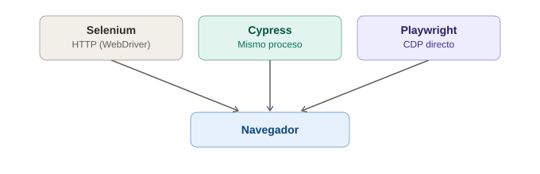

# ¿Qué es Playwright y cómo funciona?

## La analogía general

Ya se vieron dos extremos: Selenium es el operador de grúa que dirige todo **desde una cabina externa, hablando por radio** (WebDriver/HTTP). Cypress es el guardaespaldas que **vive dentro de la casa**, rapidísimo pero limitado a esa propiedad.

Playwright es un tercer perfil: un **especialista de mantenimiento que trabaja para la empresa dueña del edificio** (corre fuera del navegador, como un proceso externo, igual que Selenium), pero en vez de comunicarse por el protocolo genérico de "recepción" que cualquier visitante usaría (WebDriver), **tiene acceso directo a los planos eléctricos internos del edificio** (el protocolo CDP — Chrome DevTools Protocol) y llaves maestras que le permiten entrar a **cualquier habitación, piso o anexo** (múltiples pestañas, contextos y navegadores) sin pedir permiso especial cada vez.

---

## 1. La arquitectura: fuera del navegador, pero con acceso directo

Playwright corre como un **proceso externo en Node.js/Python/Java/.NET**, igual que Selenium — no vive dentro del navegador como Cypress. Pero en vez de usar el protocolo WebDriver (HTTP genérico, el mismo "idioma universal" que usan Selenium y Appium), Playwright usa **CDP directamente** para Chromium, y protocolos equivalentes propios para Firefox y WebKit.

> **Analogía:** Selenium le habla al navegador **por la puerta principal**, usando el protocolo de recepción que cualquier visitante externo usaría (WebDriver). Playwright, en cambio, **entra por la puerta de servicio con las llaves del ingeniero de planta** (CDP) — un canal de comunicación mucho más directo y con más control interno, sin tener que pasar por el protocolo genérico de recepción en cada instrucción.

Esto le da a Playwright una combinación que ni Selenium ni Cypress logran solos:
- **Velocidad cercana a Cypress** (comunicación más directa que el WebDriver de Selenium).
- **Sin vivir dentro del navegador** (evita la limitación de multi-dominio que sí tiene Cypress).

---

## 2. Multi-navegador real, con un solo motor de instalación

```bash
npm init playwright@latest
```

Este comando instala automáticamente los tres motores de navegador — **Chromium, Firefox y WebKit** (el motor real de Safari) — sin necesitar drivers externos descargados por separado.

> **Analogía:** es como si el especialista de mantenimiento viniera **certificado de fábrica para trabajar en los tres tipos de edificios más comunes del mundo** (Chromium, Firefox, WebKit), con las herramientas específicas de cada uno ya incluidas en su maletín — nunca hay que ir a buscar por separado "el driver de la sucursal de Safari" como sí pasaba con Selenium.

Este es un punto que compite directamente con la ventaja que Selenium tenía sobre Cypress (soporte real de Safari/WebKit) — Playwright lo iguala, y lo hace con instalación automática.

---

## 3. Multi-pestaña y multi-contexto — resolviendo la limitación de Cypress

Cypress tenía problemas históricos moviéndose entre dominios distintos, por vivir dentro del navegador. Playwright, al vivir **fuera** del navegador (como Selenium), no tiene esa restricción — y además la resuelve con una elegancia que ni Selenium tenía tan pulida: el concepto de **"contexto de navegador"** (`BrowserContext`), que es como una sesión completamente aislada (cookies, storage, todo) dentro del mismo proceso de navegador.

```javascript
const context1 = await browser.newContext(); // como un usuario A, sesión limpia
const context2 = await browser.newContext(); // como un usuario B, sesión limpia, en paralelo

const page1 = await context1.newPage();
const page2 = await context2.newPage();
```

> **Analogía:** un `BrowserContext` es como si el especialista de mantenimiento pudiera **crear una réplica temporal e independiente del edificio completo**, con su propio sistema de seguridad y registros, para simular a un segundo visitante completamente distinto — sin que las dos réplicas se enteren la una de la otra. Selenium podía abrir varias ventanas, pero coordinarlas con sesiones totalmente aisladas era mucho más manual; Cypress directamente no podía cruzar "propiedades vecinas" con la misma libertad.

---

## 4. Multi-lenguaje, igual que Selenium

```javascript
// JavaScript/TypeScript
await page.goto('https://ejemplo.com');
```
```python
# Python
page.goto("https://ejemplo.com")
```
```java
// Java
page.navigate("https://ejemplo.com");
```
```csharp
// C#
await page.GotoAsync("https://ejemplo.com");
```

> **Analogía:** a diferencia de Cypress (que solo "habla" JavaScript), el especialista de mantenimiento de Playwright **domina varios idiomas** — igual que la agencia global de Selenium — por lo que un equipo que ya trabaja en Java, Python o C# puede adoptarlo sin forzar a todo el equipo a aprender JavaScript.

---

## 5. Por qué esto se siente como "lo mejor de ambos mundos"

| Característica | Selenium | Cypress | Playwright |
|---|---|---|---|
| Corre fuera del navegador | Sí | No | Sí |
| Velocidad | Más lenta (WebDriver/HTTP) | Rápida | Rápida (CDP directo) |
| Multi-dominio sin fricción | Sí | Limitado | Sí |
| Multi-navegador real (incluye WebKit) | Sí | Limitado | Sí |
| Multi-lenguaje | Sí | No (solo JS/TS) | Sí |
| Interceptar red nativo | No | Sí (`cy.intercept`) | Sí (`page.route`) |
| Instalación de navegadores | Manual (drivers) | Automática (un navegador) | Automática (los tres motores) |

> **Analogía final:** si Selenium es la agencia global con sucursales certificadas en todo el mundo, y Cypress es el guardaespaldas rapidísimo pero limitado a una sola casa, Playwright es como si la agencia global **le hubiera dado a su especialista las llaves maestras y el acceso directo a los planos internos de cada sucursal** — conserva el alcance y la flexibilidad multi-idioma de la agencia grande, pero opera con la velocidad y fluidez del guardaespaldas personal.

---

## 6. La contrapartida: es la herramienta más joven de las tres

Playwright es de Microsoft, lanzado en 2020 — más reciente incluso que Cypress (2017). Tiene menos años de comunidad acumulada que Selenium, aunque su crecimiento y adopción han sido muy rápidos, en parte precisamente porque resuelve las limitaciones que Selenium y Cypress tenían por separado.

---

## 7. Diagrama de las tres arquitecturas



*(Diagrama ilustrativo: Selenium habla con el navegador por HTTP/WebDriver, Cypress vive dentro del mismo proceso del navegador, y Playwright se comunica por CDP directo — un canal externo pero mucho más rápido que el de Selenium.)*

---

## 8. Por qué esto importa para lo que ya se sabe de Selenium y Cypress

No es necesario aprender un paradigma completamente nuevo: los conceptos de esperas explícitas, Page Object Model, y estructura de tests se trasladan con matices desde ambas herramientas. Lo que sí cambia es la sintaxis específica de locators y el modelo de `page`/`context`/`browser`, que se cubrirán en los siguientes temas.
