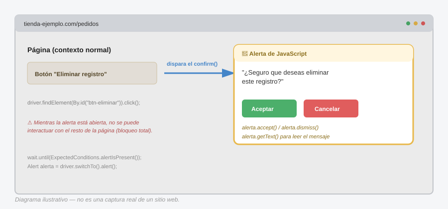

# Manejo de alertas de JavaScript en Selenium (Java)

Las alertas de JavaScript (`alert()`, `confirm()`, `prompt()`) son especiales: **no son parte del DOM**. No puedes hacer `driver.findElement(...)` sobre ellas porque, técnicamente, no viven en la página — las genera el navegador mismo, por encima de todo. Por eso tienen su propio mecanismo: `switchTo().alert()`.

> **Analogía general:** una alerta de JavaScript es como cuando estás cocinando en la cocina de tu casa (interactuando con la página) y de repente **suena la alarma de incendios del edificio completo**. No puedes seguir cocinando con normalidad — el sistema entero queda "congelado" hasta que alguien atienda esa alarma. No puedes ni abrir el refrigerador (`findElement`) mientras la alarma sigue sonando; primero hay que ir al panel y silenciarla.

---

## 1. Los tres tipos de alertas

### `alert()` — solo informa, un botón

```javascript
// JavaScript en la página
alert("Tu sesión expirará en 5 minutos");
```
> **Analogía:** es como la alarma de incendio que solo tiene un botón: "Silenciar". No te pide ninguna decisión, solo debes reconocer que la escuchaste.

### `confirm()` — pide una decisión sí/no

```javascript
confirm("¿Seguro que deseas eliminar este registro?");
```
> **Analogía:** es como cuando alguien toca a tu puerta y te pregunta "¿confirmas que quieres que bote esta caja de cosas viejas?" — tienes dos botones: Aceptar o Cancelar, y tu respuesta cambia lo que pasa después en el "código" de la casa.

### `prompt()` — pide una decisión + un dato escrito

```javascript
prompt("Escribe el motivo de la cancelación:");
```
> **Analogía:** es como si la persona en la puerta no solo te preguntara sí/no, sino que además te entregara una libreta para que escribas algo antes de que ella se retire con esa información.

---

## 2. Esperar a que la alerta aparezca

**Nunca asumas que la alerta ya está ahí apenas haces clic.** El navegador tarda un instante en renderizarla (aunque sea breve), así que siempre se espera explícitamente:

```java
driver.findElement(By.id("btn-eliminar")).click();

WebDriverWait wait = new WebDriverWait(driver, Duration.ofSeconds(10));
wait.until(ExpectedConditions.alertIsPresent());

Alert alerta = driver.switchTo().alert();
```
> **Analogía:** tocas el botón que dispara la acción (como jalar la palanca que activa la alarma), y **esperas a que la alarma efectivamente empiece a sonar** antes de correr al panel de control. Si corres al panel demasiado rápido, todavía no hay nada que apagar — y Selenium lanzaría `NoAlertPresentException`, el equivalente a llegar al panel y encontrarlo apagado porque la alarma ni siquiera había arrancado.

---

## 3. Leer el texto de la alerta

```java
String mensaje = alerta.getText();
System.out.println(mensaje); // "¿Seguro que deseas eliminar este registro?"
```
> **Analogía:** antes de decidir si apagas la alarma o evacúas, **lees el letrero del panel** que te dice de qué se trata la alerta. No respondes a ciegas sin saber qué te están preguntando.

---

## 4. Aceptar, rechazar y escribir

### Aceptar (equivalente a click en "Aceptar"/"OK")

```java
alerta.accept();
```
> **Analogía:** presionas el botón verde del panel: "Sí, adelante, procede con lo que sea que estaba pendiente".

### Rechazar (equivalente a click en "Cancelar")

```java
alerta.dismiss();
```
> **Analogía:** presionas el botón rojo: "No, cancela la acción, todo sigue como estaba".

### Escribir en un `prompt()` antes de aceptar

```java
alerta.sendKeys("Cliente solicitó cancelación por error de compra");
alerta.accept();
```
> **Analogía:** en el caso de la persona con la libreta en la puerta (el `prompt`), primero escribes tu respuesta en la libreta, y **luego** le entregas la libreta de vuelta (aceptas). Si intentas `sendKeys` en un `alert()` simple o en un `confirm()` que no tiene campo de texto, obtendrás una excepción — es como intentar escribir en una libreta que la persona nunca te entregó.

---

## 5. Diagrama del concepto



*(Diagrama ilustrativo: el botón "Eliminar registro" dispara el `confirm()`. Mientras la alerta está abierta, el resto de la página queda bloqueado — no se puede interactuar con nada más hasta atenderla con `accept()` o `dismiss()`.)*

---

## 6. Ejemplo completo: `confirm()` antes de eliminar un registro

```java
import org.openqa.selenium.Alert;
import org.openqa.selenium.By;
import org.openqa.selenium.WebDriver;
import org.openqa.selenium.support.ui.WebDriverWait;
import org.openqa.selenium.support.ui.ExpectedConditions;
import java.time.Duration;

public class EliminarRegistroTest {

    public void eliminarYConfirmar(WebDriver driver) {
        WebDriverWait wait = new WebDriverWait(driver, Duration.ofSeconds(10));

        // 1. Disparamos la acción que genera el confirm()
        driver.findElement(By.id("btn-eliminar-fila-3")).click();

        // 2. Esperamos a que la alarma suene
        wait.until(ExpectedConditions.alertIsPresent());
        Alert alerta = driver.switchTo().alert();

        // 3. Leemos qué está preguntando
        String textoAlerta = alerta.getText();
        System.out.println("Alerta detectada: " + textoAlerta);

        // 4. Decidimos: en este caso, confirmamos la eliminación
        alerta.accept();

        // 5. Volvemos al flujo normal de la página y verificamos el resultado
        wait.until(ExpectedConditions.invisibilityOfElementLocated(By.id("fila-3")));
        System.out.println("Registro eliminado con éxito");
    }
}
```

---

## 7. Ejemplo completo: `prompt()` con motivo de cancelación

```java
public void cancelarConMotivo(WebDriver driver, String motivo) {
    WebDriverWait wait = new WebDriverWait(driver, Duration.ofSeconds(10));

    driver.findElement(By.id("btn-cancelar-pedido")).click();

    wait.until(ExpectedConditions.alertIsPresent());
    Alert alerta = driver.switchTo().alert();

    alerta.sendKeys(motivo);
    alerta.accept();

    // Verificar que el pedido cambió de estado
    wait.until(ExpectedConditions.textToBePresentInElementLocated(
        By.id("estado-pedido"), "Cancelado"
    ));
}
```

---

## 8. Manejo de errores y casos límite

### `NoAlertPresentException`

Ocurre cuando intentas acceder a `driver.switchTo().alert()` sin que exista una alerta activa (o ya se cerró antes de que llegaras).

```java
try {
    wait.until(ExpectedConditions.alertIsPresent());
    Alert alerta = driver.switchTo().alert();
    alerta.accept();
} catch (org.openqa.selenium.NoAlertPresentException e) {
    System.out.println("No había ninguna alerta presente");
}
```
> **Analogía:** llegas corriendo al panel de la alarma, pero resulta que nunca sonó (o alguien más ya la apagó). El sistema te avisa "aquí no hay nada que atender".

### `UnhandledAlertException`

Si una alerta queda abierta y tratas de hacer **cualquier otra cosa** con el driver (buscar un elemento, navegar, etc.) sin haberla atendido primero, Selenium lanza esta excepción — la página entera queda "bloqueada" hasta resolver la alerta.

> **Analogía:** es como intentar seguir cocinando en la cocina mientras la alarma de incendios sigue sonando a todo volumen — literalmente no puedes concentrarte en nada más hasta que alguien la apague. El navegador se comporta igual: no procesa otras acciones hasta que la alerta se resuelva.

### Alertas inesperadas (que no forman parte del flujo esperado del test)

Algunas apps disparan alertas en momentos inesperados (ej. "Tu sesión expiró"). Una estrategia defensiva:

```java
public void cerrarAlertaSiExiste(WebDriver driver) {
    try {
        Alert alerta = driver.switchTo().alert();
        System.out.println("Alerta inesperada detectada: " + alerta.getText());
        alerta.dismiss();
    } catch (org.openqa.selenium.NoAlertPresentException e) {
        // no había alerta, seguimos normal
    }
}
```
> **Analogía:** antes de continuar con tu rutina, das un vistazo rápido al panel de alarmas "por si acaso" alguien la activó sin que te dieras cuenta — y si está sonando, la atiendes antes de seguir con lo tuyo.

### Alertas nativas del navegador (que NO son de JavaScript)

Cosas como el diálogo de "Guardar archivo", ventanas de autenticación básica HTTP, o el selector nativo de archivos del sistema operativo **no son manejables con `switchTo().alert()`** — esos viven fuera del navegador (a nivel de sistema operativo) y requieren otras herramientas (perfiles de navegador preconfigurados, AutoIT, Sikuli, etc.).

> **Analogía:** es la diferencia entre la alarma de incendios de tu edificio (que sí puedes apagar desde el panel interior) y una alarma de un carro estacionado en la calle — no tienes ningún control sobre ella desde adentro de tu casa.

---

## 9. Patrón recomendado (Java)

```java
public class AlertUtils {

    public static Alert esperarAlerta(WebDriver driver, int timeoutSegundos) {
        WebDriverWait wait = new WebDriverWait(driver, Duration.ofSeconds(timeoutSegundos));
        wait.until(ExpectedConditions.alertIsPresent());
        return driver.switchTo().alert();
    }

    public static String aceptarYObtenerTexto(WebDriver driver, int timeoutSegundos) {
        Alert alerta = esperarAlerta(driver, timeoutSegundos);
        String texto = alerta.getText();
        alerta.accept();
        return texto;
    }

    public static void responderPrompt(WebDriver driver, String respuesta, int timeoutSegundos) {
        Alert alerta = esperarAlerta(driver, timeoutSegundos);
        alerta.sendKeys(respuesta);
        alerta.accept();
    }

    public static boolean hayAlertaPresente(WebDriver driver) {
        try {
            driver.switchTo().alert();
            return true;
        } catch (org.openqa.selenium.NoAlertPresentException e) {
            return false;
        }
    }
}
```

---

## 10. Tabla resumen

| Método | Qué hace | Analogía |
|---|---|---|
| `switchTo().alert()` | Cambia el contexto a la alerta activa | Ir corriendo al panel de la alarma |
| `getText()` | Lee el mensaje de la alerta | Leer el letrero del panel |
| `accept()` | Click en "Aceptar"/"OK" | Botón verde: proceder |
| `dismiss()` | Click en "Cancelar" | Botón rojo: cancelar |
| `sendKeys(texto)` | Escribe texto (solo en `prompt()`) | Escribir en la libreta antes de devolverla |
| `alertIsPresent()` (ExpectedCondition) | Espera a que la alerta exista | Esperar a que la alarma empiece a sonar |
