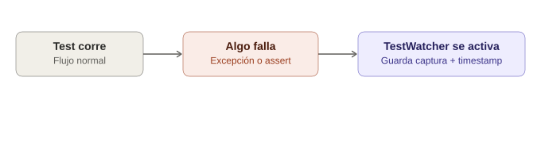

# Screenshots y evidencias — captura automática en fallos

Este tema es fundamental para cualquier suite de tests seria: cuando un test falla en CI (donde nadie está mirando la pantalla en vivo), la **única** forma de entender qué pasó es teniendo evidencia visual del momento exacto del fallo.

> **Analogía general:** imagina una cámara de seguridad en una tienda. Si algo se rompe o desaparece durante la noche, no le preguntas al empleado "¿qué crees que pasó?" — revisas la **grabación exacta del momento del incidente**. Un test que falla sin captura de pantalla es como una tienda sin cámaras: sabes que algo salió mal, pero tienes que adivinar qué.

---

## 1. Captura básica de pantalla

Selenium tiene la interfaz `TakesScreenshot`, que casi todos los drivers (Chrome, Firefox, Edge) implementan.

```java
import org.openqa.selenium.OutputType;
import org.openqa.selenium.TakesScreenshot;
import java.io.File;
import org.apache.commons.io.FileUtils;

File origen = ((TakesScreenshot) driver).getScreenshotAs(OutputType.FILE);
FileUtils.copyFile(origen, new File("screenshots/captura.png"));
```
> **Analogía:** `getScreenshotAs(OutputType.FILE)` es como apretar el botón de "captura instantánea" de la cámara de seguridad — te entrega la foto ya tomada, pero todavía está en un cajón temporal (`origen`, un archivo temporal del sistema). `FileUtils.copyFile` es sacar esa foto del cajón temporal y guardarla en el álbum permanente que tú decidiste (`screenshots/captura.png`).

### Alternativa: capturar como Base64 (útil para incrustar en reportes HTML)

```java
String base64Screenshot = ((TakesScreenshot) driver).getScreenshotAs(OutputType.BASE64);
```
> **Analogía:** en vez de guardar la foto impresa en un álbum físico, la conviertes en un código digital que puedes **pegar directamente dentro de un documento** (un reporte HTML), sin necesidad de adjuntar un archivo aparte.

---

## 2. Capturar automáticamente SOLO cuando el test falla

Lo importante no es capturar en cada paso (eso generaría miles de fotos inútiles), sino **capturar justo en el momento del fallo**. Con JUnit 5, esto se hace con un `TestWatcher`.

> **Analogía:** no quieres que la cámara grabe las 24 horas y tengas que revisar horas de video aburrido — quieres que la cámara **se active automáticamente solo cuando salta la alarma** (el test falla), y guarde esa foto específica con la fecha y hora del incidente.

### 2.1 Implementación con JUnit 5 (`TestWatcher`)

```java
package utils;

import org.junit.jupiter.api.extension.ExtensionContext;
import org.junit.jupiter.api.extension.TestWatcher;
import org.openqa.selenium.OutputType;
import org.openqa.selenium.TakesScreenshot;
import org.openqa.selenium.WebDriver;
import java.io.File;
import java.io.IOException;
import java.nio.file.Files;
import java.nio.file.Paths;
import java.time.format.DateTimeFormatter;
import java.time.LocalDateTime;

public class ScreenshotOnFailureExtension implements TestWatcher {

    private WebDriver driver;

    public ScreenshotOnFailureExtension(WebDriver driver) {
        this.driver = driver;
    }

    @Override
    public void testFailed(ExtensionContext context, Throwable cause) {
        String nombreTest = context.getDisplayName();
        String timestamp = LocalDateTime.now().format(DateTimeFormatter.ofPattern("yyyyMMdd_HHmmss"));
        String nombreArchivo = "screenshots/FALLO_" + nombreTest + "_" + timestamp + ".png";

        try {
            byte[] captura = ((TakesScreenshot) driver).getScreenshotAs(OutputType.BYTES);
            Files.createDirectories(Paths.get("screenshots"));
            Files.write(Paths.get(nombreArchivo), captura);
            System.out.println("Captura guardada en: " + nombreArchivo);
        } catch (IOException e) {
            System.err.println("No se pudo guardar la captura: " + e.getMessage());
        }
    }
}
```
> **Analogía:** `testFailed(...)` es el sensor de la alarma — se dispara **solo** cuando algo se rompe, no en cada movimiento normal de la tienda. El nombre del archivo incluye el nombre del test y la fecha/hora exacta, igual que una cámara de seguridad marca cada grabación con un timestamp para poder encontrarla después entre cientos de archivos.

### 2.2 Usarlo en el test

```java
package tests;

import org.junit.jupiter.api.*;
import org.junit.jupiter.api.extension.ExtendWith;
import org.openqa.selenium.WebDriver;
import org.openqa.selenium.chrome.ChromeDriver;
import utils.ScreenshotOnFailureExtension;

public class LoginTest {

    private WebDriver driver;

    @RegisterExtension
    ScreenshotOnFailureExtension screenshotExtension;

    @BeforeEach
    void setUp() {
        driver = new ChromeDriver();
        screenshotExtension = new ScreenshotOnFailureExtension(driver);
    }

    @Test
    void loginConCredencialesValidas() {
        driver.get("https://app-ejemplo.com/login");
        // ... pasos del test ...
        // Si algo falla aquí (un assert, una excepción de Selenium),
        // la extensión automáticamente toma la captura
    }

    @AfterEach
    void tearDown() {
        driver.quit();
    }
}
```
> **Analogía:** registrar la extensión (`@RegisterExtension`) es como contratar a la empresa de seguridad e instalar la cámara **antes** de que la tienda abra. No tienes que acordarte de "tomar la foto" manualmente en cada test — el sistema de vigilancia queda funcionando de fondo automáticamente.

---

## 3. Diagrama del flujo



*(Diagrama ilustrativo: el test corre con normalidad; si algo falla, el "sensor" (`TestWatcher`) se activa automáticamente y guarda la captura con nombre y timestamp, sin que el test tenga que pedirlo explícitamente.)*

---

## 4. Nombrar los archivos de forma útil

Un error común es guardar todas las capturas como `screenshot1.png`, `screenshot2.png`. Cuando tienes 200 tests fallando en CI, esto es inútil.

**Buena convención:**
```
screenshots/FALLO_loginConClaveIncorrecta_20260712_143205.png
screenshots/FALLO_agregarProductoAlCarrito_20260712_143312.png
```

> **Analogía:** es la diferencia entre una caja de fotos sin etiquetar tiradas en un cajón, versus un álbum donde cada foto dice claramente **qué evento fue y cuándo ocurrió**. Cuando revisas 50 fallos en CI a las 2am, agradeces poder identificar cada uno sin tener que abrir cada imagen una por una.

---

## 5. Integración con reportes (Allure / Extent Reports)

La mayoría de los frameworks de reporte permiten **adjuntar la captura directamente dentro del reporte HTML**, en vez de dejarla suelta en una carpeta.

### Ejemplo con Allure

```java
import io.qameta.allure.Allure;
import java.io.ByteArrayInputStream;

@Override
public void testFailed(ExtensionContext context, Throwable cause) {
    byte[] captura = ((TakesScreenshot) driver).getScreenshotAs(OutputType.BYTES);
    Allure.addAttachment(
        "Captura de pantalla al fallar",
        new ByteArrayInputStream(captura)
    );
}
```
> **Analogía:** en vez de dejar la foto de la cámara de seguridad suelta en una carpeta física, la **pegas directamente dentro del informe policial** (el reporte de Allure) junto al incidente correspondiente. Así, quien revisa el reporte ve el fallo y la foto **en el mismo lugar**, sin tener que ir a buscarla aparte.

---

## 6. Capturar también el HTML de la página (evidencia extra)

A veces una imagen no basta — quizás el elemento sí estaba ahí, pero el CSS lo hacía invisible. Guardar el HTML crudo en el momento del fallo da contexto adicional.

```java
@Override
public void testFailed(ExtensionContext context, Throwable cause) {
    // Captura de imagen
    byte[] captura = ((TakesScreenshot) driver).getScreenshotAs(OutputType.BYTES);

    // Captura del HTML completo de la página en ese momento
    String htmlActual = driver.getPageSource();

    try {
        Files.write(Paths.get("screenshots/fallo.png"), captura);
        Files.writeString(Paths.get("screenshots/fallo.html"), htmlActual);
    } catch (IOException e) {
        System.err.println("Error guardando evidencia: " + e.getMessage());
    }
}
```
> **Analogía:** además de la foto de la cámara de seguridad, también guardas el **reporte del sensor de movimiento** (los datos crudos) — a veces la foto sola no explica todo, pero combinada con el registro técnico exacto de lo que pasó en el sistema, tienes el panorama completo.

---

## 7. Buenas prácticas

1. **No captures en cada paso** — solo en fallos (o en pasos clave si estás depurando activamente). Cientos de capturas innecesarias saturan el almacenamiento y hacen más lento el CI.
2. **Incluye timestamp y nombre del test** en el nombre del archivo — nunca nombres genéricos.
3. **Limpia capturas viejas periódicamente** en CI (o usa una retención automática), para no acumular gigas de imágenes de ejecuciones antiguas.
4. **Considera capturar también logs de consola del navegador** (errores de JavaScript) junto con el screenshot — a veces el fallo visual es consecuencia de un error de JS que no se ve en la imagen.
5. **Asegúrate de que la captura se tome ANTES de cerrar el driver** (`driver.quit()`) — si el `tearDown()` cierra el navegador antes de que la extensión capture la pantalla, obtendrás una excepción o una imagen en blanco.
