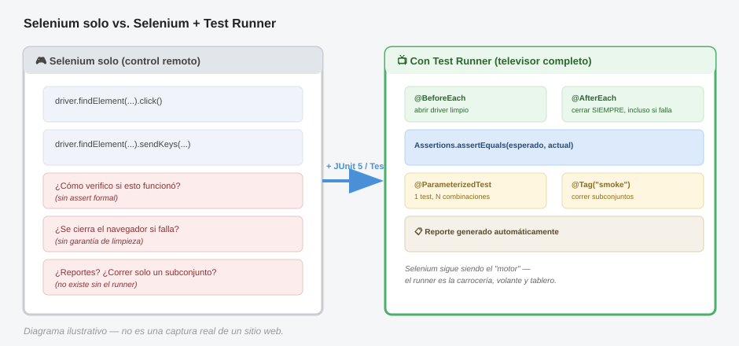

# Integración con un framework de test runner (JUnit 5 / TestNG) — Java

Selenium solo sabe abrir un navegador y hacer clics — **no sabe organizar tests, no sabe qué es un "assert", no sabe generar reportes, no sabe qué hacer si un test falla a mitad de camino**. Todo eso lo aporta el test runner (JUnit 5 o TestNG). Selenium es el motor; el test runner es el auto completo con volante, frenos y tablero.

> **Analogía general:** Selenium es como un control remoto universal que sabe apretar botones de la tele (clics, texto, navegación). Pero un control remoto solo no organiza un "programa de televisión" — no decide qué canal ver primero, no lleva un registro de qué programas ya viste, no te avisa si algo salió mal. El test runner es el **televisor completo con guía de programación**: organiza el orden, lleva el registro (reportes), y decide qué hacer si un programa falla a mitad de camino (fixtures de limpieza).

---

## 1. ¿Qué le falta a Selenium solo?

```java
// Esto es Selenium "pelado" — funciona, pero no es un test real
public class Prueba {
    public static void main(String[] args) {
        WebDriver driver = new ChromeDriver();
        driver.get("https://app-ejemplo.com/login");
        driver.findElement(By.id("username")).sendKeys("usuario123");
        // ¿cómo verifico que esto funcionó? ¿Qué reporta esto si falla?
        // ¿cómo cierro el navegador si algo lanza una excepción a mitad de camino?
        driver.quit();
    }
}
```

Sin un test runner: no hay asserts formales, no hay reportes, no hay garantía de limpieza si algo falla, no hay forma de correr "solo los tests de login" o "todos menos los lentos", y no hay forma de correr tests en paralelo.

---

## 2. JUnit 5 — la opción más común hoy en día

### 2.1 Fixtures: `@BeforeEach`, `@AfterEach`, `@BeforeAll`, `@AfterAll`

```java
import org.junit.jupiter.api.*;
import org.openqa.selenium.WebDriver;
import org.openqa.selenium.chrome.ChromeDriver;

public class LoginTest {

    private WebDriver driver;

    @BeforeAll
    static void configuracionGlobal() {
        System.out.println("Se ejecuta UNA sola vez, antes de todos los tests de esta clase");
        // ej: levantar un servidor de pruebas, configurar variables de entorno
    }

    @BeforeEach
    void setUp() {
        // Se ejecuta ANTES de CADA test — abrir un navegador limpio
        driver = new ChromeDriver();
        driver.get("https://app-ejemplo.com/login");
    }

    @Test
    void loginConCredencialesValidas() {
        driver.findElement(By.id("username")).sendKeys("usuario123");
        driver.findElement(By.id("password")).sendKeys("clave123");
        driver.findElement(By.cssSelector("button[type='submit']")).click();

        String mensaje = driver.findElement(By.id("welcome-message")).getText();
        Assertions.assertTrue(mensaje.contains("Bienvenido"));
    }

    @Test
    void loginConClaveIncorrecta() {
        driver.findElement(By.id("username")).sendKeys("usuario123");
        driver.findElement(By.id("password")).sendKeys("clave-mala");
        driver.findElement(By.cssSelector("button[type='submit']")).click();

        String error = driver.findElement(By.id("error-message")).getText();
        Assertions.assertEquals("Usuario o contraseña incorrectos", error);
    }

    @AfterEach
    void tearDown() {
        // Se ejecuta DESPUÉS de CADA test, incluso si el test falló
        if (driver != null) {
            driver.quit();
        }
    }

    @AfterAll
    static void limpiezaGlobal() {
        System.out.println("Se ejecuta UNA sola vez, al final de todos los tests");
    }
}
```

> **Analogía:** `@BeforeEach`/`@AfterEach` son como **abrir y cerrar la tienda cada día** — sin importar qué tan bien o mal haya ido el día anterior, mañana abres con la caja registradora en cero otra vez. `@BeforeAll`/`@AfterAll` son cosas que haces **una sola vez al iniciar el negocio** (contratar personal) y **una sola vez al cerrarlo definitivamente** (liquidar todo), no cada día.

**Punto crítico:** `@AfterEach` se ejecuta **incluso si el test falla** — esto es exactamente lo que garantiza que el navegador se cierre aunque un `assert` haya fallado a mitad del test. Sin el test runner, tendrías que envolver manualmente cada test en `try/finally`.

### 2.2 Asserts — el corazón de "¿esto pasó o no?"

```java
Assertions.assertEquals("esperado", "actual");
Assertions.assertTrue(condicion);
Assertions.assertFalse(condicion);
Assertions.assertNotNull(objeto);
Assertions.assertThrows(NoSuchElementException.class, () -> {
    driver.findElement(By.id("elemento-que-no-existe"));
});
```
> **Analogía:** un assert es como un **inspector de calidad en una fábrica** que revisa "¿esta pieza mide exactamente lo que debería medir?". Si no coincide, el inspector detiene la línea y reporta exactamente qué se esperaba vs. qué se encontró — no simplemente dice "algo está mal", te dice **específicamente qué**.

### 2.3 Tests parametrizados (correr el mismo test con distintos datos)

```java
import org.junit.jupiter.params.ParameterizedTest;
import org.junit.jupiter.params.provider.CsvSource;

@ParameterizedTest
@CsvSource({
    "usuario123, clave123, true",
    "usuario123, clave-mala, false",
    "usuario-inexistente, clave123, false"
})
void loginConVariasCombinaciones(String usuario, String clave, boolean deberiaSerExitoso) {
    driver.findElement(By.id("username")).sendKeys(usuario);
    driver.findElement(By.id("password")).sendKeys(clave);
    driver.findElement(By.cssSelector("button[type='submit']")).click();

    boolean loginExitoso = driver.findElements(By.id("welcome-message")).size() > 0;
    Assertions.assertEquals(deberiaSerExitoso, loginExitoso);
}
```
> **Analogía:** en vez de escribir 3 recetas de cocina casi idénticas que solo cambian la cantidad de sal, escribes **una sola receta con una tabla de variaciones** al lado — "prueba esta receta con 1 cucharada, luego con 2, luego con ninguna" — y el sistema se encarga de repetir el proceso automáticamente por ti con cada combinación.

### 2.4 Agrupar y filtrar tests con `@Tag`

```java
@Tag("smoke")
@Test
void loginConCredencialesValidas() { /* ... */ }

@Tag("regresion")
@Test
void loginConClaveIncorrecta() { /* ... */ }
```
Luego, desde Maven/Gradle, puedes correr solo los tests etiquetados como `smoke` (los críticos, rápidos) sin ejecutar toda la suite completa de regresión.

> **Analogía:** es como ponerle etiquetas de color a las tareas de una lista ("urgente", "puede esperar") — así, cuando tienes poco tiempo antes de un deploy, corres solo las tareas "urgentes" (`smoke`) en vez de la lista completa.

---

## 3. TestNG — la alternativa clásica, muy usada en Selenium

TestNG nació pensando específicamente en testing (a diferencia de JUnit, que empezó más genérico), así que tiene algunas ventajas nativas para Selenium: paralelización más simple, dependencias entre tests, y `@DataProvider`.

```java
import org.testng.annotations.*;
import org.testng.Assert;
import org.openqa.selenium.WebDriver;
import org.openqa.selenium.chrome.ChromeDriver;
import org.openqa.selenium.By;

public class LoginTestNG {

    private WebDriver driver;

    @BeforeMethod
    public void setUp() {
        driver = new ChromeDriver();
        driver.get("https://app-ejemplo.com/login");
    }

    @Test(priority = 1, groups = "smoke")
    public void loginConCredencialesValidas() {
        driver.findElement(By.id("username")).sendKeys("usuario123");
        driver.findElement(By.id("password")).sendKeys("clave123");
        driver.findElement(By.cssSelector("button[type='submit']")).click();

        String mensaje = driver.findElement(By.id("welcome-message")).getText();
        Assert.assertTrue(mensaje.contains("Bienvenido"));
    }

    @Test(priority = 2, groups = "regresion", dependsOnMethods = "loginConCredencialesValidas")
    public void cerrarSesionFunciona() {
        // Este test solo corre SI el anterior pasó
        driver.findElement(By.id("logout-btn")).click();
        Assert.assertTrue(driver.getCurrentUrl().contains("/login"));
    }

    @DataProvider(name = "credenciales")
    public Object[][] proveerCredenciales() {
        return new Object[][] {
            {"usuario123", "clave123", true},
            {"usuario123", "clave-mala", false}
        };
    }

    @Test(dataProvider = "credenciales")
    public void loginParametrizado(String usuario, String clave, boolean esperado) {
        driver.findElement(By.id("username")).sendKeys(usuario);
        driver.findElement(By.id("password")).sendKeys(clave);
        driver.findElement(By.cssSelector("button[type='submit']")).click();

        boolean exitoso = driver.findElements(By.id("welcome-message")).size() > 0;
        Assert.assertEquals(exitoso, esperado);
    }

    @AfterMethod
    public void tearDown() {
        if (driver != null) driver.quit();
    }
}
```
> **Analogía:** `dependsOnMethods` es como decir "no tiene sentido probar que 'cerrar sesión' funciona si primero ni siquiera pudiste iniciar sesión" — es una **fila con orden lógico obligatorio**, no una lista de tareas sueltas sin relación. `@DataProvider` cumple el mismo rol que `@CsvSource` en JUnit: alimentar el mismo test con múltiples combinaciones de datos.

---

## 4. Diagrama: qué le aporta el test runner a Selenium



*(Diagrama ilustrativo: Selenium por sí solo solo abre el navegador y hace clics; el test runner añade fixtures, asserts, organización y reportes alrededor de esas acciones.)*

---

## 5. JUnit 5 vs TestNG — comparación rápida

| Característica | JUnit 5 | TestNG |
|---|---|---|
| Fixtures | `@BeforeEach` / `@AfterEach` / `@BeforeAll` / `@AfterAll` | `@BeforeMethod` / `@AfterMethod` / `@BeforeClass` / `@AfterClass` |
| Datos parametrizados | `@ParameterizedTest` + `@CsvSource`/`@MethodSource` | `@DataProvider` |
| Dependencias entre tests | No nativo (se considera mala práctica en JUnit) | `dependsOnMethods` nativo |
| Paralelización | Soportada, configuración algo más manual | Soportada de forma más directa vía XML |
| Agrupar/filtrar tests | `@Tag` | `groups` |
| Ecosistema / integración | Más estándar en proyectos Spring Boot modernos | Muy común históricamente en proyectos de QA/Selenium puros |
| Reportes | Necesita plugin extra (Surefire + Allure, etc.) | Reporte HTML básico incluido de fábrica |

**En la práctica:** ambos son válidos y sólidos. JUnit 5 es la opción más "moderna" y estándar en el ecosistema Java en general; TestNG tiene ventajas específicas para suites grandes de automatización (dependencias, paralelización, reportes nativos). Muchos equipos de QA todavía prefieren TestNG específicamente por eso.

---

## 6. Reportes: el runner solo no basta del todo

Tanto JUnit como TestNG generan reportes básicos, pero para reportes visuales ricos (con capturas de pantalla incrustadas, como vimos en el tema anterior), se integran con **Allure** o **Extent Reports**:

```java
// Con Allure (funciona tanto con JUnit 5 como con TestNG)
import io.qameta.allure.Step;
import io.qameta.allure.Attachment;

@Step("Iniciar sesión con usuario {usuario}")
public void login(String usuario, String clave) {
    driver.findElement(By.id("username")).sendKeys(usuario);
    driver.findElement(By.id("password")).sendKeys(clave);
    driver.findElement(By.cssSelector("button[type='submit']")).click();
}
```
> **Analogía:** el reporte básico del test runner es como el "recibo simple" que te da una máquina expendedora — te dice si tu compra fue exitosa o no. Allure es como pedir **factura detallada con foto del producto**, desglose de cada paso, y tiempo que tardó cada uno.

---

## 7. Buenas prácticas al integrar Selenium con un test runner

1. **El `WebDriver` se crea en el setup y se destruye en el teardown** — nunca a nivel de variable estática compartida entre tests, o un test contaminará el estado del navegador para el siguiente.
2. **Los asserts van en el test, nunca en el Page Object** (como vimos en el tema de POM) — el runner es responsable de decidir pasa/falla, no la página.
3. **Usa `@Tag`/`groups` desde el principio**, aunque tengas pocos tests — cuando la suite crezca a 300 tests, vas a agradecer poder correr solo un subconjunto.
4. **No pongas lógica de negocio compleja dentro de un `@BeforeAll`/`@BeforeClass`** — si algo ahí falla, TODOS los tests de la clase fallan sin ninguna pista clara de por qué.
5. **Combina esto con lo que ya aprendiste**: fixtures de JUnit/TestNG + `TestWatcher` (screenshots en fallo) + Page Object Model = una suite de automatización realmente profesional.
