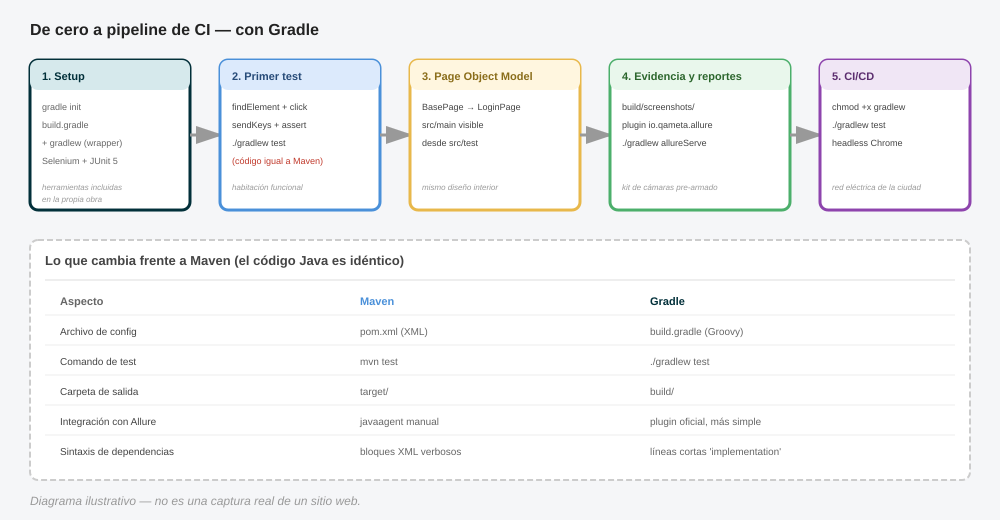

# Tutorial: Crea tu primera suite de automatización con Selenium desde cero (con Gradle)

Misma ruta de aprendizaje que el tutorial anterior, pero usando **Gradle** en vez de Maven como gestor de proyecto y dependencias. Si ya viste la versión con Maven, notarás que la lógica y las analogías son las mismas — lo que cambia es la herramienta que orquesta la construcción del proyecto.

> **Analogía general:** si Maven es como seguir una receta con pasos fijos y bastante rígidos (XML detallado paso a paso), Gradle es como cocinar con un lenguaje de script más flexible (Groovy o Kotlin DSL) — mismo resultado final (la casa construida), pero con una herramienta de construcción distinta y, para muchos, más rápida y legible.

**Qué vamos a construir:** lo mismo que antes — una suite de automatización en Java que prueba el login de una aplicación web de ejemplo, con Page Object Model, capturas de pantalla en fallos, reportes con Allure, y ejecución automática en GitHub Actions. Esta vez, gestionado con Gradle.

---

## Paso 0: Prerrequisitos

- **Java JDK 17 o superior** (`java -version`)
- **Gradle** (`gradle -version`) — o usar el wrapper que generamos en el paso 1, que no requiere instalación previa
- Un IDE (IntelliJ IDEA tiene soporte nativo excelente para Gradle)
- Google Chrome instalado
- Cuenta de GitHub

> **Analogía:** los mismos cimientos de antes — electricidad, agua, terreno — solo que ahora el "manual de construcción" que vamos a seguir está escrito en un idioma distinto (Gradle en vez de Maven).

---

## Paso 1: Crear el proyecto Gradle

```bash
mkdir suite-login-tests
cd suite-login-tests
gradle init --type java-application \
  --dsl groovy \
  --test-framework junit-jupiter \
  --package com.miempresa.automatizacion \
  --project-name suite-login-tests
```

Esto genera:

```
suite-login-tests/
├── build.gradle
├── settings.gradle
├── gradlew
├── gradlew.bat
├── gradle/wrapper/
└── src/
    ├── main/java/com/miempresa/automatizacion/
    └── test/java/com/miempresa/automatizacion/
```

> **Analogía:** `gradle init` es como levantar la estructura de cimientos y vigas, igual que antes — pero aquí Gradle además te entrega el `gradlew` (**Gradle Wrapper**), que es como dejar **una copia exacta de las herramientas de construcción guardada dentro de la propia obra**. Así, cualquier otro albañil (desarrollador) que llegue al proyecto usa exactamente la misma versión de Gradle sin tener que instalarla manualmente — evita el clásico "en mi máquina funciona" por diferencias de versión.

---

## Paso 2: Configurar `build.gradle` con las dependencias necesarias

Reemplaza `build.gradle` por esto:

```groovy
plugins {
    id 'java'
}

group = 'com.miempresa.automatizacion'
version = '1.0-SNAPSHOT'

java {
    toolchain {
        languageVersion = JavaLanguageVersion.of(17)
    }
}

repositories {
    mavenCentral()
}

dependencies {
    // Selenium: el motor que controla el navegador
    implementation 'org.seleniumhq.selenium:selenium-java:4.27.0'

    // WebDriverManager: descarga automáticamente el driver correcto para tu versión de Chrome
    implementation 'io.github.bonigarcia:webdrivermanager:5.9.2'

    // JUnit 5: el test runner
    testImplementation platform('org.junit:junit-bom:5.11.3')
    testImplementation 'org.junit.jupiter:junit-jupiter'
}

test {
    useJUnitPlatform()
    testLogging {
        events "passed", "skipped", "failed"
    }
}
```

> **Analogía:** el `build.gradle` cumple el mismo rol que el `pom.xml` de Maven — es tu **lista de materiales de construcción**. La sintaxis es más compacta (Groovy en vez de XML), pero el contenido conceptual es idéntico: motor de Selenium, asistente que compra el driver correcto automáticamente (WebDriverManager), y el test runner (JUnit 5). Fíjate en `useJUnitPlatform()` dentro del bloque `test {}` — esta línea es la que le dice a Gradle **"usa JUnit 5 para correr los tests"**; sin ella, Gradle no sabría cómo ejecutarlos correctamente.

---

## Paso 3: Escribir el primer test (crudo, sin estructura)

Crea `src/test/java/com/miempresa/automatizacion/PrimerTest.java`:

```java
package com.miempresa.automatizacion;

import io.github.bonigarcia.wdm.WebDriverManager;
import org.junit.jupiter.api.*;
import org.openqa.selenium.By;
import org.openqa.selenium.WebDriver;
import org.openqa.selenium.chrome.ChromeDriver;

import static org.junit.jupiter.api.Assertions.assertTrue;

public class PrimerTest {

    private WebDriver driver;

    @BeforeEach
    void setUp() {
        WebDriverManager.chromedriver().setup();
        driver = new ChromeDriver();
        driver.get("https://the-internet.herokuapp.com/login");
    }

    @Test
    void loginConCredencialesValidasFunciona() {
        driver.findElement(By.id("username")).sendKeys("tomsmith");
        driver.findElement(By.id("password")).sendKeys("SuperSecretPassword!");
        driver.findElement(By.cssSelector("button[type='submit']")).click();

        String mensaje = driver.findElement(By.cssSelector(".flash.success")).getText();
        assertTrue(mensaje.contains("You logged into a secure area"));
    }

    @AfterEach
    void tearDown() {
        if (driver != null) driver.quit();
    }
}
```

Corre el test con el wrapper (recomendado, no requiere Gradle instalado globalmente):

```bash
./gradlew test
```

En Windows sería `gradlew.bat test`.

> **Analogía:** exactamente la misma "habitación funcional" que construimos antes — el código Java es idéntico, porque Selenium y JUnit no cambian. Lo único distinto es el comando que usamos para "prender la luz" (`./gradlew test` en vez de `mvn test`).

---

## Paso 4: Agregar esperas explícitas

```java
import org.openqa.selenium.support.ui.WebDriverWait;
import org.openqa.selenium.support.ui.ExpectedConditions;
import java.time.Duration;

@Test
void loginConCredencialesValidasFunciona() {
    WebDriverWait wait = new WebDriverWait(driver, Duration.ofSeconds(10));

    wait.until(ExpectedConditions.visibilityOfElementLocated(By.id("username")))
        .sendKeys("tomsmith");
    driver.findElement(By.id("password")).sendKeys("SuperSecretPassword!");
    driver.findElement(By.cssSelector("button[type='submit']")).click();

    String mensaje = wait.until(ExpectedConditions.visibilityOfElementLocated(
        By.cssSelector(".flash.success")
    )).getText();

    assertTrue(mensaje.contains("You logged into a secure area"));
}
```

> **Analogía:** el mismo sensor de movimiento de antes en la puerta — este paso no depende para nada del gestor de dependencias, es puro Selenium.

---

## Paso 5: Refactor a Page Object Model

### 5.1 Crear `BasePage`

`src/main/java/com/miempresa/automatizacion/pages/BasePage.java`:

```java
package com.miempresa.automatizacion.pages;

import org.openqa.selenium.By;
import org.openqa.selenium.WebDriver;
import org.openqa.selenium.WebElement;
import org.openqa.selenium.support.ui.ExpectedConditions;
import org.openqa.selenium.support.ui.WebDriverWait;
import java.time.Duration;

public abstract class BasePage {
    protected WebDriver driver;
    protected WebDriverWait wait;

    public BasePage(WebDriver driver) {
        this.driver = driver;
        this.wait = new WebDriverWait(driver, Duration.ofSeconds(10));
    }

    protected void escribir(By locator, String texto) {
        WebElement campo = wait.until(ExpectedConditions.visibilityOfElementLocated(locator));
        campo.clear();
        campo.sendKeys(texto);
    }

    protected void click(By locator) {
        wait.until(ExpectedConditions.elementToBeClickable(locator)).click();
    }

    protected String obtenerTexto(By locator) {
        return wait.until(ExpectedConditions.visibilityOfElementLocated(locator)).getText();
    }
}
```

**Nota importante de Gradle:** este archivo va en `src/main/java`, no en `src/test/java`. Con el plugin `java` básico, el código de `main` es visible automáticamente desde `test` — no necesitas configuración adicional para que `LoginPage` (que crearemos ahora) sea accesible desde tus tests.

### 5.2 Crear `LoginPage`

`src/main/java/com/miempresa/automatizacion/pages/LoginPage.java`:

```java
package com.miempresa.automatizacion.pages;

import org.openqa.selenium.By;
import org.openqa.selenium.WebDriver;

public class LoginPage extends BasePage {

    private final By campoUsuario = By.id("username");
    private final By campoClave = By.id("password");
    private final By botonIngresar = By.cssSelector("button[type='submit']");
    private final By mensajeResultado = By.cssSelector(".flash");

    public LoginPage(WebDriver driver) {
        super(driver);
    }

    public void navegar() {
        driver.get("https://the-internet.herokuapp.com/login");
    }

    public void login(String usuario, String clave) {
        escribir(campoUsuario, usuario);
        escribir(campoClave, clave);
        click(botonIngresar);
    }

    public String obtenerMensajeResultado() {
        return obtenerTexto(mensajeResultado);
    }
}
```

### 5.3 Reescribir el test usando el Page Object

```java
package com.miempresa.automatizacion;

import com.miempresa.automatizacion.pages.LoginPage;
import io.github.bonigarcia.wdm.WebDriverManager;
import org.junit.jupiter.api.*;
import org.openqa.selenium.WebDriver;
import org.openqa.selenium.chrome.ChromeDriver;

import static org.junit.jupiter.api.Assertions.assertTrue;

public class LoginTest {

    private WebDriver driver;
    private LoginPage loginPage;

    @BeforeEach
    void setUp() {
        WebDriverManager.chromedriver().setup();
        driver = new ChromeDriver();
        loginPage = new LoginPage(driver);
        loginPage.navegar();
    }

    @Test
    void loginConCredencialesValidasFunciona() {
        loginPage.login("tomsmith", "SuperSecretPassword!");
        String mensaje = loginPage.obtenerMensajeResultado();
        assertTrue(mensaje.contains("You logged into a secure area"));
    }

    @Test
    void loginConClaveIncorrectaMuestraError() {
        loginPage.login("tomsmith", "clave-incorrecta");
        String mensaje = loginPage.obtenerMensajeResultado();
        assertTrue(mensaje.contains("Your password is invalid"));
    }

    @AfterEach
    void tearDown() {
        if (driver != null) driver.quit();
    }
}
```

Corre de nuevo:

```bash
./gradlew test
```

> **Analogía:** el mismo electricista especializado (`LoginPage`) — el diseño interior de la casa no cambia según qué constructora contrataste, solo cambia el papeleo administrativo detrás.

---

## Paso 6: Screenshots automáticos en fallos

Idéntico al anterior — este código no depende del build tool:

`src/test/java/com/miempresa/automatizacion/utils/ScreenshotExtension.java`:

```java
package com.miempresa.automatizacion.utils;

import org.junit.jupiter.api.extension.ExtensionContext;
import org.junit.jupiter.api.extension.TestWatcher;
import org.openqa.selenium.OutputType;
import org.openqa.selenium.TakesScreenshot;
import org.openqa.selenium.WebDriver;

import java.nio.file.Files;
import java.nio.file.Paths;
import java.time.LocalDateTime;
import java.time.format.DateTimeFormatter;

public class ScreenshotExtension implements TestWatcher {

    private final WebDriver driver;

    public ScreenshotExtension(WebDriver driver) {
        this.driver = driver;
    }

    @Override
    public void testFailed(ExtensionContext context, Throwable cause) {
        try {
            String timestamp = LocalDateTime.now().format(DateTimeFormatter.ofPattern("yyyyMMdd_HHmmss"));
            String nombre = "build/screenshots/FALLO_" + context.getDisplayName() + "_" + timestamp + ".png";
            byte[] captura = ((TakesScreenshot) driver).getScreenshotAs(OutputType.BYTES);
            Files.createDirectories(Paths.get("build/screenshots"));
            Files.write(Paths.get(nombre), captura);
            System.out.println("Captura guardada: " + nombre);
        } catch (Exception e) {
            System.err.println("No se pudo guardar la captura: " + e.getMessage());
        }
    }
}
```

**Nota clave:** cambiamos la carpeta de destino de `target/screenshots` (convención de Maven) a `build/screenshots` (convención de Gradle) — Gradle usa `build/` como carpeta de salida en vez de `target/`.

Actualiza el test:

```java
import org.junit.jupiter.api.extension.RegisterExtension;
import com.miempresa.automatizacion.utils.ScreenshotExtension;

public class LoginTest {

    private WebDriver driver;
    private LoginPage loginPage;

    @RegisterExtension
    ScreenshotExtension screenshotExtension;

    @BeforeEach
    void setUp() {
        WebDriverManager.chromedriver().setup();
        driver = new ChromeDriver();
        loginPage = new LoginPage(driver);
        loginPage.navegar();
        screenshotExtension = new ScreenshotExtension(driver);
    }

    // ... resto igual
}
```

> **Analogía:** la misma cámara de seguridad que se activa solo cuando salta la alarma — únicamente cambiamos **en qué estante del depósito** se guardan las fotos (`build/` en vez de `target/`), porque cada constructora (Gradle vs Maven) organiza sus bodegas con una convención distinta.

---

## Paso 7: Reportes con Allure

Con Gradle, Allure se integra mucho más simple gracias al plugin oficial de Allure para Gradle — sin necesidad de configurar manualmente el javaagent de AspectJ como en Maven.

Actualiza `build.gradle`:

```groovy
plugins {
    id 'java'
    id 'io.qameta.allure' version '2.12.0'
}

// ... resto de configuración igual ...

dependencies {
    implementation 'org.seleniumhq.selenium:selenium-java:4.27.0'
    implementation 'io.github.bonigarcia:webdrivermanager:5.9.2'

    testImplementation platform('org.junit:junit-bom:5.11.3')
    testImplementation 'org.junit.jupiter:junit-jupiter'

    // Allure para JUnit 5
    testImplementation 'io.qameta.allure:allure-junit5:2.29.0'
}

allure {
    version = '2.29.0'
    useJUnit5 {
        version = '2.29.0'
    }
}

test {
    useJUnitPlatform()
}
```

> **Analogía:** el plugin oficial de Allure para Gradle es como si la ferretería te vendiera **el kit de cámaras de seguridad ya pre-armado**, con los cables y el software correctamente conectados de fábrica — en vez de tener que instalar cada pieza (el javaagent) manualmente como en la versión de Maven.

Agrega pasos descriptivos al `LoginPage` (idéntico a la versión Maven):

```java
import io.qameta.allure.Step;

public class LoginPage extends BasePage {
    // ... locators ...

    @Step("Navegar a la página de login")
    public void navegar() {
        driver.get("https://the-internet.herokuapp.com/login");
    }

    @Step("Iniciar sesión con usuario: {usuario}")
    public void login(String usuario, String clave) {
        escribir(campoUsuario, usuario);
        escribir(campoClave, clave);
        click(botonIngresar);
    }
}
```

Corre y visualiza el reporte:

```bash
./gradlew test
./gradlew allureServe
```

> **Analogía:** `allureServe` cumple exactamente el mismo rol que `allure serve target/allure-results` en la versión de Maven — abre la sala de juntas con el informe de auditoría completo — solo que Gradle ya sabe automáticamente dónde están los resultados, sin que tengas que indicarle la ruta manualmente.

---

## Paso 8: Preparar el proyecto para correr en CI (modo headless)

Idéntico conceptualmente a la versión Maven — este código tampoco depende del build tool:

```java
import org.openqa.selenium.chrome.ChromeOptions;

@BeforeEach
void setUp() {
    WebDriverManager.chromedriver().setup();

    ChromeOptions opciones = new ChromeOptions();
    if (System.getenv("CI") != null) {
        opciones.addArguments("--headless=new");
        opciones.addArguments("--no-sandbox");
        opciones.addArguments("--disable-dev-shm-usage");
        opciones.addArguments("--window-size=1920,1080");
    }

    driver = new ChromeDriver(opciones);
    loginPage = new LoginPage(driver);
    loginPage.navegar();
    screenshotExtension = new ScreenshotExtension(driver);
}
```

> **Analogía:** la misma fábrica funcionando sin luces para humanos — el modo headless es una configuración de Selenium/Chrome, totalmente independiente de si usas Maven o Gradle para orquestar el proyecto.

---

## Paso 9: Configurar GitHub Actions con Gradle

Crea `.github/workflows/tests.yml`:

```yaml
name: Suite de tests de login

on:
  push:
    branches: [main]
  pull_request:
    branches: [main]

jobs:
  test:
    runs-on: ubuntu-latest

    steps:
      - name: Descargar el código
        uses: actions/checkout@v4

      - name: Configurar Java 17
        uses: actions/setup-java@v4
        with:
          java-version: '17'
          distribution: 'temurin'

      - name: Dar permisos de ejecución al Gradle Wrapper
        run: chmod +x ./gradlew

      - name: Ejecutar tests
        run: ./gradlew test

      - name: Subir capturas de pantalla (si hubo fallos)
        if: failure()
        uses: actions/upload-artifact@v4
        with:
          name: screenshots-de-fallo
          path: build/screenshots/

      - name: Subir resultados de Allure
        if: always()
        uses: actions/upload-artifact@v4
        with:
          name: allure-results
          path: build/allure-results/
```

> **Analogía:** el mismo "electricista automático en la nube" que revisa la casa en cada push — la única diferencia real frente a la versión Maven es el paso adicional `chmod +x ./gradlew` (dar permisos de ejecución al wrapper en el entorno Linux del runner de GitHub Actions) y que usamos `./gradlew test` en vez de `mvn test`. También notarás que las rutas de los artifacts cambiaron de `target/` a `build/`, siguiendo la convención de carpetas de Gradle.

---

## Diagrama del flujo completo



*(Diagrama ilustrativo: el mismo recorrido de siempre — setup, primer test, POM, evidencia/reportes, CI — mostrando en cada paso qué cambia específicamente al usar Gradle en vez de Maven.)*

---

## Estructura final del proyecto

```
suite-login-tests/
├── build.gradle
├── settings.gradle
├── gradlew
├── gradlew.bat
├── gradle/wrapper/
├── .github/
│   └── workflows/
│       └── tests.yml
└── src/
    ├── main/java/com/miempresa/automatizacion/
    │   └── pages/
    │       ├── BasePage.java
    │       └── LoginPage.java
    └── test/java/com/miempresa/automatizacion/
        ├── LoginTest.java
        └── utils/
            └── ScreenshotExtension.java
```

---

## Diferencias clave frente a la versión con Maven

| Aspecto | Maven | Gradle |
|---|---|---|
| Archivo de configuración | `pom.xml` (XML) | `build.gradle` (Groovy/Kotlin DSL) |
| Comando para correr tests | `mvn test` | `./gradlew test` |
| Carpeta de salida | `target/` | `build/` |
| Wrapper incluido por defecto | Sí (`mvnw`, menos usado en la práctica) | Sí (`gradlew`, uso casi universal) |
| Integración con Allure | Requiere javaagent manual | Plugin oficial (`io.qameta.allure`), más simple |
| Sintaxis de dependencias | Bloques XML verbosos | Líneas cortas tipo `implementation '...'` |
| Velocidad de builds incrementales | Más lenta | Generalmente más rápida (cacheo incremental) |

**El código Java (Selenium, Page Objects, tests, esperas, excepciones) es exactamente el mismo en ambos casos** — lo único que cambia es la capa de gestión de dependencias y construcción del proyecto. Esto confirma algo importante: **el conocimiento de Selenium en sí es independiente de la herramienta de build que elijas**.

---

## Siguientes pasos sugeridos

1. Agregar más Page Objects a medida que pruebes más páginas.
2. Parametrizar el test de login con `@ParameterizedTest`.
3. Aplicar los patrones de depuración de excepciones comunes vistos anteriormente.
4. Explorar ejecución en paralelo con Gradle (`maxParallelForks` en el bloque `test {}`).
5. Cachear la carpeta `~/.gradle/caches` en GitHub Actions para acelerar builds sucesivos del pipeline.
